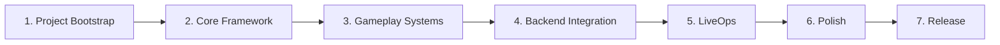

# Documentation — Master Index

> Blueprint chính thức của dự án **2D Idle Squad RPG** (Godot 4.x client + .NET 9 backend, live-service). Mọi prompt hiện thực tương lai **phải tuân** các tài liệu này.

---

## 1. Hai lớp tài liệu

| Lớp | Thư mục | Vai trò |
|---|---|---|
| **SSOT nghiệp vụ** | [`mvp/`](mvp/) | Product Discovery — yêu cầu game (KHÔNG sửa ở phase kiến trúc) |
| **Blueprint kiến trúc** | các thư mục dưới | Cách hiện thực (dựa trên SSOT) |

---

## 2. Bản đồ tài liệu

| Khu vực | Nội dung | Vào đây khi... |
|---|---|---|
| [architecture/](architecture/) | Tổng quan, cấu trúc repo, đồ thị phụ thuộc, thứ tự hiện thực | Cần bức tranh tổng & ranh giới |
| [adr/](adr/) | 11 quyết định kiến trúc (ADR-001..011) | Cần biết **vì sao** thiết kế thế này |
| [conventions/](conventions/) | Đặt tên, code style, git, JSON/markdown | Trước khi viết code/commit |
| [backend/](backend/) | Clean Arch, CQRS, EF, Redis, API | Làm backend |
| [godot/](godot/) | Scene, state, resource, UI, tooling | Làm client |
| [gameplay/](gameplay/) | Ranh giới module gameplay (không logic) | Làm hệ thống game |
| [liveops/](liveops/) | Remote config, flag, schedule, mail, admin | Làm LiveOps |
| [testing/](testing/) | Chiến lược & test 2 phía | Viết test / lập CI |
| [deployment/](deployment/) | CI/CD, môi trường, release, vận hành | Deploy/vận hành |
| [roadmap/](roadmap/) | Phase giao hàng (P0–P7) | Lập kế hoạch/tiến độ |
| [ai/](ai/) | Quy tắc cộng tác AI, context, DoD | Mỗi task AI-assisted |

---

## 3. Quyết định nền tảng (nhớ nhanh)

| # | Quyết định | ADR |
|---|---|---|
| 1 | **Server-authoritative + re-simulation** (combat & hệ nhạy cảm) | ADR-011 |
| 2 | **Online-required, server-authoritative state** (AFK tính server-side) | ADR-008, ADR-007 |
| 3 | **Combat deterministic theo seed** (integer/fixed-point) | ADR-011 |
| 4 | **Data-driven** mọi cân bằng gameplay | ADR-004, ADR-005 |
| 5 | Clean Architecture + CQRS/MediatR (BE); feature-based + composition (client) | ADR-003, ADR-002 |

> 3 quyết định đầu giải R1–R3 (`mvp/14-readiness-checklist.md`).

---

## 4. Recommended Implementation Sequence

> Trình tự tổng từ Bootstrap → Release. Chi tiết phase ở [`roadmap/`](roadmap/README.md); thứ tự kỹ thuật module ở [`architecture/implementation-order.md`](architecture/implementation-order.md).

| # | Giai đoạn | Làm gì | Tham chiếu |
|---|---|---|---|
| 1 | **Project Bootstrap** | Repo layout, CI skeleton, conventions, Docker dev | roadmap P0 · impl-order S0 |
| 2 | **Core Framework** | Contracts+schema, BE Clean Arch skeleton+DI, client autoloads, Auth+Save, Configuration Service | P1 · S1–S5 |
| 3 | **Gameplay Systems** | Deterministic combat sim (golden vector), Hero/Formation/Battle, Summon/Inventory/Currencies, Campaign/Progression/AFK/Energy | P2–P3 · S6–S9 |
| 4 | **Backend Integration** | Kinh tế (Equipment/Ascension/Shop/Quest/Mail), Ranking, tutorial, tích hợp & làm chặt client-server | P4–P5 · S10–S11 |
| 5 | **LiveOps** | Remote config nâng cao, feature flags, mail hàng loạt, telemetry, schema event/banner/shop | P6 · S12 |
| 6 | **Polish** | Balance, perf mobile, security pass, regression/smoke | P7 · S13 |
| 7 | **Release** | Build phát hành thử (Android trước), monitoring, soft launch | P7 · deployment/ |

**Nguyên tắc:** không giai đoạn nào đòi rewrite giai đoạn trước (nền chốt bằng ADR trước khi build); cắt scope theo MoSCoW (`mvp/01`) khi trễ, giữ Must (giai đoạn 1–3).

---

## 5. Lưu ý cho mọi người/AI làm việc
- Bắt đầu mỗi task bằng [`ai/context-strategy.md`](ai/context-strategy.md).
- Không đổi nghiệp vụ trong `mvp/`; điểm mơ hồ → [`mvp/10-open-questions.md`](mvp/10-open-questions.md).
- Tuân [`ai/coding-rules.md`](ai/coding-rules.md) & [`ai/review-and-dod.md`](ai/review-and-dod.md).
