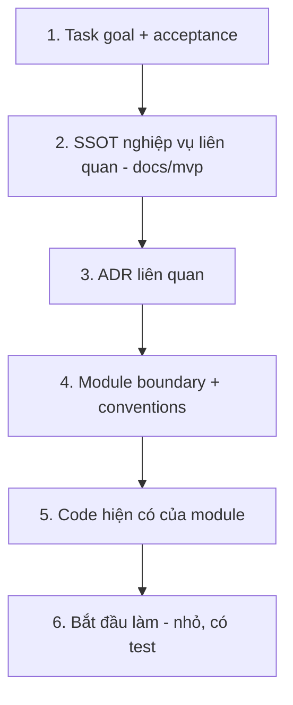

# AI Context Strategy

> Cách nạp đúng ngữ cảnh cho AI agent: Context Package, Context Loading Strategy, AI Memory Strategy. Mục tiêu: agent hiểu đủ để làm đúng, không nạp thừa gây nhiễu.

---

## 1. Context Package (gói ngữ cảnh cho một task)

Mỗi task hiện thực nên kèm **gói ngữ cảnh** gồm:

| Thành phần | Nguồn |
|---|---|
| Mục tiêu & phạm vi task | Prompt/issue + `../roadmap/` |
| Yêu cầu nghiệp vụ liên quan | File cụ thể trong `../mvp/` (không toàn bộ) |
| Quyết định kiến trúc liên quan | ADR cụ thể (`../adr/`) |
| Ranh giới module | `../architecture/dependency-graph.md` + doc module (`../gameplay/`, `../backend/`, `../godot/`) |
| Conventions áp dụng | `../conventions/` |
| Tiêu chí hoàn thành | `review-and-dod.md` + acceptance của phase |

> **Nguyên tắc:** nạp **file liên quan trực tiếp**, không đổ hết `docs/`. Feature README (`../godot/scene-architecture.md` §3) giúp khoanh vùng.

## 2. Context Loading Strategy (thứ tự nạp)

| Bước | Lý do |
|---|---|
| Goal trước | Biết đích |
| SSOT trước code | Không phát minh yêu cầu |
| ADR trước implement | Không đảo quyết định |
| Boundary trước sửa | Không phá phụ thuộc |
| Code hiện có | Tái sử dụng, không trùng lặp |

## 3. AI Memory Strategy

| Loại "trí nhớ" | Nơi lưu | Dùng khi |
|---|---|---|
| Quyết định lâu dài | `../adr/` | Mọi phiên (không lặp lại tranh luận) |
| Yêu cầu nghiệp vụ | `../mvp/` | Khi làm feature |
| Ngôn ngữ chung | `../mvp/12-glossary.md` | Đặt tên/đọc domain |
| Điểm chưa chốt | `../mvp/10-open-questions.md` | Khi gặp mơ hồ → hỏi, không đoán |
| Trạng thái tiến độ | `../roadmap/` + task tracker | Biết đang ở phase nào |
| Ghi chú phiên | Task/PR description | Trao ngữ cảnh giữa phiên |

**Quy tắc chống mất ngữ cảnh (`../mvp/09` AI4):**
- Khi có quyết định kiến trúc mới → **ghi ADR**, không để trong đầu.
- Khi phát hiện điểm mơ hồ → thêm vào `open-questions`, không tự quyết ngầm.
- PR mô tả rõ WHY + liên kết ADR/mvp.

## 4. Chống "bịa" (hallucination) API/pattern (`../mvp/09` AI2)
- Chỉ dùng pattern/interface đã tài liệu hoá (`../backend/`, `../godot/`); nếu cần cái mới → đề xuất trong PR + cân nhắc ADR.
- Kiểm chứng bằng test & CI trước khi coi là "xong".

## 5. Liên kết
- Coding rules: `coding-rules.md` · DoD: `review-and-dod.md`
- Dependency rule: `../architecture/dependency-graph.md`
