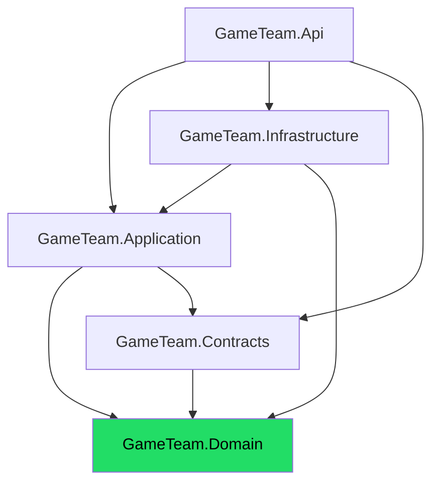
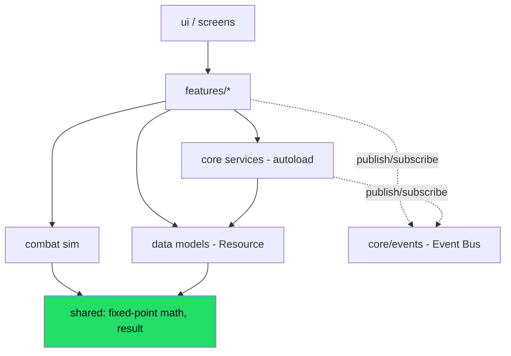
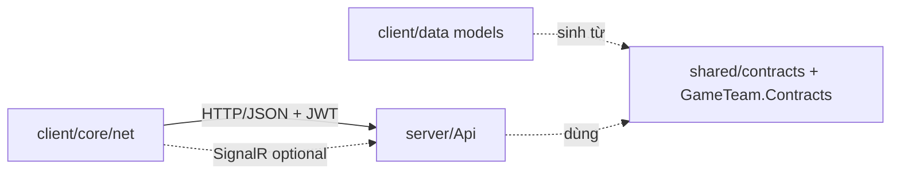
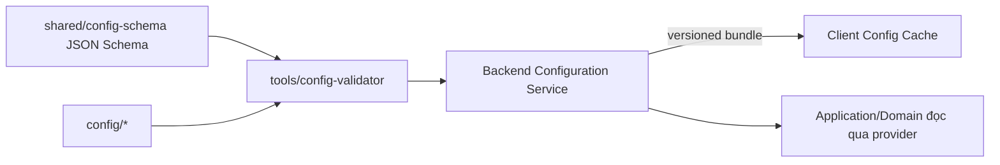

# Dependency Graph & Module Ownership

> Đồ thị phụ thuộc toàn hệ thống, **luật chống vòng lặp**, và **ownership** từng module. Mục tiêu: nhiều AI agent/dev làm song song mà không tạo coupling xấu hay circular dependency.

---

## 1. Nguyên tắc phụ thuộc (bất biến)

| # | Luật | Hệ quả nếu vi phạm |
|---|---|---|
| R1 | Phụ thuộc **một chiều, hướng vào lõi** (Domain là trong cùng) | Vỡ Clean Architecture |
| R2 | **Không circular dependency** ở mọi cấp (project, module, feature) | Không build/test độc lập được |
| R3 | Giao tiếp cross-module qua **interface/port + event**, không qua lớp cụ thể | Coupling cứng |
| R4 | Domain **không** phụ thuộc framework/I/O | Không test thuần được |
| R5 | Client feature **không** import chéo feature khác | Rối, khó bảo trì |
| R6 | Code **không** phụ thuộc giá trị config cụ thể — chỉ phụ thuộc schema | Không data-driven (ADR-004) |

---

## 2. Đồ thị phụ thuộc Backend (project-level)

**Giải thích hướng mũi tên (A → B = A phụ thuộc B):**
- `Api` phụ thuộc `Application` (gọi command/query) và `Infrastructure` (chỉ để **wiring DI** ở composition root — không dùng logic Infrastructure trực tiếp).
- `Infrastructure` **implements** các port khai báo trong `Application` (đảo phụ thuộc — DIP).
- `Domain` là lõi, **không mũi tên đi ra**.

> **Quy tắc composition root:** chỉ `Api` (entry point) được biết `Infrastructure` cụ thể để đăng ký DI. Handler trong `Application` chỉ thấy **interface**.

---

## 3. Đồ thị phụ thuộc Client (Godot)

**Quy tắc client:**
- `features/*` **không** phụ thuộc lẫn nhau; nếu cần phối hợp → qua **Event Bus** (`core/events`) hoặc điều phối ở tầng scene/router.
- `combat/` là lõi thuần (chỉ phụ thuộc `shared/` math) → **đồng nhất ruleset với server** & test được.
- UI chỉ phụ thuộc feature (view-model), **không** gọi network trực tiếp.

---

## 4. Ranh giới Client ↔ Backend

- Hợp đồng nằm ở `shared/contracts` (+ `GameTeam.Contracts`). Client model **sinh mã** từ đây (codegen) → không lệch tay.
- Versioning API bắt buộc (ADR-008, `../backend/api-and-versioning.md`).

---

## 5. Đồ thị phụ thuộc Config (data-driven)

- **Code phụ thuộc schema, không phụ thuộc giá trị.** Đổi giá trị = đổi dữ liệu, không đổi code (ADR-004/005).

---

## 6. Ma trận Ownership (ai sở hữu module)

> "Owner" = nơi chịu trách nhiệm chính về thiết kế & thay đổi; giúp phân công AI agent/dev tránh giẫm chân.

| Module | Vị trí | Owner (vai trò) | Phụ thuộc được phép | Cấm phụ thuộc |
|---|---|---|---|---|
| Domain (BE) | `server/src/GameTeam.Domain` | Backend/Domain | (không) | Framework, EF, network |
| Application (BE) | `.../GameTeam.Application` | Backend | Domain, Contracts | Infrastructure cụ thể |
| Infrastructure (BE) | `.../GameTeam.Infrastructure` | Backend/Platform | Application, Domain | Api |
| Api (BE) | `.../GameTeam.Api` | Backend/Platform | Application, Infra (DI), Contracts | Domain internals |
| Contracts | `shared/contracts` + `GameTeam.Contracts` | Platform (chung) | Domain (enum/hằng) | Infrastructure |
| Config schema | `shared/config-schema` | Platform + Game Design | (không) | Code cụ thể |
| Combat sim | `client/src/combat` + `server` sim | Gameplay/Combat | shared math | UI, network, DB |
| Client core | `client/src/core` | Client/Platform | shared, data | features (không ngược) |
| Client features | `client/src/features/*` | Gameplay (mỗi feature) | core, data, combat, event bus | feature khác |
| UI | `client/src/ui` | Client/UI | features (view-model) | network trực tiếp |
| Tools | `tools/*` | Platform | schema, contracts | runtime game |
| Deploy/CI | `deploy/`, `.github/` | DevOps/Platform | — | — |

---

## 7. Cơ chế chống circular dependency

| Cấp | Cách phát hiện/ngăn |
|---|---|
| BE project | Cấu trúc reference cố định (R2); analyzer + review; Domain không có `using` framework |
| BE feature (trong Application) | Chia theo feature-folder + MediatR (handler không gọi handler khác trực tiếp; qua domain event/notification) |
| Client feature | Lint quy ước import; feature giao tiếp qua Event Bus; review checklist (`docs/ai/review-and-dod.md`) |
| Config ↔ code | Code chỉ đọc qua provider interface; validator CI |

> **Kiểm chứng tự động (khuyến nghị Post-bootstrap):** thêm test kiến trúc (vd NetArchTest cho .NET) để **fail CI** nếu Domain lỡ tham chiếu Infrastructure — chi tiết `docs/testing/backend-testing.md`.

---

## 8. Điểm coupling nhạy cảm cần canh

| Điểm | Rủi ro | Biện pháp |
|---|---|---|
| Combat sim client vs server | Lệch ruleset → verify sai | Ruleset thuần, chia sẻ đặc tả; test vector chung (ADR-011) |
| Contracts | Lệch DTO | Codegen từ nguồn duy nhất |
| Config schema | Đổi schema phá dữ liệu cũ | Schema versioning + migration (ADR-005) |
| Event Bus | Lạm dụng thành "kênh ngầm" God | Đặt tên & tài liệu event rõ (`../conventions/naming.md`) |

---

## 9. Liên kết
- Kiến trúc tổng: `overview.md`
- Cấu trúc thư mục: `project-structure.md`
- Thứ tự hiện thực: `implementation-order.md`
- ADR liên quan: ADR-002, ADR-003, ADR-004, ADR-008, ADR-010, ADR-011
