# Implementation Order (Thứ tự hiện thực theo phụ thuộc kỹ thuật)

> Thứ tự hiện thực **theo phụ thuộc kỹ thuật** (layer/module), mỗi bước **test độc lập** và **không đòi viết lại về sau**. Đây là góc nhìn "kỹ thuật/module"; góc nhìn "phase giao hàng sản phẩm" ở `../roadmap/README.md`. Ánh xạ sản phẩm: `../mvp/11-development-roadmap.md`.

---

## 1. Nguyên tắc sắp thứ tự

| Nguyên tắc | Diễn giải |
|---|---|
| Nền trước, feature sau | Hợp đồng/config/DI/save nền tảng làm trước |
| Rủi ro cao làm sớm | Combat deterministic + authority (ADR-011) sớm để lộ vấn đề |
| Mỗi bước testable | Có tiêu chí kiểm chứng độc lập |
| Không rework | Không xây trên nền chưa chốt (đã chốt ADR trước khi code) |
| Contract-first | Định nghĩa hợp đồng/schema trước khi hiện thực 2 phía |

---

## 2. Sơ đồ phụ thuộc các bước

```mermaid
flowchart LR
    S0[S0 Repo & CI skeleton] --> S1[S1 Contracts & Config schema]
    S1 --> S2[S2 BE Clean Arch skeleton + DI]
    S1 --> S3[S3 Client core skeleton + autoload]
    S2 --> S4[S4 Auth + Save/Profile]
    S4 --> S5[S5 Configuration Service data-driven]
    S5 --> S6[S6 Deterministic Combat Sim - shared ruleset]
    S6 --> S7[S7 Hero + Formation + Battle vertical slice]
    S7 --> S8[S8 Summon/Gacha + Inventory + Currencies]
    S8 --> S9[S9 Campaign + Progression + AFK]
    S9 --> S10[S10 Economy systems: Equipment/Ascension/Shop/Quest/Mail]
    S10 --> S11[S11 Ranking + QoL - sweep/2x]
    S11 --> S12[S12 LiveOps foundation + Telemetry]
    S12 --> S13[S13 Hardening: perf/security/regression]
```

---

## 3. Chi tiết từng bước

### S0 — Repo & CI skeleton
| | |
|---|---|
| Mục tiêu | Cấu trúc repo (`project-structure.md`), CI build rỗng cho client+server, editorconfig/lint |
| Test độc lập | CI xanh: build client & server "hello", chạy 1 test mẫu mỗi phía |
| Không rework | Layout & conventions chốt trước (`../conventions/`) |

### S1 — Contracts & Config schema (contract-first)
| | |
|---|---|
| Mục tiêu | `shared/contracts` (API skeleton, enum chung), `shared/config-schema` (JSON Schema hero/stage/gacha...), `tools/config-validator` |
| Phụ thuộc | S0 |
| Test độc lập | Validator chạy trên config mẫu; codegen sinh model client |
| WHY sớm | Chốt hợp đồng trước để 2 phía làm song song không lệch |

### S2 — Backend Clean Architecture skeleton + DI
| | |
|---|---|
| Mục tiêu | 4 project (Domain/Application/Infrastructure/Api), MediatR + pipeline behavior, DI composition root, health check |
| Phụ thuộc | S1 |
| Test độc lập | Test kiến trúc (Domain không ref Infra); 1 command/query mẫu qua MediatR |

### S3 — Client core skeleton + autoloads
| | |
|---|---|
| Mục tiêu | Autoload tối giản: NetworkClient, ConfigProvider, EventBus, SceneRouter, StateCache (`../godot/`) |
| Phụ thuộc | S1 |
| Test độc lập | Boot vào main scene; gọi API health; nhận config mẫu |

### S4 — Auth + Save/Profile
| | |
|---|---|
| Mục tiêu | JWT auth (guest→link sau), profile persistence (EF Core/PostgreSQL), schema versioning nền (ADR-007) |
| Phụ thuộc | S2 |
| Test độc lập | Đăng ký/đăng nhập guest; lưu/đọc profile; migration chạy |
| Nguồn | `../mvp/10` BE3, ADR-007 |

### S5 — Configuration Service (data-driven runtime)
| | |
|---|---|
| Mục tiêu | Nạp/validate/version config (ADR-005), phân phối bundle versioned cho client, cache Redis |
| Phụ thuộc | S1, S2, S4 |
| Test độc lập | Client nhận config version X; đổi giá trị config không cần rebuild client |
| WHY | Nền cho **mọi** gameplay data-driven & LiveOps |

### S6 — Deterministic Combat Sim (shared ruleset)
| | |
|---|---|
| Mục tiêu | Bộ sim thuần deterministic (integer/fixed-point, seeded RNG) ở **cả client & server**; test vector chung (ADR-011) |
| Phụ thuộc | S5 (đọc hero/skill config) |
| Test độc lập | Cùng seed+input → cùng output ở client và server (golden test) |
| WHY sớm | Rủi ro kỹ thuật cao nhất; là nền của battle/AFK/verify |

### S7 — Hero + Formation + Battle (vertical slice)
| | |
|---|---|
| Mục tiêu | Hero từ config, đội 6 + formation, gọi battle → server re-sim → kết quả; client replay bằng seed |
| Phụ thuộc | S6 |
| Test độc lập | Đánh 1 stage cố định, kết quả server-authoritative, client hiển thị khớp |
| Nguồn | `../mvp/03` (Hero/Formation/Battle) |

### S8 — Summon/Gacha + Inventory + Currencies
| | |
|---|---|
| Mục tiêu | Gacha server-authoritative (rate+pity, RNG server), inventory, 3 tiền tệ nền |
| Phụ thuộc | S7 |
| Test độc lập | Summon nhiều lần kiểm rate/pity server-side; nhận hero vào inventory; trừ tiền atomic |
| Nguồn | `../mvp/03`, `06` |

### S9 — Campaign + Progression + AFK (loop khép kín)
| | |
|---|---|
| Mục tiêu | Campaign nhiều stage, level hero, **AFK tính server-side khi claim**, energy |
| Phụ thuộc | S8 |
| Test độc lập | Đẩy stage, tiêu energy, level hero, claim AFK theo thời gian server |
| Nguồn | `../mvp/02`, `05`, `06`; đánh dấu **kết thúc = MVP Must loop chạy** |

### S10 — Economy systems (Should)
| | |
|---|---|
| Mục tiêu | Equipment cơ bản, Ascension/nâng sao, Shop tĩnh, Quest daily, Mail |
| Phụ thuộc | S9 |
| Test độc lập | Mỗi hệ test riêng qua command/query + config |
| Nguồn | `../mvp/01` (Should), `03` |

### S11 — Ranking + QoL
| | |
|---|---|
| Mục tiêu | Leaderboard đơn giản, sweep/quick-battle, tua 2x, faction advantage (nếu vào) |
| Phụ thuộc | S10 |
| Test độc lập | Leaderboard cập nhật; sweep dùng lại kết quả deterministic |
| Nguồn | `../mvp/03`, `04` (F20–F23) |

### S12 — LiveOps foundation + Telemetry
| | |
|---|---|
| Mục tiêu | Remote config nâng cao, feature flag, mail hàng loạt, telemetry sự kiện (`../liveops/`, `../mvp/07`) |
| Phụ thuộc | S5, S9 |
| Test độc lập | Bật/tắt feature qua flag; sự kiện telemetry ghi nhận |

### S13 — Hardening
| | |
|---|---|
| Mục tiêu | Perf mobile, security pass (anti-cheat/authz), regression/smoke, chuẩn hoá release |
| Phụ thuộc | tất cả |
| Test độc lập | Smoke suite xanh; profiling đạt ngưỡng; security checklist |

---

## 4. Bảng "gate" giữa các bước (Definition of Ready trước khi sang bước sau)

| Chuyển | Điều kiện |
|---|---|
| →S2/S3 | Contracts & schema đã review, codegen chạy |
| →S6 | ADR-011 chốt (đã chốt), config hero/skill có |
| →S7 | Sim golden test khớp client-server |
| →S9 | Gacha & currency server-authoritative & atomic đã test |
| →S12 | Loop MVP (S9) ổn định |

---

## 5. Liên kết
- Phase giao hàng sản phẩm: `../roadmap/README.md`
- Roadmap sản phẩm gốc: `../mvp/11-development-roadmap.md`
- Đồ thị phụ thuộc: `dependency-graph.md`
- ADR nền: ADR-003, ADR-005, ADR-007, ADR-011
