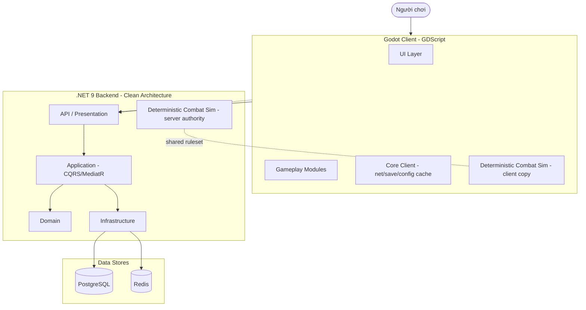
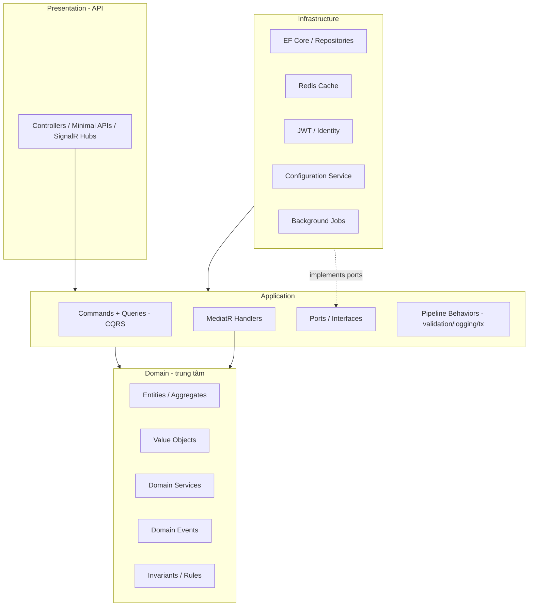
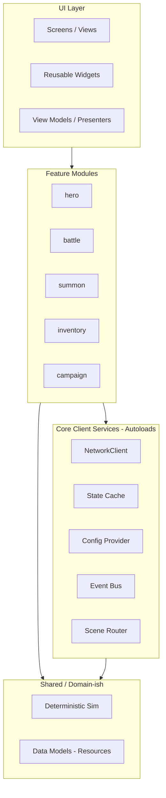
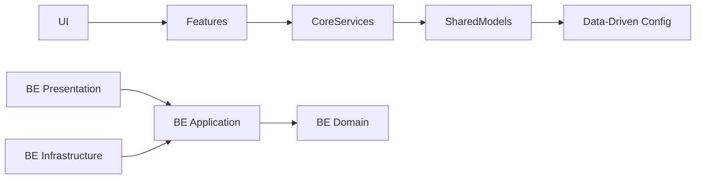
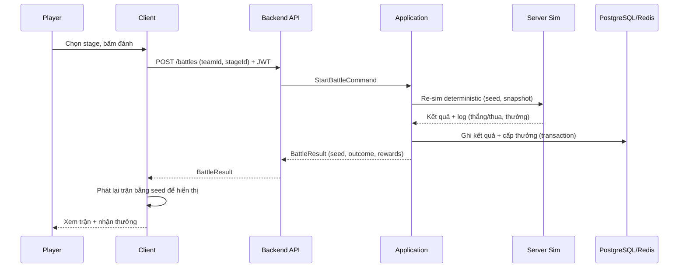

# Architecture Overview (Tổng quan kiến trúc)

> **Blueprint kiến trúc — Architecture & Project Bootstrap phase.** Nguồn yêu cầu nghiệp vụ duy nhất: `docs/mvp/` (SSOT). Tài liệu này mô tả kiến trúc tổng, các tầng, hướng phụ thuộc và ranh giới module. Chi tiết quyết định nằm ở `docs/adr/`.

---

## 1. Bối cảnh & mục tiêu kiến trúc

| Mục tiêu | Vì sao | Nguồn |
|---|---|---|
| Scalability | Live-service 5+ năm, thêm hero/mode liên tục | `docs/mvp/00`, `07` |
| Maintainability | Nhiều AI agent + dev người cùng làm | Đề bài |
| Modularity | Feature-based, thêm/bớt không phá core | `docs/mvp/04`, `09` SC1 |
| Testability | Combat/kinh tế phải verify được | `docs/mvp/08`, `09` |
| AI-assisted dev | Context rõ ràng, ranh giới chặt | Đề bài, `docs/ai/` |
| Data-driven | Mọi config gameplay tách khỏi code | `docs/mvp/06`, `07`, ADR-004 |

**3 quyết định nền tảng đã chốt** (giải R1–R3 của `docs/mvp/14-readiness-checklist.md`):
1. **Server-authoritative + re-simulation** cho combat & hệ nhạy cảm — ADR-011.
2. **Online-required, server-authoritative state** — ADR-008.
3. **Combat deterministic theo seed (integer/fixed-point)** — ADR-011.

---

## 2. Kiến trúc hệ thống mức cao (C4 — Context/Container)

> **Điểm mấu chốt:** bộ luật combat (deterministic ruleset) tồn tại **hai bản đồng nhất về quy tắc** — client (hiển thị/dự đoán) và server (thẩm quyền/xác thực). Chi tiết ranh giới ở `docs/gameplay/combat-framework.md` và ADR-011.

---

## 3. Hai "khối" lớn & trách nhiệm

| Khối | Công nghệ | Trách nhiệm chính | KHÔNG chịu trách nhiệm |
|---|---|---|---|
| **Godot Client** | Godot 4.x, GDScript | Hiển thị, input, UI/UX, mô phỏng combat để xem, cache trạng thái, phát request | Là nguồn sự thật; quyết định thưởng/kết quả nhạy cảm |
| **.NET Backend** | .NET 9, Clean Arch | Nguồn sự thật, xác thực, re-sim combat, kinh tế, gacha, AFK, lưu trữ, config | Rendering, animation, UX |

---

## 4. Backend — Clean Architecture (các tầng)

**Quy tắc phụ thuộc (Dependency Rule):** phụ thuộc **luôn hướng vào trong** (Presentation → Application → Domain). **Domain không phụ thuộc gì**. Infrastructure phụ thuộc Application/Domain qua **interface (ports)**, được nối bằng **Dependency Injection**. Chi tiết ADR-003, `docs/backend/`.

| Tầng | Phụ thuộc vào | Chứa gì |
|---|---|---|
| Domain | (không) | Entity, Aggregate, Value Object, Domain Service, Domain Event, business rule thuần |
| Application | Domain | Command/Query (CQRS), MediatR handler, port/interface, validator, pipeline behavior |
| Infrastructure | Application, Domain | EF Core, repository impl, Redis, JWT, config service, job, external adapter |
| Presentation | Application | Controller/Minimal API, SignalR hub, DTO, mapping, auth filter |

---

## 5. Client — kiến trúc Godot (các lớp)

**Quy tắc client:** UI **không** gọi thẳng network; đi qua feature module → core service. Feature module giao tiếp lỏng qua **Event Bus / signals**. Không có "God autoload". Chi tiết ADR-002, `docs/godot/`.

---

## 6. Hướng phụ thuộc tổng (Dependency Direction)

**Nguyên tắc bất biến:**
- Phụ thuộc **một chiều, hướng vào lõi**. Không vòng lặp (xem `dependency-graph.md`).
- Giao tiếp giữa module = **interface + event**, không gọi trực tiếp lớp cụ thể.
- Config gameplay là **dữ liệu** (data-driven), không phải code (ADR-004/005).

---

## 7. Ranh giới module (Module Boundaries)

| Ranh giới | Cách thực thi | WHY |
|---|---|---|
| Client ↔ Backend | Hợp đồng API + DTO versioned (`docs/backend/api-and-versioning.md`) | Hai phía deploy độc lập |
| Feature ↔ Feature (client) | Event Bus / signals, không import chéo | Low coupling |
| Application ↔ Infrastructure | Port/interface + DI | Đảo phụ thuộc, testable |
| Domain ↔ mọi thứ | Domain thuần, không I/O | Bảo vệ business rule |
| Code ↔ Config | Data-driven qua Configuration Service | LiveOps & tune (ADR-005) |
| Combat rule ↔ nền tảng | Bộ sim thuần, deterministic, dùng chung | Server re-sim verify (ADR-011) |

---

## 8. Luồng dữ liệu tiêu biểu (ví dụ: đánh 1 trận campaign)

> Client mô phỏng **để hiển thị** dựa trên `seed` server trả; server là **nguồn sự thật** của kết quả & thưởng. Chi tiết `docs/gameplay/combat-framework.md`.

---

## 9. Nguyên tắc kiến trúc bắt buộc (tóm tắt)

| Nguyên tắc | Áp dụng |
|---|---|
| Clean Architecture | Backend theo tầng; Domain trung tâm |
| SOLID + SRP | Mỗi lớp/module một trách nhiệm |
| Composition over Inheritance | Godot node composition; C# prefer composition |
| Data-Driven | Config gameplay = dữ liệu (ADR-004) |
| Event-Driven | Event Bus/signals (client), Domain Events (backend) |
| DI hợp lý | Backend: DI container; Client: service locator autoload tối giản |
| Feature-based modularization | Cả hai phía chia theo feature |
| **Cấm** God Object / giant manager | Xem `docs/ai/coding-rules.md` |
| **Cấm** switch để mở rộng gameplay | Dùng polymorphism/registry/data (ADR-004) |
| **Cấm** hardcode config gameplay | Configuration Service (ADR-005) |

---

## 10. Liên kết
- Cấu trúc repo: `project-structure.md`
- Đồ thị phụ thuộc & ownership: `dependency-graph.md`
- Thứ tự hiện thực: `implementation-order.md`
- Quyết định kiến trúc: `../adr/`
- Backend chi tiết: `../backend/`
- Client chi tiết: `../godot/`
- SSOT nghiệp vụ: `../mvp/`
