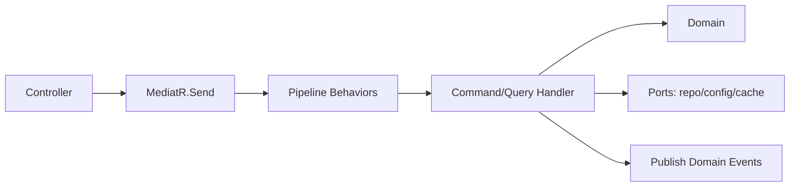

# Domain & Application Layers

> Thiết kế tầng Domain (lõi business) và Application (CQRS/MediatR). Không hiện thực logic gameplay ở đây — chỉ ranh giới, trách nhiệm, pattern.

---

## 1. Domain Layer

### Thành phần
| Thành phần | Vai trò | Ví dụ (domain game này) |
|---|---|---|
| Entity | Đối tượng có định danh & vòng đời | `Hero`, `PlayerProfile`, `BattleRecord` |
| Aggregate Root | Ranh giới nhất quán, cổng ghi | `PlayerProfile` (chứa inventory, currency) |
| Value Object | Bất biến, so sánh theo giá trị | `Currency`, `PowerRating`, `Seed` |
| Domain Service | Logic không thuộc 1 entity | `PityCalculator`, `AfkAccrualPolicy` |
| Domain Event | Sự việc nghiệp vụ đã xảy ra | `BattleWon`, `HeroAscended` |
| Invariant/Rule | Bất biến bảo vệ trong entity | "team đúng 6 hero" (`../mvp/03`) |

### Nguyên tắc
- **Thuần**: không EF, không HTTP, không `DateTime.Now` (inject `IClock`).
- Bảo vệ invariant trong method, tránh setter công khai bừa bãi.
- Không phụ thuộc Application/Infrastructure.
- Business rule liên quan gameplay tham chiếu `../mvp/03`, `05`, `06` — **không phát minh rule mới**.

### Foundation primitives (Phase 09 — đã đóng)

`GameTeam.Domain/Common/` chứa base type tái dùng (một public type/file, **BCL-only**, `GameTeam.Domain`
**không có package reference** — architecture test canh). Đây là nền cho mọi phase nghiệp vụ; **không** tự phát
minh primitive mới trùng chức năng.

| Primitive | Quy ước |
|---|---|
| `Result` / `Result<T>` | Dùng cho **lỗi nghiệp vụ mong đợi** (thiếu tiền, sai điều kiện…). `IsSuccess`/`IsFailure`/`Error`; `Result<T>.Value` **ném** `InvalidOperationException` nếu truy cập khi thất bại (trạng thái không hợp lệ). **KHÔNG** biến mọi exception thành Result. |
| `Error(Code, Message)` | Value bất biến (so sánh theo giá trị). `Code` **ổn định**, `SCREAMING_SNAKE_CASE`, dùng để map API (phase 13). `Error.None` = trạng thái không lỗi. **Không** rò stack trace / chi tiết DB / hạ tầng / thông tin nhạy cảm. |
| `Entity<TId>` | Equality theo **định danh** (`Id` + kiểu runtime), không theo giá trị thuộc tính. Không annotation persistence, không audit field. |
| `ValueObject` | Equality theo **giá trị** (các thành phần ở `GetEqualityComponents()`); hash nhất quán với equality; an toàn null-component. |
| `AggregateRoot<TId>` | Kế thừa `Entity<TId>`; **sở hữu** domain event. `DomainEvents` (read-only, không ép về `List` để sửa), `RaiseDomainEvent` (protected), `ClearDomainEvents`. |
| `IDomainEvent` | Marker tối giản (không timestamp → tránh wall-clock trong Domain). |
| `IClock` | Port thời gian, `DateTimeOffset UtcNow` — **ranh giới server-time**. Infrastructure hiện thực & inject (phase sau). |
| `Guard` | `NotNull` / `Positive` / `InRange` bảo vệ **bất biến** → **ném** BCL argument exception (chiến lược nhất quán). |

**Result vs Exception (ranh giới bắt buộc):**
- **Result** — lỗi nghiệp vụ *mong đợi*, là một phần hợp đồng của thao tác (handler trả về, caller xử lý).
- **Exception** — lỗi lập trình / vi phạm bất biến nội bộ / lỗi hạ tầng / điều kiện thật sự bất thường. `Guard`
  ném exception vì vi phạm invariant là lỗi lập trình, **không** phải luồng nghiệp vụ. Không tạo **hai paradigm
  validate** song song (Guard không trả `Result`).

**Domain event lifecycle & ranh giới dispatch:**
1. Aggregate **raise** event trong method nghiệp vụ (`RaiseDomainEvent`).
2. Aggregate **thu thập** event (`DomainEvents`); `AggregateRoot<TId>` hiện thực marker BCL-only
   **`IHasDomainEvents`** (`Common/IHasDomainEvents.cs`, thêm ở Phase 11) để Infrastructure phát hiện event
   không cần biết `TId`.
3. Infrastructure **dispatch tại `AppDbContext.SaveChangesAsync`** (Phase 11 — đã hiện thực): sau khi persist,
   trong cùng transaction, publish qua MediatR (`DomainEventNotification<T>` + `IPublisher`) rồi `ClearDomainEvents`.
> Domain **chỉ** raise & collect — **KHÔNG** dispatch, **KHÔNG** MediatR/bus/notification trong Domain. `IHasDomainEvents`
> chỉ là seam đọc/clear (không kéo package vào Domain — NetArchTest purity vẫn xanh).

**Server-time rule:** mọi thời gian nghiệp vụ (AFK, energy, cooldown…) lấy qua `IClock.UtcNow`; **cấm** `DateTime.Now/UtcNow`,
`DateTimeOffset.Now/UtcNow` trực tiếp trong Domain (Forbidden Pattern, `../ai/coding-rules.md` §3) — cho test tái lập & chống gian lận giờ.

---

## 2. Application Layer — CQRS + MediatR

### Command vs Query
| Loại | Đặc điểm | Ví dụ |
|---|---|---|
| Command | Đổi trạng thái, trả kết quả tối thiểu | `StartBattleCommand`, `ClaimAfkCommand`, `SummonCommand` |
| Query | Chỉ đọc, không side-effect | `GetHeroListQuery`, `GetProfileQuery` |

### Luồng qua MediatR

### Pipeline Behaviors (cross-cutting chuẩn hoá — Phase 10 đã hiện thực 4 behaviors)

Thứ tự thực thi cố định: **`Logging → Validation → Transaction → Caching`** (ngoài→trong). Chi tiết đầy đủ
(ràng buộc generic, marker, quy ước cache key, ports) ở [`cross-cutting.md`](cross-cutting.md) §2.5 — không lặp lại ở đây.

| Behavior | Vai trò | Trạng thái |
|---|---|---|
| LoggingBehavior | Log tên request + elapsed + outcome (không log body/nhạy cảm) | Phase 10 ✅ |
| ValidationBehavior | FluentValidation **trước** handler; fail ⇒ `Result` lỗi (`VALIDATION_FAILED`), không ném thô | Phase 10 ✅ |
| TransactionBehavior | Bọc **`ITransactionalRequest`** trong `IUnitOfWork` — commit/rollback, atomic (ADR-007) | Phase 10 ✅ |
| CachingBehavior | Cache query có **`ICacheableQuery`** theo key+TTL (Redis ở phase 12) | Phase 10 ✅ |
| IdempotencyBehavior | Chống double-execute cho command nhạy cảm (claim/summon) | Defer (phase sau) |

> Handler **mỏng**: cross-cutting ở behaviors, không rải trong handler. Mọi command/query tương lai đi qua
> pipeline (`IMediator.Send`) — **không** bypass MediatR.

### Ports (interface) — đảo phụ thuộc
`IHeroRepository`, `IPlayerProfileRepository`, `IUnitOfWork`, `IConfigProvider`, `IClock`, `ICacheService`, `IRandomProvider` (seeded), `ICombatSimulator`... — **Infrastructure implements**.

**Ports nền đã khai báo (Phase 10):** `IUnitOfWork`, `IRepository<TEntity, TId>` (`Abstractions/Persistence`),
`ICacheService` (`Abstractions/Caching`), `IConfigProvider` (`Abstractions/Configuration`, chỉ `CurrentVersion`;
Config Service hiện thực ở **phase 21**). Hiện thực: **EF Core — phase 11 ĐÃ hiện thực** (`UnitOfWork`/`EfRepository`
trong `GameTeam.Infrastructure/Persistence`, xem `infrastructure.md` §1.1), Redis (**phase 12**). `SystemClock`
(Infrastructure) đã hiện thực `IClock` ở mức tối giản (server-time boundary).

> **Vị trí port:** khai báo port ở tầng **cần** nó nhất. `IClock` thuộc **`GameTeam.Domain`** (`Common/IClock.cs`, Phase 09)
> vì Domain cần server-time cho invariant/logic mà không được chạm wall-clock; Application/Infrastructure tái dùng cùng
> interface đó. Các repository/UnitOfWork (I/O nghiệp vụ) khai báo ở **Application**. Infrastructure hiện thực tất cả.

---

## 3. Ví dụ trách nhiệm: Start Battle (không phải code)

| Bước | Ai làm |
|---|---|
| Nhận `StartBattleCommand(teamId, stageId)` | Api → MediatR |
| Validate team hợp lệ (6 hero, sở hữu) | ValidationBehavior + Domain rule |
| Lấy snapshot hero + stage config | Handler qua `IConfigProvider`, repo |
| Sinh seed, gọi `ICombatSimulator.Simulate(...)` | Handler (server sim, deterministic — ADR-011) |
| Ghi `BattleRecord` + cấp thưởng | Domain + repo trong TransactionBehavior |
| Publish `BattleWon`/`BattleLost` | Domain Event → cập nhật quest/progression |
| Trả `BattleResult{seed, outcome, rewards, log}` | Handler → Api |

> Logic cân bằng/số liệu nằm ở **config** (ADR-004); handler chỉ điều phối cơ chế.

---

## 4. Domain Events & tách rời
- Handler phát domain event; các reaction (cập nhật quest, leaderboard, telemetry) xử lý qua **notification handler** riêng → tránh handler gọi handler (chống circular, `../architecture/dependency-graph.md`).

## 5. Liên kết
- Infrastructure (impl ports): `infrastructure.md`
- API contract: `api-and-versioning.md`
- Combat sim: `../gameplay/combat-framework.md`, ADR-011
- ADR-003, ADR-004, ADR-007
