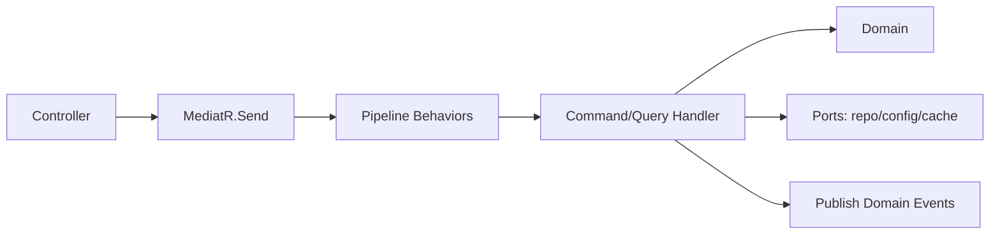

# Domain & Application Layers

> Thiết kế tầng Domain (lõi business) và Application (CQRS/MediatR). Không hiện thực logic gameplay ở đây — chỉ ranh giới, trách nhiệm, pattern.

---

## 1. Domain Layer

### Thành phần
| Thành phần | Vai trò | Ví dụ (domain game này) |
|---|---|---|
| Entity | Đối tượng có định danh & vòng đời | `Hero`, `PlayerProfile`, `BattleRecord` |
| Aggregate Root | Ranh giới nhất quán, cổng ghi | `PlayerProfile` (chứa inventory, currency) |
| Value Object | Bất biến, so sánh theo giá trị | `Currency`, `PowerRating`, `Seed` |
| Domain Service | Logic không thuộc 1 entity | `PityCalculator`, `AfkAccrualPolicy` |
| Domain Event | Sự việc nghiệp vụ đã xảy ra | `BattleWon`, `HeroAscended` |
| Invariant/Rule | Bất biến bảo vệ trong entity | "team đúng 6 hero" (`../mvp/03`) |

### Nguyên tắc
- **Thuần**: không EF, không HTTP, không `DateTime.Now` (inject `IClock`).
- Bảo vệ invariant trong method, tránh setter công khai bừa bãi.
- Không phụ thuộc Application/Infrastructure.
- Business rule liên quan gameplay tham chiếu `../mvp/03`, `05`, `06` — **không phát minh rule mới**.

---

## 2. Application Layer — CQRS + MediatR

### Command vs Query
| Loại | Đặc điểm | Ví dụ |
|---|---|---|
| Command | Đổi trạng thái, trả kết quả tối thiểu | `StartBattleCommand`, `ClaimAfkCommand`, `SummonCommand` |
| Query | Chỉ đọc, không side-effect | `GetHeroListQuery`, `GetProfileQuery` |

### Luồng qua MediatR

### Pipeline Behaviors (cross-cutting chuẩn hoá)
| Behavior | Vai trò |
|---|---|
| ValidationBehavior | FluentValidation trước handler |
| LoggingBehavior | Log request/response có cấu trúc |
| TransactionBehavior | Bọc command trong transaction (UnitOfWork) — atomic (ADR-007) |
| CachingBehavior | Cache query đọc nhiều (Redis) |
| IdempotencyBehavior | Chống double-execute cho command nhạy cảm (claim/summon) |

### Ports (interface) — đảo phụ thuộc
`IHeroRepository`, `IPlayerProfileRepository`, `IUnitOfWork`, `IConfigProvider`, `IClock`, `ICacheStore`, `IRandomProvider` (seeded), `ICombatSimulator`... — **Infrastructure implements**.

---

## 3. Ví dụ trách nhiệm: Start Battle (không phải code)

| Bước | Ai làm |
|---|---|
| Nhận `StartBattleCommand(teamId, stageId)` | Api → MediatR |
| Validate team hợp lệ (6 hero, sở hữu) | ValidationBehavior + Domain rule |
| Lấy snapshot hero + stage config | Handler qua `IConfigProvider`, repo |
| Sinh seed, gọi `ICombatSimulator.Simulate(...)` | Handler (server sim, deterministic — ADR-011) |
| Ghi `BattleRecord` + cấp thưởng | Domain + repo trong TransactionBehavior |
| Publish `BattleWon`/`BattleLost` | Domain Event → cập nhật quest/progression |
| Trả `BattleResult{seed, outcome, rewards, log}` | Handler → Api |

> Logic cân bằng/số liệu nằm ở **config** (ADR-004); handler chỉ điều phối cơ chế.

---

## 4. Domain Events & tách rời
- Handler phát domain event; các reaction (cập nhật quest, leaderboard, telemetry) xử lý qua **notification handler** riêng → tránh handler gọi handler (chống circular, `../architecture/dependency-graph.md`).

## 5. Liên kết
- Infrastructure (impl ports): `infrastructure.md`
- API contract: `api-and-versioning.md`
- Combat sim: `../gameplay/combat-framework.md`, ADR-011
- ADR-003, ADR-004, ADR-007
