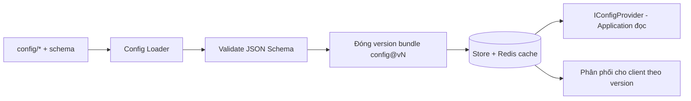

# Infrastructure Layer

> Hiện thực các port của Application: EF Core (PostgreSQL), repositories, Redis cache, Configuration Service, migration. Không chứa business rule.

---

## 1. Persistence — EF Core + PostgreSQL

| Chủ đề | Thiết kế |
|---|---|
| ORM | EF Core (code-first) |
| DB | PostgreSQL (nguồn sự thật — ADR-007) |
| Repository | Implements port (`IHeroRepository`...); truy vấn gọn, không rò EF ra Application |
| UnitOfWork | Bọc transaction (TransactionBehavior gọi) — atomic cho giao dịch nhạy cảm |
| Mapping | EF configuration tách (`IEntityTypeConfiguration`), không annotate domain |
| Aggregate | Ghi qua aggregate root (`PlayerProfile`) để giữ nhất quán |

**Nguyên tắc:** Domain không biết EF; mapping ở Infrastructure. Query đọc nhiều có thể dùng projection/`AsNoTracking`.

---

## 2. Caching — Redis

| Dùng cho | Ghi chú |
|---|---|
| Config bundle versioned | Phân phối nhanh cho client (ADR-005) |
| Query đọc nhiều (leaderboard, static data) | CachingBehavior, TTL hợp lý |
| Session/token phụ trợ, rate-limit | Chống lạm dụng |
| Idempotency keys | Chống double-claim/summon (ADR-007) |
| Server time/schedule anchor | Hỗ trợ AFK/energy (ADR-008) |

**Nguyên tắc:** cache là tối ưu, **không** là nguồn sự thật; invalidation theo version/sự kiện.

---

## 3. Configuration Service (ADR-005)

- Implements `IConfigProvider` cho Application/Domain policy đọc số liệu.
- Bundle **bất biến, versioned**; đổi giá trị = publish version mới.
- Nền cho feature flags/schedule (ADR-006, `../liveops/`).

---

## 4. Deterministic Combat Simulator (server)
- Implements `ICombatSimulator` (port) — bộ sim thuần, integer/fixed-point, seeded (ADR-011).
- Đọc chỉ số từ `IConfigProvider`; **không** I/O trong vòng lặp sim.
- Dùng chung đặc tả với client sim; golden test vector (`../testing/`).

---

## 5. Migration & schema versioning

| Chủ đề | Thiết kế |
|---|---|
| DB migration | EF Core Migrations; chạy có kiểm soát khi deploy (`../deployment/`) |
| Backward-compat | Ưu tiên migration cộng thêm (additive) trước khi xoá (`../mvp/09` TE4) |
| Profile version | Trường version + migration dữ liệu người chơi khi đổi cấu trúc (ADR-007) |
| Config schema version | `schema_version` + compat rule (ADR-005) |
| Seed data | Script seed cho môi trường dev/test (`scripts/db`) |

---

## 6. Background Jobs
- Hàng đợi/job cho: gửi mail hàng loạt, tổng hợp leaderboard, dọn dữ liệu tạm, tác vụ định kỳ LiveOps.
- Dùng scheduler (vd Hangfire/Quartz hoặc hosted service) — chốt cụ thể ở implementation (đặt sau bootstrap).
- Job **idempotent**; dựa server time.

## 7. Liên kết
- Ports định nghĩa ở: `domain-and-application.md`
- Cross-cutting (auth/log/monitor): `cross-cutting.md`
- ADR-005, ADR-007, ADR-011
