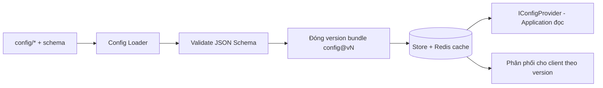

# Infrastructure Layer

> Hiện thực các port của Application: EF Core (PostgreSQL), repositories, Redis cache, Configuration Service, migration. Không chứa business rule.

---

## 1. Persistence — EF Core + PostgreSQL

| Chủ đề | Thiết kế |
|---|---|
| ORM | EF Core 9 (code-first) + Npgsql provider |
| DB | PostgreSQL (nguồn sự thật — ADR-007) |
| Repository | Implements port (`IHeroRepository`...); truy vấn gọn, không rò EF ra Application |
| UnitOfWork | Bọc transaction (TransactionBehavior gọi) — atomic cho giao dịch nhạy cảm |
| Mapping | EF configuration tách (`IEntityTypeConfiguration`), không annotate domain |
| Aggregate | Ghi qua aggregate root (`PlayerProfile`) để giữ nhất quán |

**Nguyên tắc:** Domain không biết EF; mapping ở Infrastructure. Query đọc nhiều có thể dùng projection/`AsNoTracking`.

### 1.1 Nền persistence đã chốt (Phase 11 — đóng & verify)

Nguồn hiện thực ở **`GameTeam.Infrastructure/Persistence/`** (EF Core CHỈ ở Infrastructure; NetArchTest
`Application_should_not_depend_on_efcore_or_npgsql` gác cổng):

| Thành phần | File | Ghi chú |
|---|---|---|
| `AppDbContext` | `Persistence/AppDbContext.cs` | Ctor `(DbContextOptions<AppDbContext>, DomainEventDispatcher)`; `OnModelCreating` = `ApplyConfigurationsFromAssembly`; **override `SaveChangesAsync`** dispatch domain event. Ctor `protected` không-generic cho context dẫn xuất (test). |
| EF configuration | `Persistence/Configurations/*` | Một `IEntityTypeConfiguration<T>`/entity; **bảng/cột `snake_case` tường minh** (`ToTable`/`HasColumnName`), key/constraint rõ. |
| `IRepository<TEntity,TId>` | `Persistence/Repositories/EfRepository.cs` | Generic (`Set<TEntity>()`), chỉ `GetByIdAsync`+`AddAsync` (contract Phase 10); **không** rò `IQueryable`/`DbSet`/`DbContext`. |
| `IUnitOfWork` | `Persistence/UnitOfWork.cs` | `Begin/Commit/Rollback` qua EF transaction. Port **không** có SaveChanges ⇒ **`CommitAsync` tự gọi `SaveChangesAsync`** (persist+dispatch) rồi commit tx. Scoped; `IAsyncDisposable`; guard double-begin. |
| Domain-event dispatch | `Persistence/DomainEventDispatcher.cs` + `DomainEventNotification<T>` | Bọc mỗi `IDomainEvent` (marker thuần) trong `DomainEventNotification<TEvent> : INotification` rồi MediatR `IPublisher.Publish` (đóng generic theo kiểu runtime, cache factory). |
| Schema version | `Persistence/SchemaMetadata.cs` (+ config) | Bảng `schema_metadata` một hàng (`id`,`version`), **seed `version=1`** ở migration `Initial` (ADR-007). Neo versioning; profile per-row version ở phase 19. |
| Migration | `Persistence/Migrations/*_Initial.cs` | `dotnet ef migrations add Initial`. Design-time factory `AppDbContextFactory` đọc env `ConnectionStrings__Postgres` (fallback dev-compose). |
| DI | `DependencyInjection.cs` | `AddInfrastructure` đăng ký `AppDbContext`(Npgsql) + `IUnitOfWork`/`IRepository<,>`(scoped) + `DomainEventDispatcher` + `IClock`. |

**Connection string:** lấy từ config khoá **`ConnectionStrings:Postgres`** (env `ConnectionStrings__Postgres`) —
**không hardcode**; thiếu ⇒ `AddInfrastructure` ném lỗi rõ. Mặc định local ở `appsettings.json` khớp
`deploy/compose/docker-compose.yml` (dev-only; production override qua env/secret).

**Domain-event dispatch (nhất quán — ADR-007):** `SaveChangesAsync` thu event từ mọi aggregate đang track
(`IHasDomainEvents` — marker BCL-only ở `GameTeam.Domain/Common`, do `AggregateRoot<TId>` hiện thực) → persist
(`base.SaveChangesAsync`) → publish → `ClearDomainEvents`. Vì `UnitOfWork.CommitAsync` gọi SaveChanges **trong**
transaction đang mở, event dispatch **sau persist, trước commit ⇒ cùng transaction**. Handler tái nhập / outbox
bền vững nằm ngoài phạm vi (nợ kỹ thuật, xem §5).

### 1.2 Profile persistence (Phase 19 — đóng & verify)

Bảng nghiệp vụ đầu tiên: **`player_profiles`** — gốc save server-authoritative (ADR-007), gắn 1-1 với `accounts`.

| Thành phần | File | Ghi chú |
|---|---|---|
| EF config | `Persistence/Configurations/PlayerProfileConfiguration.cs` | `ToTable("player_profiles")`; cột `snake_case`: `id`(uuid PK, `ValueGeneratedNever`), `account_id`, `display_name`, `level`, `schema_version`, `created_at`, `updated_at`. **Unique index `ix_player_profiles_account_id`** + **FK → `accounts.id`** (cascade) ⇒ 1 profile / account. `Ignore(DomainEvents)`. |
| Repository | `Persistence/Repositories/PlayerProfileRepository.cs` | Hiện thực `IPlayerProfileRepository` (`GetById`+`Add`+**`GetByAccountIdAsync`**); query giữ trong Infrastructure, **không** rò `IQueryable`/`DbContext`. |
| Migration | `Persistence/Migrations/*_AddPlayerProfiles.cs` | Tạo bảng + PK + FK + unique index. `has-pending-model-changes` sạch. |
| DI | `DependencyInjection.cs` | `AddInfrastructure` đăng ký `IPlayerProfileRepository → PlayerProfileRepository` (scoped). `DbSet<PlayerProfile>` thêm vào `AppDbContext`. |

- **Idempotency ở tầng DB (bắt buộc):** unique index trên `account_id` là bảo đảm "một profile / account" — **không** dựa
  vào `if(!exists) insert` đơn thuần. Guest login tạo `Account` + `PlayerProfile` **cùng transaction**; retry login = account
  mới (không trùng). Get-or-create tuần tự tìm-rồi-tạo; concurrent double-create thua ở unique index (không sinh hàng thứ hai).
- **Ownership (ADR-007/008):** chủ sở hữu lấy từ token `sub` qua `ICurrentUser` (adapter ở tầng Api) — không tin id client.
- **Migration dữ liệu profile ≠ EF DDL migration:** `schema_version` per-row + `PlayerProfile.Upgrade()` (read-repair, chạy
  trong transaction của `GetOrCreateProfileCommand`) là migration **dữ liệu** — xem `domain-and-application.md`. §5 dưới là
  EF DDL migration (tạo/đổi bảng).

---

## 2. Caching — Redis

| Dùng cho | Ghi chú |
|---|---|
| Config bundle versioned | Phân phối nhanh cho client (ADR-005) |
| Query đọc nhiều (leaderboard, static data) | CachingBehavior, TTL hợp lý |
| Session/token phụ trợ, rate-limit | Chống lạm dụng |
| Idempotency keys | Chống double-claim/summon (ADR-007) |
| Server time/schedule anchor | Hỗ trợ AFK/energy (ADR-008) |

**Nguyên tắc:** cache là tối ưu, **không** là nguồn sự thật; invalidation theo version/sự kiện.

### 2.1 Nền cache đã chốt (Phase 12 — đóng & verify)

Nguồn hiện thực ở **`GameTeam.Infrastructure/Caching/`** + **`Serialization/`** (StackExchange.Redis **CHỈ** ở
Infrastructure; consumer phụ thuộc port `ICacheService`, **không** biết StackExchange.Redis). Hiện thực port
Phase 10 `ICacheService`:

| Thành phần | File | Ghi chú |
|---|---|---|
| `RedisCacheService` | `Caching/RedisCacheService.cs` | Hiện thực `ICacheService` (`GetAsync`/`SetAsync`/`RemoveAsync`). Serialize JSON, TTL = **absolute expiry**, key namespaced. **Graceful degradation**: lỗi Redis (`RedisException`) hoặc entry hỏng (`JsonException`) ⇒ **log warning + degrade** (Get→miss/null, Set/Remove→bỏ qua), KHÔNG ném lên caller; lỗi lập trình (`ArgumentNullException`…) vẫn ném. |
| `RedisCacheKey` | `Caching/RedisCacheKey.cs` | Chuẩn hoá key **tập trung** theo quy ước `{env}:{domain}:{name}:{configVersion?}`; cache query dùng domain `cache` ⇒ key đầy đủ `{env}:cache:{rawKey}` (rawKey do CachingBehavior dựng, đã chứa `cfg{version}`). |
| `ResultJsonConverterFactory` | `Serialization/ResultJsonConverterFactory.cs` | Converter STJ cho `Result`/`Result<T>` (Phase 09 bất biến, ctor không public ⇒ STJ mặc định KHÔNG deserialize được). CachingBehavior cache nguyên `Result<T>` ⇒ bắt buộc. Giữ Domain sạch (không attribute JSON trong Domain). |
| `CacheSerialization` | `Serialization/CacheSerialization.cs` | `JsonSerializerOptions` **dùng chung, bất biết** (Web defaults + converter, `MakeReadOnly`) ⇒ serialize deterministic. |
| DI | `DependencyInjection.cs` | `AddInfrastructure` đăng ký `IConnectionMultiplexer` **singleton** (`AbortOnConnectFail=false` ⇒ boot không chặn/ném khi Redis down) + `ICacheService → RedisCacheService`. |

**Connection string:** lấy từ config khoá **`ConnectionStrings:Redis`** (env `ConnectionStrings__Redis`) —
**không hardcode** host/port/password; thiếu ⇒ `AddInfrastructure` fail-fast. Mặc định local ở
`appsettings.json` (`localhost:6379`) khớp `deploy/compose/docker-compose.yml` (`redis:6379` inject cho profile
`api`).

**Quy ước key** `{env}:{domain}:{name}:{configVersion?}` — ví dụ `dev:cache:GetServerTimeQuery:server-time:cfg0`.
`env` từ `ASPNETCORE_ENVIRONMENT` (mặc định `dev`); `configVersion` do CachingBehavior gấp vào `name`
(`cfg{IConfigProvider.CurrentVersion.Bundle}`) ⇒ rollout config tự vô hiệu cache cũ. **TTL** là absolute expiry
do caller khai (`ICacheableQuery.CacheTtl`); bundle config bất biến `config@vN` (ADR-005) ⇒ an toàn cache dài,
key gắn version tránh dữ liệu cũ.

**Failure behavior (graceful degradation — tiêu chí đóng phase):** Redis **không** là điểm chết đơn của request.
Redis down ⇒ cache degrade (Get miss ⇒ caller chạy nguồn thật; Set/Remove bỏ qua) + **log warning**, request vẫn
phục vụ. **Healthcheck** `/health` ping Redis (`PingAsync`, timeout ngắn): `{"status":"ok"}` khi truy cập được,
`{"status":"degraded"}` khi không — vẫn HTTP 200 (liveness semantics; full health checks = phase 13+).

**Integration test** (`GameTeam.Infrastructure.Tests/Caching/`): **Testcontainers Redis** (`redis:7-alpine`) — Redis
thật, **yêu cầu Docker** (CI `ubuntu-latest` có sẵn; local `scripts/dev/up`). Bao phủ: set/get (kể cả `Result<T>`),
**TTL hết hạn** (poll, không sleep dài), remove, **down→degrade** (endpoint chết ⇒ không ném + log warning), và
**CachingBehavior chạy thật với Redis** (query lần 2 cache hit, handler chỉ chạy 1 lần). Key GUID để cô lập, không
phụ thuộc thứ tự chạy.

---

## 2.5 Auth: JWT token service (Phase 18 — đóng & verify)

Nền auth guest sống ở **`GameTeam.Infrastructure/Auth/`** (thư viện JWT **chỉ** ở Infrastructure — Application chỉ
phụ thuộc port `ITokenService`; NetArchTest `Application_should_not_depend_on_jwt_or_authentication_frameworks` gác).

- **`JwtTokenService : ITokenService`** phát access token **HS256** (khoá đối xứng) với claims `sub` = account id,
  `type` = `guest`, cùng `jti`/`iat`/`nbf`/`exp`/`iss`/`aud`. Thời gian lấy từ **`IClock`** (server-time boundary —
  không wall-clock). **Refresh token** = chuỗi 256-bit ngẫu nhiên (base64url) — **nền tảng**; validation/rotation/
  persistence refresh là phase sau (không làm ở đây). **Không log** khoá/token.
- **`JwtOptions`** (Options pattern, section `Jwt`): `Issuer`/`Audience`/`AccessTokenMinutes` (không bí mật, ở
  appsettings) + **`SigningKey`** lấy từ secret/env **`Jwt__SigningKey`** — **không hardcode/commit**. `AddInfrastructure`
  đăng ký `IOptions<JwtOptions>` **lazy** (factory) rồi **fail-fast** khi resolve nếu thiếu key/issuer/audience hoặc
  key < 256-bit (đăng ký lazy để build-time OpenAPI gen không cần key). Đây là **Options pattern đầu tiên** của repo —
  các phase sau gom cấu hình nhóm nên theo mẫu này thay vì đọc rời rạc.
- **Account persistence:** `Account` là aggregate nghiệp vụ (Domain) — bảng **`accounts`** (`AccountConfiguration`,
  snake_case: `id uuid` PK, `type int`, `created_at timestamptz`), migration **`AddAccounts`**. `AccountCreated` dispatch
  tại `SaveChanges` (Phase 11). Bảng liên kết provider (`account_providers`) là **tương lai/Post-MVP** — chưa tạo.
- **Bật scheme + authorization mặc định** nằm ở **`AddApi`** (tầng Web) — xem `api-and-versioning.md` §4.5.
- **Test:** `JwtTokenServiceTests` (claims/lifetime/refresh duy nhất) + `AccountPersistenceTests` (Testcontainers
  `postgres:16-alpine`: CRUD + `AccountCreated` dispatch). Auth HTTP end-to-end ở `Api.IntegrationTests`.

---

## 3. Configuration Service (ADR-005)



- Implements `IConfigProvider` cho Application/Domain policy đọc số liệu.
- Bundle **bất biến, versioned**; đổi giá trị = publish version mới.
- Nền cho feature flags/schedule (ADR-006, `../liveops/`).

### 3.1 Nền Configuration Service đã chốt (Phase 21 — đóng & verify)

Nguồn hiện thực ở **`GameTeam.Infrastructure/Configuration/`** — SSOT **runtime** cho config (ADR-005). Pipeline:
`config/ → validate → build bundle bất biến (config@vN) → persist (DB) + cache (Redis) → flip "current" nguyên tử →
IConfigProvider`. Domain/Application đọc config **CHỈ** qua port `IConfigProvider` (không chạm filesystem — grep guard).

| Thành phần | File | Ghi chú |
|---|---|---|
| `RuntimeConfigProvider` | `Configuration/RuntimeConfigProvider.cs` | Hiện thực `IConfigProvider` (thay `DefaultConfigProvider`). Giữ **snapshot bất biến trong bộ nhớ** (`ConfigSnapshot`, swap qua field `volatile`); `CurrentVersion` + `Get<T>(type,id)` (deserialize entry JSON→T, snake_case) + `GetIds(type)` — **đồng bộ, không I/O** (an toàn hot path; `CachingBehavior` đọc `CurrentVersion.Bundle` đồng bộ). Singleton; publisher gọi `Apply(snapshot)`. |
| `ConfigBundleBuilder` | `Configuration/ConfigBundleBuilder.cs` | Gộp entity → `data{type:{id:node}}` (đủ 8 type key, sort). **Checksum SHA-256 xác định** trên canonical `{schema_version,data}` (sort key đệ quy ⇒ độc lập thứ tự file/JSON; **loại `generated_at`** ⇒ redeploy trùng không đổi checksum). `ComposeBundleJson` ⇒ tài liệu envelope canonical phục vụ **nguyên văn**. |
| `ConfigBundlePublisher` | `Configuration/ConfigBundlePublisher.cs` | Điều phối: `ConfigValidationRunner.Run` (**tái dùng core lib phase 07** qua ProjectReference — một nguồn validate) → fail ⇒ **không publish** (current giữ nguyên, nạp lại last-good) → build + checksum → **dedup** (checksum trùng current ⇒ không bump) → `newVersion=current+1` → `SaveAndPublishAsync` → `provider.Apply`. |
| `ConfigBundleStore` | `Configuration/ConfigBundleStore.cs` | DB (`AppDbContext`) + cache. `GetByVersionAsync` (Redis→DB fallback→re-warm), `GetCurrentAsync` (theo con trỏ). `SaveAndPublishAsync`: insert bundle + flip con trỏ `config_current` **trong 1 transaction** (persist+flip nguyên tử), warm cache **sau commit**. Cache tái dùng `ICacheService` (Phase 12), key `config-bundle:config@vN`, TTL dài (immutable). |
| `ConfigPublishHostedService` | `Configuration/ConfigPublishHostedService.cs` | **Publish khi deploy (MVP)**: `IHostedService` chạy `PublishAsync` MỘT LẦN lúc boot. **Best-effort/graceful degradation** — mọi lỗi boot (DB chưa migrate…) log Warning + nuốt, KHÔNG sập host; provider phục vụ bundle đã publish trước đó nếu có. |
| `ConfigServiceOptions` + `ConfigPathResolver` | `Configuration/*` | Options section `ConfigService` (`ConfigRoot`/`SchemaRoot`, mặc định repo-relative). Resolver tìm repo root (ancestor chứa `config/` + `shared/config-schema/`) ⇒ chạy đúng bất kể working dir; test truyền path tuyệt đối. |
| Persistence | `Persistence/ConfigBundleRecord.cs` (bảng `config_bundles`) + `ConfigCurrentPointer.cs` (bảng `config_current`) + `Configurations/*` + migration `AddConfigBundles` | `config_bundles`: `version`(PK int), `config_version`(text, unique index), `schema_version`, `checksum`, `generated_at`, `payload`(text — envelope nguyên văn). **Immutable** (một row/version, không sửa). `config_current`: singleton (`id`,`current_version`) — con trỏ "current", **không seed** (rỗng = chưa publish). |

- **Bundle envelope** (payload phục vụ): `{ schema_version, config_version:"config@vN", checksum, generated_at, data:{type:{id:entry}} }` — khớp `shared/config-schema/config-bundle.schema.json` (client parse ở phase 22). `schema_version` = `VersionValidator.SupportedSchemaVersion` (=1).
- **Atomic publish (rủi ro nửa chừng):** con trỏ `current` chỉ flip **sau** khi validate + build + checksum + persist xong, **trong** transaction cùng insert bundle. Publish lỗi giữa chừng ⇒ rollback ⇒ current vẫn trỏ version cũ; bundle chưa hoàn tất KHÔNG bao giờ là "current".
- **Immutable cache theo version:** mỗi `config@vN` một key Redis riêng (không overwrite); ADR-005 ⇒ an toàn cache dài. Bump `CurrentVersion.Bundle` tự vô hiệu cache query (`CachingBehavior`, §2.1).
- **Endpoint** (tầng Api, version set, `.AllowAnonymous` — bundle là nội dung chung): `GET /api/v1/config/current` (→ `ConfigBundleDto`) + `GET /api/v1/config/bundle?bundleVersion=N` (payload nguyên văn; thiếu ⇒ current; không có ⇒ 404 `ErrorEnvelope` `CONFIG_BUNDLE_NOT_FOUND`). Param `bundleVersion` (KHÔNG `version`) để tránh trùng token `{version:apiVersion}` — xem `api-and-versioning.md`.
- **Test:** unit `ConfigBundleBuilderTests` (6 — checksum xác định/độc lập thứ tự/đổi giá trị) + integration Testcontainers `postgres:16-alpine`+`redis:7-alpine` `ConfigServiceIntegrationTests` (5 — publish→provider, version bump + giữ bản cũ, validator-fail chặn, redeploy trùng không bump, immutable Redis key) + `Api.IntegrationTests/ConfigEndpointTests` (4 — current/bundle anonymous + 404). Yêu cầu Docker.
- **Tái dùng, KHÔNG reinvent:** validate = core lib phase 07 (không fork validator thứ 2); cache = `ICacheService` phase 12; persist = `AppDbContext`/migration phase 11; endpoint = version set + `ApiResults`/`ErrorEnvelope` phase 13. Typed config POCO (hero/skill) = phase 27+; client bundle e2e/caching = phase 22; live swap/feature flags = Post-MVP/phase 49.

Decision log: `.memory/0019-config-service-standardized.md`.

---

## 4. Deterministic Combat Simulator (server)
- Implements `ICombatSimulator` (port) — bộ sim thuần, integer/fixed-point, seeded (ADR-011).
- Đọc chỉ số từ `IConfigProvider`; **không** I/O trong vòng lặp sim.
- Dùng chung đặc tả với client sim; golden test vector (`../testing/`).

---

## 5. Migration & schema versioning

| Chủ đề | Thiết kế |
|---|---|
| DB migration | EF Core Migrations; chạy có kiểm soát khi deploy (`../deployment/`) |
| Backward-compat | Ưu tiên migration cộng thêm (additive) trước khi xoá (`../mvp/09` TE4) |
| Profile version | `PlayerProfile.SchemaVersion` per-row + `Upgrade()` migrate dữ liệu (read-repair) khi đổi cấu trúc (ADR-007, Phase 19 — §1.2). Đổi cấu trúc profile ⇒ **bump `SchemaVersion` + bước `MigrateV{n}ToV{n+1}` + test preservation + EF migration** cùng change. |
| Config schema version | `schema_version` + compat rule (ADR-005) |
| Seed data | Script seed cho môi trường dev/test (`scripts/db`) |

### 5.1 Cách chạy migration & integration test (Phase 11)

**Migration** (design-time factory tự cấp DbContext; `add` không cần DB, `update` cần Postgres):
```bash
# Tạo migration mới (output vào Persistence/Migrations)
dotnet ef migrations add <Name> \
  --project server/src/GameTeam.Infrastructure --startup-project server/src/GameTeam.Infrastructure \
  --output-dir Persistence/Migrations

# Kiểm drift (không cần DB) — phải "No changes"
dotnet ef migrations has-pending-model-changes \
  --project server/src/GameTeam.Infrastructure --startup-project server/src/GameTeam.Infrastructure

# Apply/rollback trên Postgres dev (scripts/dev/up trước); connection lấy từ env ConnectionStrings__Postgres
dotnet ef database update  --project server/src/GameTeam.Infrastructure --startup-project server/src/GameTeam.Infrastructure
dotnet ef database update 0 --project server/src/GameTeam.Infrastructure --startup-project server/src/GameTeam.Infrastructure  # down
```
> Migration là **artifact source-controlled**; mọi thay đổi schema đi qua migration — **không** sửa DB thủ công
> để thay migration workflow. **Không** sửa file migration bằng tay để che lỗi model (seed dùng `HasData` ⇒ nằm
> trong model snapshot, không drift).

**Integration test** (`GameTeam.Infrastructure.Tests`): **Testcontainers PostgreSQL** (`postgres:16-alpine`) — DB
thật cho hành vi SQL đúng. **Yêu cầu Docker runtime** (CI `ubuntu-latest` có sẵn; local chạy `scripts/dev/up`).
Chạy: `dotnet test server/tests/GameTeam.Infrastructure.Tests/...`. Bao phủ: CRUD qua repo/UoW, **rollback thực**,
**domain-event dispatch** sau SaveChanges, migration up/down; **profile (Phase 19)**: round-trip theo `account_id`,
**unique index chặn profile thứ hai**, dispatch `PlayerProfileCreated`, **migrate v0→current giữ nguyên dữ liệu**. Entity mẫu
sống trong assembly test (`TestDbContext : AppDbContext`) để **giữ schema production sạch** — không map bảng demo vào
Infrastructure. Profile end-to-end (login→profile→`GET /profile`, authz chủ sở hữu) ở `GameTeam.Api.IntegrationTests`
(Testcontainers Postgres).

**Nợ kỹ thuật (ghi nhận, dùng sau):** bảng/khoá **idempotency** (chống double-grant, ADR-007) đặt nền ở phase này
nhưng **dùng thật ở phase 31 (currency)/37 (AFK)**; **outbox bền vững / handler tái nhập** chưa làm (dispatch
in-process tối giản). Redis (phase 12), Config Service (phase 21), bảng nghiệp vụ (profile phase 19+).

---

## 6. Background Jobs
- Hàng đợi/job cho: gửi mail hàng loạt, tổng hợp leaderboard, dọn dữ liệu tạm, tác vụ định kỳ LiveOps.
- Dùng scheduler (vd Hangfire/Quartz hoặc hosted service) — chốt cụ thể ở implementation (đặt sau bootstrap).
- Job **idempotent**; dựa server time.

## 7. Liên kết
- Ports định nghĩa ở: `domain-and-application.md`
- Cross-cutting (auth/log/monitor): `cross-cutting.md`
- ADR-005, ADR-007, ADR-011
