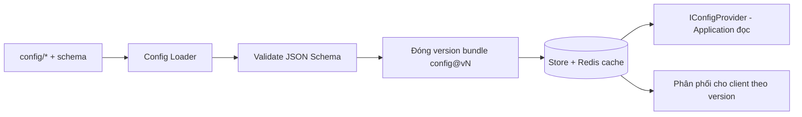

# Infrastructure Layer

> Hiện thực các port của Application: EF Core (PostgreSQL), repositories, Redis cache, Configuration Service, migration. Không chứa business rule.

---

## 1. Persistence — EF Core + PostgreSQL

| Chủ đề | Thiết kế |
|---|---|
| ORM | EF Core 9 (code-first) + Npgsql provider |
| DB | PostgreSQL (nguồn sự thật — ADR-007) |
| Repository | Implements port (`IHeroRepository`...); truy vấn gọn, không rò EF ra Application |
| UnitOfWork | Bọc transaction (TransactionBehavior gọi) — atomic cho giao dịch nhạy cảm |
| Mapping | EF configuration tách (`IEntityTypeConfiguration`), không annotate domain |
| Aggregate | Ghi qua aggregate root (`PlayerProfile`) để giữ nhất quán |

**Nguyên tắc:** Domain không biết EF; mapping ở Infrastructure. Query đọc nhiều có thể dùng projection/`AsNoTracking`.

### 1.1 Nền persistence đã chốt (Phase 11 — đóng & verify)

Nguồn hiện thực ở **`GameTeam.Infrastructure/Persistence/`** (EF Core CHỈ ở Infrastructure; NetArchTest
`Application_should_not_depend_on_efcore_or_npgsql` gác cổng):

| Thành phần | File | Ghi chú |
|---|---|---|
| `AppDbContext` | `Persistence/AppDbContext.cs` | Ctor `(DbContextOptions<AppDbContext>, DomainEventDispatcher)`; `OnModelCreating` = `ApplyConfigurationsFromAssembly`; **override `SaveChangesAsync`** dispatch domain event. Ctor `protected` không-generic cho context dẫn xuất (test). |
| EF configuration | `Persistence/Configurations/*` | Một `IEntityTypeConfiguration<T>`/entity; **bảng/cột `snake_case` tường minh** (`ToTable`/`HasColumnName`), key/constraint rõ. |
| `IRepository<TEntity,TId>` | `Persistence/Repositories/EfRepository.cs` | Generic (`Set<TEntity>()`), chỉ `GetByIdAsync`+`AddAsync` (contract Phase 10); **không** rò `IQueryable`/`DbSet`/`DbContext`. |
| `IUnitOfWork` | `Persistence/UnitOfWork.cs` | `Begin/Commit/Rollback` qua EF transaction. Port **không** có SaveChanges ⇒ **`CommitAsync` tự gọi `SaveChangesAsync`** (persist+dispatch) rồi commit tx. Scoped; `IAsyncDisposable`; guard double-begin. |
| Domain-event dispatch | `Persistence/DomainEventDispatcher.cs` + `DomainEventNotification<T>` | Bọc mỗi `IDomainEvent` (marker thuần) trong `DomainEventNotification<TEvent> : INotification` rồi MediatR `IPublisher.Publish` (đóng generic theo kiểu runtime, cache factory). |
| Schema version | `Persistence/SchemaMetadata.cs` (+ config) | Bảng `schema_metadata` một hàng (`id`,`version`), **seed `version=1`** ở migration `Initial` (ADR-007). Neo versioning; profile per-row version ở phase 19. |
| Migration | `Persistence/Migrations/*_Initial.cs` | `dotnet ef migrations add Initial`. Design-time factory `AppDbContextFactory` đọc env `ConnectionStrings__Postgres` (fallback dev-compose). |
| DI | `DependencyInjection.cs` | `AddInfrastructure` đăng ký `AppDbContext`(Npgsql) + `IUnitOfWork`/`IRepository<,>`(scoped) + `DomainEventDispatcher` + `IClock`. |

**Connection string:** lấy từ config khoá **`ConnectionStrings:Postgres`** (env `ConnectionStrings__Postgres`) —
**không hardcode**; thiếu ⇒ `AddInfrastructure` ném lỗi rõ. Mặc định local ở `appsettings.json` khớp
`deploy/compose/docker-compose.yml` (dev-only; production override qua env/secret).

**Domain-event dispatch (nhất quán — ADR-007):** `SaveChangesAsync` thu event từ mọi aggregate đang track
(`IHasDomainEvents` — marker BCL-only ở `GameTeam.Domain/Common`, do `AggregateRoot<TId>` hiện thực) → persist
(`base.SaveChangesAsync`) → publish → `ClearDomainEvents`. Vì `UnitOfWork.CommitAsync` gọi SaveChanges **trong**
transaction đang mở, event dispatch **sau persist, trước commit ⇒ cùng transaction**. Handler tái nhập / outbox
bền vững nằm ngoài phạm vi (nợ kỹ thuật, xem §5).

---

## 2. Caching — Redis

| Dùng cho | Ghi chú |
|---|---|
| Config bundle versioned | Phân phối nhanh cho client (ADR-005) |
| Query đọc nhiều (leaderboard, static data) | CachingBehavior, TTL hợp lý |
| Session/token phụ trợ, rate-limit | Chống lạm dụng |
| Idempotency keys | Chống double-claim/summon (ADR-007) |
| Server time/schedule anchor | Hỗ trợ AFK/energy (ADR-008) |

**Nguyên tắc:** cache là tối ưu, **không** là nguồn sự thật; invalidation theo version/sự kiện.

### 2.1 Nền cache đã chốt (Phase 12 — đóng & verify)

Nguồn hiện thực ở **`GameTeam.Infrastructure/Caching/`** + **`Serialization/`** (StackExchange.Redis **CHỈ** ở
Infrastructure; consumer phụ thuộc port `ICacheService`, **không** biết StackExchange.Redis). Hiện thực port
Phase 10 `ICacheService`:

| Thành phần | File | Ghi chú |
|---|---|---|
| `RedisCacheService` | `Caching/RedisCacheService.cs` | Hiện thực `ICacheService` (`GetAsync`/`SetAsync`/`RemoveAsync`). Serialize JSON, TTL = **absolute expiry**, key namespaced. **Graceful degradation**: lỗi Redis (`RedisException`) hoặc entry hỏng (`JsonException`) ⇒ **log warning + degrade** (Get→miss/null, Set/Remove→bỏ qua), KHÔNG ném lên caller; lỗi lập trình (`ArgumentNullException`…) vẫn ném. |
| `RedisCacheKey` | `Caching/RedisCacheKey.cs` | Chuẩn hoá key **tập trung** theo quy ước `{env}:{domain}:{name}:{configVersion?}`; cache query dùng domain `cache` ⇒ key đầy đủ `{env}:cache:{rawKey}` (rawKey do CachingBehavior dựng, đã chứa `cfg{version}`). |
| `ResultJsonConverterFactory` | `Serialization/ResultJsonConverterFactory.cs` | Converter STJ cho `Result`/`Result<T>` (Phase 09 bất biến, ctor không public ⇒ STJ mặc định KHÔNG deserialize được). CachingBehavior cache nguyên `Result<T>` ⇒ bắt buộc. Giữ Domain sạch (không attribute JSON trong Domain). |
| `CacheSerialization` | `Serialization/CacheSerialization.cs` | `JsonSerializerOptions` **dùng chung, bất biết** (Web defaults + converter, `MakeReadOnly`) ⇒ serialize deterministic. |
| DI | `DependencyInjection.cs` | `AddInfrastructure` đăng ký `IConnectionMultiplexer` **singleton** (`AbortOnConnectFail=false` ⇒ boot không chặn/ném khi Redis down) + `ICacheService → RedisCacheService`. |

**Connection string:** lấy từ config khoá **`ConnectionStrings:Redis`** (env `ConnectionStrings__Redis`) —
**không hardcode** host/port/password; thiếu ⇒ `AddInfrastructure` fail-fast. Mặc định local ở
`appsettings.json` (`localhost:6379`) khớp `deploy/compose/docker-compose.yml` (`redis:6379` inject cho profile
`api`).

**Quy ước key** `{env}:{domain}:{name}:{configVersion?}` — ví dụ `dev:cache:GetServerTimeQuery:server-time:cfg0`.
`env` từ `ASPNETCORE_ENVIRONMENT` (mặc định `dev`); `configVersion` do CachingBehavior gấp vào `name`
(`cfg{IConfigProvider.CurrentVersion.Bundle}`) ⇒ rollout config tự vô hiệu cache cũ. **TTL** là absolute expiry
do caller khai (`ICacheableQuery.CacheTtl`); bundle config bất biến `config@vN` (ADR-005) ⇒ an toàn cache dài,
key gắn version tránh dữ liệu cũ.

**Failure behavior (graceful degradation — tiêu chí đóng phase):** Redis **không** là điểm chết đơn của request.
Redis down ⇒ cache degrade (Get miss ⇒ caller chạy nguồn thật; Set/Remove bỏ qua) + **log warning**, request vẫn
phục vụ. **Healthcheck** `/health` ping Redis (`PingAsync`, timeout ngắn): `{"status":"ok"}` khi truy cập được,
`{"status":"degraded"}` khi không — vẫn HTTP 200 (liveness semantics; full health checks = phase 13+).

**Integration test** (`GameTeam.Infrastructure.Tests/Caching/`): **Testcontainers Redis** (`redis:7-alpine`) — Redis
thật, **yêu cầu Docker** (CI `ubuntu-latest` có sẵn; local `scripts/dev/up`). Bao phủ: set/get (kể cả `Result<T>`),
**TTL hết hạn** (poll, không sleep dài), remove, **down→degrade** (endpoint chết ⇒ không ném + log warning), và
**CachingBehavior chạy thật với Redis** (query lần 2 cache hit, handler chỉ chạy 1 lần). Key GUID để cô lập, không
phụ thuộc thứ tự chạy.

---

## 3. Configuration Service (ADR-005)



- Implements `IConfigProvider` cho Application/Domain policy đọc số liệu.
- Bundle **bất biến, versioned**; đổi giá trị = publish version mới.
- Nền cho feature flags/schedule (ADR-006, `../liveops/`).

---

## 4. Deterministic Combat Simulator (server)
- Implements `ICombatSimulator` (port) — bộ sim thuần, integer/fixed-point, seeded (ADR-011).
- Đọc chỉ số từ `IConfigProvider`; **không** I/O trong vòng lặp sim.
- Dùng chung đặc tả với client sim; golden test vector (`../testing/`).

---

## 5. Migration & schema versioning

| Chủ đề | Thiết kế |
|---|---|
| DB migration | EF Core Migrations; chạy có kiểm soát khi deploy (`../deployment/`) |
| Backward-compat | Ưu tiên migration cộng thêm (additive) trước khi xoá (`../mvp/09` TE4) |
| Profile version | Trường version + migration dữ liệu người chơi khi đổi cấu trúc (ADR-007) |
| Config schema version | `schema_version` + compat rule (ADR-005) |
| Seed data | Script seed cho môi trường dev/test (`scripts/db`) |

### 5.1 Cách chạy migration & integration test (Phase 11)

**Migration** (design-time factory tự cấp DbContext; `add` không cần DB, `update` cần Postgres):
```bash
# Tạo migration mới (output vào Persistence/Migrations)
dotnet ef migrations add <Name> \
  --project server/src/GameTeam.Infrastructure --startup-project server/src/GameTeam.Infrastructure \
  --output-dir Persistence/Migrations

# Kiểm drift (không cần DB) — phải "No changes"
dotnet ef migrations has-pending-model-changes \
  --project server/src/GameTeam.Infrastructure --startup-project server/src/GameTeam.Infrastructure

# Apply/rollback trên Postgres dev (scripts/dev/up trước); connection lấy từ env ConnectionStrings__Postgres
dotnet ef database update  --project server/src/GameTeam.Infrastructure --startup-project server/src/GameTeam.Infrastructure
dotnet ef database update 0 --project server/src/GameTeam.Infrastructure --startup-project server/src/GameTeam.Infrastructure  # down
```
> Migration là **artifact source-controlled**; mọi thay đổi schema đi qua migration — **không** sửa DB thủ công
> để thay migration workflow. **Không** sửa file migration bằng tay để che lỗi model (seed dùng `HasData` ⇒ nằm
> trong model snapshot, không drift).

**Integration test** (`GameTeam.Infrastructure.Tests`): **Testcontainers PostgreSQL** (`postgres:16-alpine`) — DB
thật cho hành vi SQL đúng. **Yêu cầu Docker runtime** (CI `ubuntu-latest` có sẵn; local chạy `scripts/dev/up`).
Chạy: `dotnet test server/tests/GameTeam.Infrastructure.Tests/...`. Bao phủ: CRUD qua repo/UoW, **rollback thực**,
**domain-event dispatch** sau SaveChanges, migration up/down. Entity mẫu sống trong assembly test
(`TestDbContext : AppDbContext`) để **giữ schema production sạch** — không map bảng demo vào Infrastructure.

**Nợ kỹ thuật (ghi nhận, dùng sau):** bảng/khoá **idempotency** (chống double-grant, ADR-007) đặt nền ở phase này
nhưng **dùng thật ở phase 31 (currency)/37 (AFK)**; **outbox bền vững / handler tái nhập** chưa làm (dispatch
in-process tối giản). Redis (phase 12), Config Service (phase 21), bảng nghiệp vụ (profile phase 19+).

---

## 6. Background Jobs
- Hàng đợi/job cho: gửi mail hàng loạt, tổng hợp leaderboard, dọn dữ liệu tạm, tác vụ định kỳ LiveOps.
- Dùng scheduler (vd Hangfire/Quartz hoặc hosted service) — chốt cụ thể ở implementation (đặt sau bootstrap).
- Job **idempotent**; dựa server time.

## 7. Liên kết
- Ports định nghĩa ở: `domain-and-application.md`
- Cross-cutting (auth/log/monitor): `cross-cutting.md`
- ADR-005, ADR-007, ADR-011
