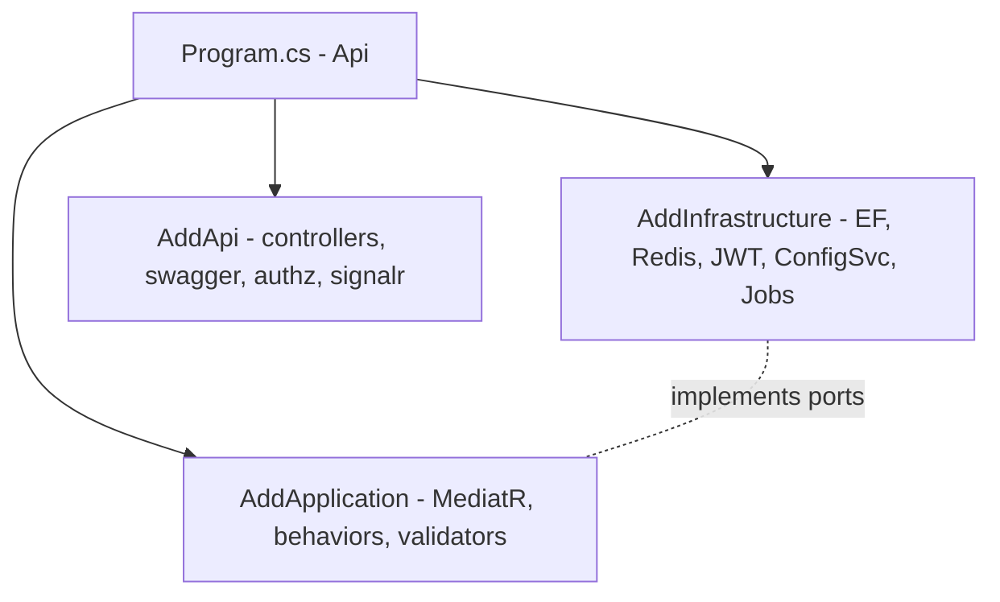

# Backend Solution Structure

> Cấu trúc solution .NET 9 theo Clean Architecture + DI. Xem cây thư mục ở `../architecture/project-structure.md` §4.

---

## 1. Projects & tầng

| Project | Tầng | Trách nhiệm | Phụ thuộc |
|---|---|---|---|
| `GameTeam.Domain` | Domain | Entity/Aggregate/VO/Domain Service/Domain Event, invariant, business rule thuần | (không) |
| `GameTeam.Application` | Application | Command/Query (CQRS), MediatR handler, port/interface, validator, pipeline behavior | Domain, Contracts |
| `GameTeam.Infrastructure` | Infrastructure | EF Core, repository impl, Redis, JWT, Configuration Service, jobs, adapters | Application, Domain |
| `GameTeam.Api` | Presentation | Controllers/Minimal API, SignalR hubs, DTO mapping, auth, composition root (DI) | Application, Infrastructure (chỉ để wiring), Contracts |
| `GameTeam.Contracts` | Chia sẻ | DTO/request/response versioned; nguồn codegen client | Domain (enum/hằng) |

**Quy tắc:** phụ thuộc chỉ hướng vào trong. Chỉ `Api` (entry) biết `Infrastructure` cụ thể để đăng ký DI. Handler chỉ thấy **interface** (`../architecture/dependency-graph.md`).

---

## 2. Composition root & DI



- Mỗi tầng có extension `IServiceCollection Add<Layer>()` để đăng ký gọn.
- DI theo constructor injection; lifetime rõ ràng (scoped cho DbContext/handler, singleton cho config cache client...).
- **Không** service locator trong Domain/Application.

---

## 3. Feature-folder trong Application (modular)

Trong `GameTeam.Application`, tổ chức **theo feature**, không theo "loại file":

```text
Application/
├── Common/            # behaviors, interfaces (ports), result types
│   ├── Behaviors/     # Validation, Logging, Transaction, Caching
│   ├── Ports/         # IHeroRepository, IConfigProvider, IClock, IUnitOfWork...
│   └── Results/
├── Heroes/            # commands/queries/validators/handlers cho hero
├── Battles/
├── Summons/
├── Campaigns/
├── Economy/           # currency, afk, shop, quest
└── Progression/
```

**WHY:** feature-folder giúp AI/dev nạp đúng ngữ cảnh, giảm coupling, dễ tách microservice sau (`../mvp/09` SC1).

---

## 4. Ánh xạ Clean Architecture ↔ dependency rule

| Từ → Đến | Được phép? | Lý do |
|---|---|---|
| Api → Application | ✅ | Gọi command/query |
| Api → Infrastructure | ✅ (chỉ DI wiring) | Composition root |
| Application → Domain | ✅ | Dùng business rule |
| Infrastructure → Application/Domain | ✅ | Implements port |
| Domain → bất kỳ | ❌ | Domain thuần |
| Application → Infrastructure | ❌ | Vi phạm DIP |

> Kiểm bằng **architecture test** (NetArchTest) trong CI (`../testing/backend-testing.md`).

---

## 5. Cấu hình chung
- `Directory.Build.props`: nullable, analyzers, langversion, warning-as-error (mức hợp lý).
- `Directory.Packages.props`: Central Package Management (ADR-010).
- `Dockerfile` cho `Api` (`../deployment/`).

## 6. Liên kết
- Domain/Application: `domain-and-application.md`
- Infrastructure: `infrastructure.md`
- Cross-cutting: `cross-cutting.md`
- ADR-003, ADR-010
