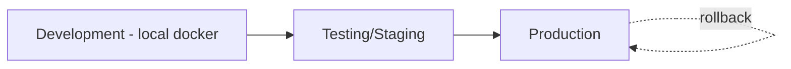

# Deployment & Operations

> Môi trường, CI/CD, release, vận hành. Nền: GitHub + GitHub Actions + Docker. Backend .NET 9 + PostgreSQL + Redis; client Godot export mobile.

## Danh mục
| File | Nội dung |
|---|---|
| [ci-cd-pipeline.md](ci-cd-pipeline.md) | GitHub Actions, build pipeline, secrets |
| [release-operations.md](release-operations.md) | Release, rollback, backup, monitoring |

---

## 1. Môi trường

| Môi trường | Mục đích | Đặc điểm |
|---|---|---|
| Development | Dev local | Docker compose (Postgres+Redis+API); Godot editor; config dev |
| Testing/Staging | Kiểm thử tích hợp, verify config/release | Gần production; dữ liệu test; nơi verify content trước prod |
| Production | Người chơi thật | HA (tương lai), backup, monitoring |

## 2. Nguyên tắc
- **Infrastructure as Code**: Docker/compose (+ k8s tương lai) trong `deploy/` (`../architecture/project-structure.md`).
- **Tách config theo môi trường**; secrets không commit.
- **Immutable artifact**: build một lần, promote qua môi trường.
- Release qua Git tag (SemVer) + CI (`../conventions/git-conventions.md`).

## 3. Thành phần triển khai

| Thành phần | Cách triển khai |
|---|---|
| Backend API | Docker image → môi trường (compose/k8s) |
| PostgreSQL/Redis | Managed hoặc container; backup (prod) |
| Config bundle | Publish qua pipeline (ADR-005) |
| Client (mobile) | Export Godot (Android trước, iOS sau — `../mvp/10` DP1) → store/APK test |

## 4. Liên kết
- CI/CD: `ci-cd-pipeline.md` · Vận hành: `release-operations.md`
- Nguồn: `../mvp/10` DP (deployment), ADR-010
