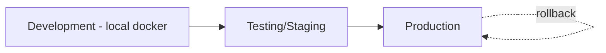

# Deployment & Operations

> Môi trường, CI/CD, release, vận hành. Nền: GitHub + GitHub Actions + Docker. Backend .NET 9 + PostgreSQL + Redis; client Godot export mobile.

## Danh mục
| File | Nội dung |
|---|---|
| [ci-cd-pipeline.md](ci-cd-pipeline.md) | GitHub Actions, build pipeline, secrets |
| [release-operations.md](release-operations.md) | Release, rollback, backup, monitoring |

---

## 1. Môi trường

| Môi trường | Mục đích | Đặc điểm |
|---|---|---|
| Development | Dev local | Docker compose (Postgres+Redis+API); Godot editor; config dev |
| Testing/Staging | Kiểm thử tích hợp, verify config/release | Gần production; dữ liệu test; nơi verify content trước prod |
| Production | Người chơi thật | HA (tương lai), backup, monitoring |



## 2. Nguyên tắc
- **Infrastructure as Code**: Docker/compose (+ k8s tương lai) trong `deploy/` (`../architecture/project-structure.md`).
- **Tách config theo môi trường**; secrets không commit.
- **Immutable artifact**: build một lần, promote qua môi trường.
- Release qua Git tag (SemVer) + CI (`../conventions/git-conventions.md`).

## 3. Thành phần triển khai

| Thành phần | Cách triển khai |
|---|---|
| Backend API | Docker image → môi trường (compose/k8s) |
| PostgreSQL/Redis | Managed hoặc container; backup (prod) |
| Config bundle | Publish qua pipeline (ADR-005) |
| Client (mobile) | Export Godot (Android trước, iOS sau — `../mvp/10` DP1) → store/APK test |

## Local development

> Môi trường dev **một lệnh** cho Postgres + Redis (+ API tuỳ chọn). Chuẩn hoá ở phase 04
> (`../roadmap/04-dev-environment-tooling.md`). Chỉ dùng cho dev/integration — **không** phải production.

### Thành phần
- `deploy/compose/docker-compose.yml`: Postgres `16-alpine` + Redis `7-alpine` (luôn bật, có healthcheck),
  service `api` sau `--profile api` (build từ `server/Dockerfile`), mạng `game-team-dev`, volume `pgdata`.
- `scripts/dev/up.{ps1,sh}` / `down.{ps1,sh}`: script đa nền tảng, idempotent, chờ healthy trước khi báo xong.
- Biến cấu hình lấy từ `.env` (copy từ `.env.example`; `.env` **không commit**).

### 1) Điều kiện tiên quyết
- Docker Desktop / Docker Engine đang chạy.
- (Chạy profile `api`) đã có `server/Dockerfile` — sẵn trong repo.
- Copy cấu hình: `cp .env.example .env` (chỉnh cổng/credential nếu cần).

### 2) Khởi động Postgres + Redis
```bash
# *nix
bash scripts/dev/up.sh
# Windows
pwsh scripts/dev/up.ps1
```
Script chờ tới khi cả hai **healthy** rồi in `docker compose ps`.

### 3) Khởi động kèm API (profile `api`)
```bash
bash scripts/dev/up.sh --api        # hoac: --profile api
pwsh scripts/dev/up.ps1 -Api
```
Ngoài Postgres+Redis, script build & chạy `api`, rồi chờ `GET /health` trả 200.

### 4) Kiểm tra health
```bash
curl http://localhost:8080/health   # -> {"status":"ok"}
```
(Đổi `8080` nếu bạn set `API_PORT` khác trong `.env`.)

### 5) Dừng môi trường (giữ dữ liệu)
```bash
bash scripts/dev/down.sh
pwsh scripts/dev/down.ps1
```
`down` mặc định **giữ** volume `game-team-dev_pgdata` — dữ liệu Postgres dev không mất.

### 6) Xoá volume có chủ đích (mất dữ liệu DB)
```bash
bash scripts/dev/down.sh -v         # hoac --volumes
pwsh scripts/dev/down.ps1 -Volumes
```

### 7) Override cổng
Sửa trong `.env` (compose đọc mặc định nếu thiếu):

| Biến | Mặc định | Dịch vụ |
|---|---|---|
| `POSTGRES_PORT` | `5432` | Postgres (host) |
| `REDIS_PORT` | `6379` | Redis (host) |
| `API_PORT` | `8080` | API (host) |

Ví dụ tránh xung đột: `POSTGRES_PORT=55432` → Postgres lắng nghe `localhost:55432`. Cổng nội bộ giữa các
container không đổi (api gọi `postgres:5432`, `redis:6379` qua mạng `game-team-dev`).

### 8) JWT signing key (Phase 18 — bắt buộc khi chạy API)
API cần khoá ký JWT lấy từ **secret/biến môi trường** — **không** commit, **không** để trong `appsettings.json`.

- Đặt trong `.env` (git-ignored): **`JWT_SIGNING_KEY=<chuỗi ≥ 32 byte / 256-bit>`** — compose `api` profile inject
  thành `Jwt__SigningKey`. Sinh nhanh: `openssl rand -base64 48`.
- Chạy API cục bộ (không qua compose): set biến môi trường `Jwt__SigningKey` trước `dotnet run`.
- Thiếu key ⇒ request đầu tiên trả **500** (fail-fast, log rõ "Thiếu Jwt:SigningKey"). `Jwt:Issuer`/`Audience`/
  `AccessTokenMinutes` là giá trị **không bí mật** ở `appsettings.json`. Chi tiết: `docs/backend/infrastructure.md` §2.5.
- **`.env.example`**: thêm dòng `JWT_SIGNING_KEY=` (placeholder rỗng) để tài liệu hoá biến này.

### 8) Troubleshooting

| Triệu chứng | Nguyên nhân | Cách xử lý |
|---|---|---|
| `bind: address already in use` cổng **5432** | Postgres khác đang chạy | Đổi `POSTGRES_PORT` trong `.env` rồi `up` lại; hoặc tắt service Postgres cũ. |
| Cổng **6379** bận | Redis khác đang chạy | Đổi `REDIS_PORT` trong `.env`. |
| Cổng **8080** bận | Dịch vụ khác chiếm 8080 | Đổi `API_PORT` trong `.env` (nhớ gọi `/health` ở cổng mới). |
| `Docker khong san sang` / `cannot connect to the Docker daemon` | Docker chưa chạy | Mở Docker Desktop / khởi động daemon rồi chạy lại `up`. |
| Container **unhealthy** / `up` báo hết thời gian chờ | Image kéo chậm, thiếu tài nguyên, cổng lỗi | `docker compose -f deploy/compose/docker-compose.yml ps` và `logs <service>`; sửa `.env`; `down` rồi `up` lại. |
| API không kết nối được Postgres/Redis | Sai connection string / DB chưa healthy | API phụ thuộc `condition: service_healthy`; đảm bảo `up` xong healthy. Trong compose api gọi `postgres`/`redis` (tên service), **không** dùng `localhost`. Kiểm `ConnectionStrings__Postgres/__Redis`. |

## 4. Liên kết
- CI/CD: `ci-cd-pipeline.md` · Vận hành: `release-operations.md`
- Nguồn: `../mvp/10` DP (deployment), ADR-010
- Dev env một lệnh: `../roadmap/04-dev-environment-tooling.md`
