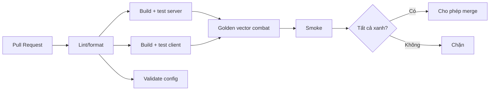

# CI/CD Pipeline (GitHub Actions)

> Pipeline build/test/validate/release trên GitHub Actions. Gate merge theo `../testing/README.md` §4.

---

## 1. Workflows

| Workflow | Trigger | Nội dung |
|---|---|---|
| `ci-server.yml` | PR/push (server/**) | Build .NET, unit+integration, architecture test, golden vector (server) |
| `ci-client.yml` | PR/push (client/**) | Godot headless: build, unit, golden vector (client), smoke |
| `validate-config.yml` | PR/push (config/**, shared/config-schema/**) | Config validator (schema + referential integrity) |
| `release.yml` | Tag `v*` | Build artifact, Docker image, publish config bundle, tạo release |
| `codeql/security` | schedule/PR | Quét bảo mật (Post-bootstrap) |

## 2. Luồng CI cho PR

## 3. Build pipeline

| Phía | Bước |
|---|---|
| Server | restore → build (warning-as-error) → test → publish → Docker image |
| Client | setup Godot (ghim version) → import → test headless → export (release) |
| Config | validate → version bundle → (release) publish lên Config Service |

## 4. Golden vector cross-phía
- Job chạy sim server + sim client trên **cùng test vector**; so khớp output (ADR-011). Lệch → fail (bảo vệ determinism).

## 4b. `ci-server.yml` chi tiết (Phase 02 — hiện trạng thực tế)

> Bảng §1–§3 mô tả pipeline **đích** (target). Mục này mô tả **đúng những gì `ci-server.yml`
> đang làm hôm nay** sau Phase 02. Các gate chưa có bản thật được đánh dấu **PLACEHOLDER**.

**Trigger & path filter.** Chạy trên `push` (`main`, `dev`) và mọi `pull_request` khi đụng:
`server/**`, `shared/**`, `server/Directory.Build.props`, `server/Directory.Packages.props`,
`.github/workflows/ci-server.yml`. Thay đổi chỉ ở client không kích hoạt pipeline này.
Có `concurrency` (huỷ run cũ cùng ref) và `permissions: contents: read` (least privilege).

| # | Nội dung | Chi tiết (job) |
|---|---|---|
| 1 | **SDK** | `actions/setup-dotnet@v4` với `global-json-file: global.json` → SDK **9.0.306** (nguồn sự thật duy nhất). |
| 2 | **Cache NuGet** | `actions/cache@v4`, `path: ~/.nuget/packages`, key = `nuget-<os>-hash(server/Directory.Packages.props)` (CPM, ADR-010; chưa dùng `packages.lock.json`), `restore-keys` fallback theo OS. |
| 3 | **Restore** | `dotnet restore server/GameTeam.sln`. |
| 4 | **Build Release** | `dotnet build … -c Release --no-restore`. |
| 5 | **Warnings-as-error** | Bật ở `server/Directory.Build.props`: compiler `TreatWarningsAsErrors=true` (cảnh báo compiler = lỗi, vỡ build). `CodeAnalysisTreatWarningsAsErrors=false` — cảnh báo analyzer **cố ý** không chặn build ở bootstrap (siết dần). Workflow không override chính sách này. |
| 6 | **Test** | `dotnet test … -c Release --no-build`; test fail ⇒ job đỏ. |
| 7 | **Coverage** | `--collect:"XPlat Code Coverage"` (coverlet.collector) → `coverage/**/coverage.cobertura.xml`. |
| 8 | **Coverage artifact** | `actions/upload-artifact@v4` tên `coverage-server`, `if-no-files-found: error` (không sinh coverage ⇒ job đỏ). |
| 9 | **Architecture gate** | Job **tách riêng** `architecture-test`: chạy `GameTeam.Application.Tests` lọc `FullyQualifiedName~ArchitectureTests` (NetArchTest). Tách khỏi `build-test` để lỗi dependency-rule hiện rõ trong CI graph. |
| 10 | **Domain→Infrastructure** | Rule `Domain_should_not_depend_on_outer_layers` (ADR-003): Domain phụ thuộc Infrastructure ⇒ `architecture-test` **đỏ**. Đã xác minh negative test (thêm leak ⇒ đỏ → revert). |
| 11 | **Path filter** | Xem danh sách `paths` ở trên (backend/shared/build-props kích hoạt; client-only thì không). |
| 12 | **`config-validate`** (hook) | **PLACEHOLDER** — job in ghi chú TODO, chưa validate thật. Bản thật: **Phase 07** (`validate-config.yml`: JSON Schema + referential integrity). |
| 13 | **`golden-vector`** (hook) | **PLACEHOLDER** — job in ghi chú TODO, chưa so khớp vector. Bản thật: **Phase 26** (sim server vs client, ADR-011 — xem §4). |

**Chưa có ở `ci-server.yml` (đích §3, để phase sau):** `publish` + Docker image, lint/format gate,
CodeQL/security (xem §1). Negative test architecture chạy thủ công/local, không phải job thường trực.

## 4c. `ci-client.yml` chi tiết (Phase 03 — hiện trạng thực tế)

> Bảng §1–§3 mô tả pipeline **đích**. Mục này mô tả **đúng những gì `ci-client.yml` làm hôm nay**
> sau Phase 03: dựng cổng nền Godot headless (import + 1 smoke test). Feature/golden test client
> mở rộng ở phase sau.

**Trigger & path filter.** `push` (`main`, `dev`) và `pull_request` khi đụng `client/**` hoặc
`.github/workflows/ci-client.yml`. Có `concurrency` (huỷ run cũ cùng ref), `permissions: contents: read`,
`timeout-minutes: 25`.

| # | Nội dung | Chi tiết |
|---|---|---|
| 1 | **Pin Godot** | `env GODOT_VERSION="4.7"`, `GODOT_RELEASE="4.7-stable"` — **phải khớp** `client/project.godot` feature `4.7` (ADR-001, ADR-010). Không dùng `latest`. |
| 2 | **Cache binary** | `actions/cache@v4`, `path: ~/godot-bin`, key `godot-<os>-4.7-stable` → không tải lại mỗi run. |
| 3 | **Download + verify** | Tải binary Linux x86_64 chính thức từ `godotengine/godot-builds` (deterministic URL) + `SHA512-SUMS.txt` cùng release; `sha512sum -c` đúng dòng của binary → **fail cứng nếu hash sai**. |
| 4 | **Version guard** | `godot --headless --version` phải khớp `GODOT_VERSION` (lệch ⇒ job đỏ). |
| 5 | **Import gate** | `godot --headless --import --path client`; **không che exit code** → lỗi import ⇒ job đỏ. |
| 6 | **gdUnit4 addon** | Vendored (commit) tại `client/addons/gdUnit4`, pin **v6.2.0** (yêu cầu Godot ≥ 4.5), enable ở `project.godot`. Plugin tự bỏ qua UI khi headless/`--import`/CLI. |
| 7 | **Smoke test** | 1 test tất định `client/tests/smoke/example_smoke_test.gd` (`extends GdUnitTestSuite`). Chạy `runtest.sh -a res://tests -rd reports` dưới `xvfb-run` (lần chạy đầu của runner cần display ảo). |
| 8 | **JUnit** | gdUnit4 ghi `client/reports/report_<n>/results.xml`; `actions/upload-artifact@v4` tên `gdunit4-results`, `if-no-files-found: error`. Test/exit ≠ 0 ⇒ job đỏ. |

**Chưa có ở `ci-client.yml` (để phase sau):** golden vector client so khớp server (**Phase 26**, ADR-011),
feature test client thật (nhóm phase 3+), export Android (**Phase 55**).

## 4d. `validate-config.yml` chi tiết (Phase 03 — hiện trạng thực tế)

**Trigger & path filter.** `push`/`pull_request` khi đụng `config/**`, `shared/config-schema/**`,
`.github/workflows/validate-config.yml`. Có `concurrency`, `permissions: contents: read`, `timeout-minutes: 10`.

| # | Nội dung | Chi tiết |
|---|---|---|
| 1 | **JSON parse-check** | Giữ nguyên (bootstrap): `python3 json.load` từng file `config/**/*.json` + `shared/config-schema/**/*.json`; JSON hỏng ⇒ `::error` + job đỏ. Hiện chỉ có `config-bundle.schema.json` (chưa có config data). |
| 2 | **`config-validator` hook** | Ngữ nghĩa `--if-present`: chạy `tools/config-validator/run.sh` nếu **executable**; nếu chưa (trước Phase 07) → in SKIP, **no-op giữ xanh**. |
| 3 | **Đường nâng cấp** | **Phase 07** chỉ cần thêm `tools/config-validator/run.sh` (JSON Schema draft 2020-12 + referential integrity) → bước hook tự động thành **GATE bắt buộc**, không phải sửa workflow. |

## 4e. `release.yml` chi tiết (Phase 03 — hiện trạng thực tế)

**Trigger.** `push` tag `v*`. `permissions: contents: write` (cần tạo GitHub Release). Xem chi tiết
release/rollback ở `release-operations.md`.

| # | Job / bước | Chi tiết |
|---|---|---|
| 1 | **`server-image`** | `setup-dotnet` theo `global.json`; cache NuGet (key theo `Directory.Packages.props`); `restore → build -c Release → test`; `timeout-minutes: 20`. |
| 2 | **Docker build** | `docker build -f server/Dockerfile -t game-team-api:<tag> .` (build context = **repo root**, khớp Dockerfile). **Không** push registry. |
| 3 | **`create-release`** | `softprops/action-gh-release@v2` với `draft: true` + `generate_release_notes: true` (`needs: server-image`); `timeout-minutes: 10`. |

**Phase 03 cố ý KHÔNG làm (để Phase 55):** push image lên registry, ký/xuất client (Android/iOS),
publish config bundle versioned, tự động publish release (chỉ tạo **draft**). Không có secret/credential
registry ở workflow này.

## 5. Secrets management
| Nguyên tắc | Chi tiết |
|---|---|
| Không commit secret | `.env`/key ngoài Git (`../architecture/project-structure.md`) |
| GitHub Secrets/Environments | Lưu token/connection string; phân theo môi trường |
| Ký ứng dụng | Keystore Android/chứng chỉ iOS lưu secret, không trong repo (`../mvp/10` DP3) |
| Least privilege | Token CI quyền tối thiểu |

## 6. Caching CI
- Cache NuGet, Godot import, để tăng tốc; không cache secret.

## 7. Liên kết
- Testing gate: `../testing/README.md` · Release: `release-operations.md`
- Git: `../conventions/git-conventions.md` · Config: ADR-005
