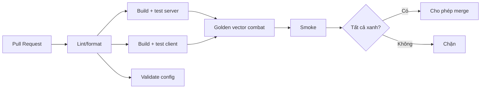

# CI/CD Pipeline (GitHub Actions)

> Pipeline build/test/validate/release trên GitHub Actions. Gate merge theo `../testing/README.md` §4.

---

## 1. Workflows

| Workflow | Trigger | Nội dung |
|---|---|---|
| `ci-server.yml` | PR/push (server/**) | Build .NET, unit+integration, architecture test, golden vector (server) |
| `ci-client.yml` | PR/push (client/**) | Godot headless: build, unit, golden vector (client), smoke |
| `validate-config.yml` | PR/push (config/**, shared/config-schema/**) | Config validator (schema + referential integrity) |
| `release.yml` | Tag `v*` | Build artifact, Docker image, publish config bundle, tạo release |
| `codeql/security` | schedule/PR | Quét bảo mật (Post-bootstrap) |

## 2. Luồng CI cho PR

## 3. Build pipeline

| Phía | Bước |
|---|---|
| Server | restore → build (warning-as-error) → test → publish → Docker image |
| Client | setup Godot (ghim version) → import → test headless → export (release) |
| Config | validate → version bundle → (release) publish lên Config Service |

## 4. Golden vector cross-phía
- Job chạy sim server + sim client trên **cùng test vector**; so khớp output (ADR-011). Lệch → fail (bảo vệ determinism).

## 5. Secrets management
| Nguyên tắc | Chi tiết |
|---|---|
| Không commit secret | `.env`/key ngoài Git (`../architecture/project-structure.md`) |
| GitHub Secrets/Environments | Lưu token/connection string; phân theo môi trường |
| Ký ứng dụng | Keystore Android/chứng chỉ iOS lưu secret, không trong repo (`../mvp/10` DP3) |
| Least privilege | Token CI quyền tối thiểu |

## 6. Caching CI
- Cache NuGet, Godot import, để tăng tốc; không cache secret.

## 7. Liên kết
- Testing gate: `../testing/README.md` · Release: `release-operations.md`
- Git: `../conventions/git-conventions.md` · Config: ADR-005
