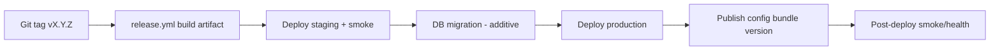

# Release, Rollback, Backup & Monitoring

> Quy trình phát hành, rollback, sao lưu và giám sát. Server-authoritative → dữ liệu người chơi & config là tài sản sống còn (`../mvp/09` BE2).

---

## 1. Release process

| Nguyên tắc | Chi tiết |
|---|---|
| SemVer tag | `vX.Y.Z` (`../conventions/git-conventions.md`) |
| Migration additive-first | Tránh phá dữ liệu (`../backend/infrastructure.md`) |
| Staging trước prod | Verify trước |
| 3 version độc lập | App / API / Config (ADR-005/008) |
| Client tương thích API | Server hỗ trợ ≥1 major cũ trong chuyển đổi (ADR-008) |

### 1a. Hiện trạng thực tế `release.yml` (Phase 03 — cổng nền)

> Sơ đồ trên là quy trình **đích**. Hôm nay sau Phase 03, `release.yml` mới làm phần đầu:

| Bước (job) | Đang làm | Ghi chú |
|---|---|---|
| Trigger | push tag `v*` | `permissions: contents: write`. |
| Build + test server | `restore → build -c Release → test` (`server-image`) | `setup-dotnet` theo `global.json`; cache NuGet. |
| Docker image | `docker build -f server/Dockerfile -t game-team-api:<tag> .` | Build context = repo root. **Không** push registry. |
| GitHub Release | `softprops/action-gh-release@v2` `draft: true` + `generate_release_notes: true` (`create-release`) | Chỉ tạo **draft**; người vận hành review rồi mới publish tay. |

**Phase 03 cố ý CHƯA làm (để Phase 55):** push image lên container registry (cần secrets),
ký/xuất client (Android/iOS keystore), publish config bundle versioned, deploy staging/prod,
migration DB, post-deploy smoke. Chưa cấu hình signing key → không lộ secret. Chi tiết pipeline:
`ci-cd-pipeline.md` §4e.

## 2. Rollback

| Thành phần | Cách rollback |
|---|---|
| Backend | Redeploy image version trước |
| Config | Trỏ về `config@vN-1` (versioned, ADR-005) |
| DB migration | Ưu tiên additive để tránh rollback schema; nếu buộc, có script down + backup |
| Client | Không rollback được máy người dùng → **feature flag/kill-switch** để tắt tính năng lỗi (ADR-006) |

> **WHY flag quan trọng:** client đã phát hành không thu hồi được ngay → dựa flag để tắt nhanh (`feature-flags-and-ab-testing.md`).

## 3. Backup

| Đối tượng | Chính sách |
|---|---|
| PostgreSQL (profile) | Backup định kỳ + point-in-time (prod); test khôi phục |
| Config bundle | Versioned trong Git + store (bất biến) |
| Secrets | Sao lưu an toàn ngoài repo |
| Redis | Cache — tái tạo được; không backup như nguồn sự thật |

## 4. Monitoring & alerting

| Trụ cột | Chỉ số |
|---|---|
| Health | `/health/live`, `/health/ready` (`../backend/cross-cutting.md`) |
| Performance | Latency, error rate, sim time, DB/Redis |
| Business | Retention/funnel/source-sink (telemetry — `../mvp/09` LO2) |
| Alert | Ngưỡng lỗi/latency → cảnh báo; kill-switch sẵn sàng |

## 5. Incident & đền bù
- Sự cố → dùng **Mail system** đền bù (`../liveops/mail-system.md`); audit log admin (`../backend/cross-cutting.md`).

## 6. Liên kết
- CI/CD: `ci-cd-pipeline.md` · Config: ADR-005 · Save: ADR-007
- Flag/rollback tính năng: `../liveops/feature-flags-and-ab-testing.md`
