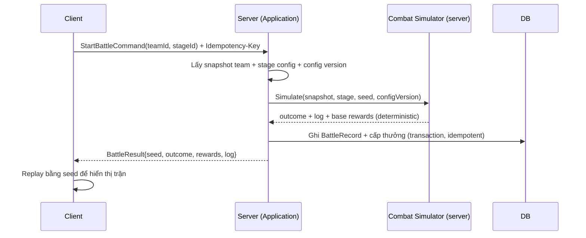

# Combat Framework — Module Architecture

> Ranh giới combat: **deterministic, server-authoritative re-simulation** (ADR-011). Combat full-auto (`../mvp/03` §4, `13` A02). Không hiện thực logic trận; mô tả kiến trúc & phân chia.

---

## 1. Trách nhiệm
- Bộ **simulator thuần** giải một trận: input (team snapshot, stage, seed, config version) → output (outcome, log, thưởng cơ sở).
- **Deterministic**: integer/fixed-point + seeded RNG (`../conventions/code-style.md` §4).
- Tồn tại **hai hiện thực đồng nhất ruleset**: client (GDScript, hiển thị) & server (.NET, thẩm quyền).

## 2. Không thuộc module này
- Rendering/animation (client visual).
- Cấp phát/ghi thưởng vào profile (→ economy/progression, transaction ADR-007).
- Định nghĩa skill effect cụ thể (→ `skill-framework.md`, data-driven).

## 3. Luồng server-authoritative

## 4. Determinism — yêu cầu (ADR-011)

| Yêu cầu | Chi tiết |
|---|---|
| Không float trong sim | Integer/fixed-point |
| RNG seeded | PRNG truyền vào; server sinh seed |
| Thứ tự lặp ổn định | Danh sách thứ tự xác định |
| Không phụ thuộc thời gian thực | Sim thuần |
| Golden test vector | Chạy CI cả 2 phía (`../testing/`) |
| Cùng (configVersion, snapshot, seed) ⇒ cùng output | Điều kiện re-sim/verify/sweep |

## 5. Thành phần sim (mechanism, không phải logic cân bằng)

| Thành phần | Vai trò |
|---|---|
| Battle state | HP/energy/vị trí các unit (từ snapshot) |
| Turn/tick scheduler | Trình tự hành động tất định |
| Target/aggro resolver | Chọn mục tiêu theo vị trí/role (chi tiết chưa chốt — `../mvp/10` CB3) |
| Skill executor | Áp effect từ `skill-framework` (data-driven) |
| Outcome evaluator | Thắng/thua, log, thưởng cơ sở |

> Chi tiết cơ chế (aggro, energy/ultimate trigger, crit) **chưa chốt** — `../mvp/10` CB3/CB4/CB5. Module thiết kế để các cơ chế này là **cấu hình/policy**, không switch cứng.

## 6. Sweep / Quick battle
- Server tính kết quả bằng chính sim tất định (không cần client xem) — `../mvp/04` F22. Tái dùng thưởng cơ sở.

## 7. Formation
- Formation (vị trí 6 hero) là **input snapshot** cho sim (ảnh hưởng target/aggro). Lưới đơn giản (`../mvp/13` A12); chi tiết `../mvp/10` GP5.

## 8. Liên kết
- Skill: `skill-framework.md` · Hero: `hero-system.md`
- Determinism/authority: ADR-011 · Save: ADR-007
- Testing golden vector: `../testing/`
