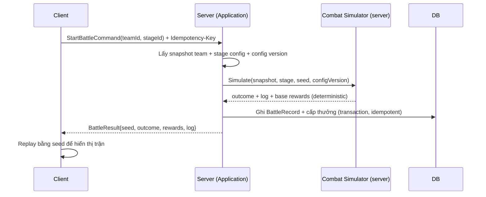

# Combat Framework — Module Architecture

> Ranh giới combat: **deterministic, server-authoritative re-simulation** (ADR-011). Combat full-auto (`../mvp/03` §4, `13` A02). Không hiện thực logic trận; mô tả kiến trúc & phân chia.

---

## 1. Trách nhiệm
- Bộ **simulator thuần** giải một trận: input (team snapshot, stage, seed, config version) → output (outcome, log, thưởng cơ sở).
- **Deterministic**: integer/fixed-point + seeded RNG (`../conventions/code-style.md` §4).
- Tồn tại **hai hiện thực đồng nhất ruleset**: client (GDScript, hiển thị) & server (.NET, thẩm quyền).

## 2. Không thuộc module này
- Rendering/animation (client visual).
- Cấp phát/ghi thưởng vào profile (→ economy/progression, transaction ADR-007).
- Định nghĩa skill effect cụ thể (→ `skill-framework.md`, data-driven).

## 3. Luồng server-authoritative



## 4. Determinism — yêu cầu (ADR-011)

| Yêu cầu | Chi tiết |
|---|---|
| Không float trong sim | Integer/fixed-point |
| RNG seeded | PRNG truyền vào; server sinh seed |
| Thứ tự lặp ổn định | Danh sách thứ tự xác định |
| Không phụ thuộc thời gian thực | Sim thuần |
| Golden test vector | Chạy CI cả 2 phía (`../testing/`) |
| Cùng (configVersion, snapshot, seed) ⇒ cùng output | Điều kiện re-sim/verify/sweep |

## 5. Thành phần sim (mechanism, không phải logic cân bằng)

| Thành phần | Vai trò |
|---|---|
| Battle state | HP/energy/vị trí các unit (từ snapshot) |
| Turn/tick scheduler | Trình tự hành động tất định |
| Target/aggro resolver | Chọn mục tiêu theo vị trí/role (chi tiết chưa chốt — `../mvp/10` CB3) |
| Skill executor | Áp effect từ `skill-framework` (data-driven) |
| Outcome evaluator | Thắng/thua, log, thưởng cơ sở |

> Chi tiết cơ chế (aggro, energy/ultimate trigger, crit) **chưa chốt** — `../mvp/10` CB3/CB4/CB5. Module thiết kế để các cơ chế này là **cấu hình/policy**, không switch cứng.

## 6. Sweep / Quick battle
- Server tính kết quả bằng chính sim tất định (không cần client xem) — `../mvp/04` F22. Tái dùng thưởng cơ sở.

## 7. Formation
- Formation (vị trí 6 hero) là **input snapshot** cho sim (ảnh hưởng target/aggro). Lưới đơn giản (`../mvp/13` A12); chi tiết `../mvp/10` GP5.

## 8. Liên kết
- Skill: `skill-framework.md` · Hero: `hero-system.md`
- Determinism/authority: ADR-011 · Save: ADR-007
- Testing golden vector: `../testing/` · Định dạng + vector mẫu: `../../shared/combat-vectors/`
- Quy tắc code determinism (tóm tắt): `../conventions/code-style.md` §4

---

# Đặc tả chi tiết combat (Phase 23 — hợp đồng hai hiện thực)

> Phần này là **hợp đồng combat** mà **phase 24 (.NET server)** và **phase 25 (GDScript client)** phải hiện thực
> **giống hệt**: cùng `(config version, team snapshot, stage, seed)` ⇒ **cùng event log + cùng result, từng bit**
> (ADR-011). Mọi **số liệu cân bằng** (stat, hệ số, tỉ lệ, ngưỡng) đến từ **config** (`combat_int` = integer ≥ 0,
> ADR-004/005, `../../shared/config-schema/`); phần này chỉ chốt **cơ chế, thứ tự, phép toán, RNG, định dạng**.
> **Không `float`/`double` trong bất kỳ phép toán combat nào.**
>
> Nhãn trạng thái mỗi mục: **[CHỐT]** = quyết định của Phase 23 (mechanism, cross-language). **[ĐỀ XUẤT]** = cơ chế
> đề xuất, số liệu để config, **chờ product xác nhận** (không phải canon vĩnh viễn). **[OPEN]** = chưa quyết định,
> không được tự bịa. Xem trạng thái open-question `../mvp/10-open-questions.md` CB1–CB6.

## 9. Quy ước chung & I/O của sim  [CHỐT]

- **Input** (thuần, không I/O): `config_version` (chuỗi `config@vN`), `seed` (uint64), `stage` (id + `max_rounds`),
  `team_snapshot` = hai đội `ally`/`enemy`, mỗi unit có: `actor_id` (chuỗi ổn định, **định danh cuối cùng cho mọi
  tie-break**), `slot` (chỉ số vị trí 0..5), `stats` (`hp/atk/def/spd` — `combat_int`), (tuỳ chọn) `energy`, `skills`.
- **Output**: `event_log` (mảng sự kiện có `seq` tăng dần) + `result` (`outcome`, `winner_team`, `rounds`, `final_hp`).
- **`actor_id`**: chuỗi ổn định do snapshot cấp (ví dụ `u_ally_01`). Sim **không** được dựa vào thứ tự dictionary/hash/
  map, thứ tự bộ nhớ, thứ tự trả về từ DB, hay thứ tự chèn — chỉ dùng khoá sắp xếp tường minh ở §13.
- Toàn bộ giá trị trong sim là **integer** hoặc **fixed-point** (§10). Không có `float` ở bất kỳ khâu nào.

## 10. Số học fixed-point  [CHỐT]

- **Biểu diễn:** một số fixed-point là **integer 64-bit có dấu** biểu diễn giá trị thực × `FIXED_SCALE`.
  **`FIXED_SCALE = 1000`** (3 chữ số thập phân, cơ số 10). Ví dụ `1.0 → 1000`, `1.5 → 1500`, `0.789 → 789`.
- **Quy tắc làm tròn DUY NHẤT: round-half-up** (làm tròn nửa lên) trên số **không âm** — mọi đại lượng combat là
  ≥ 0 theo `combat_int`; toán tử dưới đây không sinh giá trị âm (atk/def/K ≥ 0, ratio ∈ (0,1], clamp ≥ `MIN_DMG`).
  Một toán hạng âm là **vi phạm hợp đồng** (guard/exception, **không** rơi về float).
- **Mỗi** `fixed_mul`/`fixed_div` làm tròn về scale **ngay tại toán tử** (intermediate rounding), và bước chuyển
  cuối `from_fixed` làm tròn về integer — **cùng một luật round-half-up** ở mọi điểm. Không có điểm nào dùng floor/
  banker's/round-half-even.
- **Chia cho 0:** mẫu số luôn ≥ 1 theo bất biến config (`K ≥ 1` ⇒ `K+def ≥ 1`). `fixed_div(a, b)` yêu cầu `b ≥ 1`;
  `b = 0` là lỗi logic/config (guard/exception), **không** NaN/Inf/float.
- **Tràn số:** trung gian lớn nhất ~ `atk*coeff*SCALE` và `K*SCALE*SCALE` — nằm sâu trong 64-bit với dải `combat_int`
  hợp lý; hiện thực dùng số nguyên 64-bit có dấu (C# `long`, GDScript `int`). Không nới lên 128-bit ở MVP.

```text
FIXED_SCALE = 1000

round_half_up(num, den):        # den > 0, num >= 0
    return (num + den / 2) / den        # phép chia số nguyên (cắt về 0); num,den,/2 đều integer

to_fixed(x)   = x * FIXED_SCALE                 # integer -> fixed
from_fixed(f) = round_half_up(f, FIXED_SCALE)   # fixed -> integer (round-half-up)

fixed_add(a, b) = a + b
fixed_sub(a, b) = a - b
fixed_mul(a, b) = round_half_up(a * b, FIXED_SCALE)
fixed_div(a, b) = round_half_up(a * FIXED_SCALE, b)     # b >= 1
fixed_cmp(a, b) = sign(a - b)
clamp(x, lo, hi) = max(lo, min(hi, x))
```

## 11. PRNG có seed — PCG32 + SplitMix64  [CHỐT]

- **Thuật toán:** `PCG32` (biến thể `pcg_setseq_64_xsh_rr_32`: state 64-bit, output 32-bit). Seed một trận là **một
  `uint64`** do **server sinh** (ADR-011) và là input tường minh; **một** stream PCG cho cả trận, tiêu thụ theo thứ tự
  hành động (§13). **Không** global/ambient RNG, **không** timestamp/OS randomness, **không** RNG theo engine.
- **Nở seed:** dùng **SplitMix64** để suy ra `(initstate, initseq)` từ `uint64` seed (tránh state PCG nghèo khi seed nhỏ).
- **Ngữ nghĩa unsigned trong ngôn ngữ 64-bit có dấu:** coi state là **unsigned 64-bit** (mẫu bit); mọi nhân là **wrap
  mod 2^64** (C# `unchecked`; GDScript int 64-bit tràn wrap two's-complement — kết quả low-64 giống nhau bất kể dấu).
  Mọi dịch phải là **logical shift right** (`lsr`, không nhân bản bit dấu). C# ép `ulong` rồi `>>`; GDScript dùng `lsr`
  bên dưới. Mọi hằng/độ rộng phải khớp **từng bit** giữa hai phía.

```text
U64_MASK = 2^64 - 1
U32_MASK = 2^32 - 1
PCG_MULT = 6364136223846793005            # 0x5851F42D4C957F2D

lsr(x, n)  = (x >> n) & ((1 << (64 - n)) - 1)   # logical shift right cho int 64-bit (n>0)
wmul(a, b) = (a * b) & U64_MASK                 # nhân wrap 64-bit
wadd(a, b) = (a + b) & U64_MASK

# ---- SplitMix64: bộ nở seed ----
splitmix64_next(state):        # state: uint64, trả (new_state, output)
    state = wadd(state, 0x9E3779B97F4A7C15)
    z = state
    z = wmul(z ^ lsr(z, 30), 0xBF58476D1CE4E5B9)
    z = wmul(z ^ lsr(z, 27), 0x94D049BB133111EB)
    z = z ^ lsr(z, 31)
    return (state, z)

# ---- PCG32 ----
pcg_seed(seed_u64):            # trả pcg{state, inc}
    sm = seed_u64
    (sm, initstate) = splitmix64_next(sm)
    (sm, initseq)   = splitmix64_next(sm)
    inc   = wadd((initseq << 1) & U64_MASK, 1)     # phải lẻ
    state = 0
    state = wadd(wmul(state, PCG_MULT), inc)        # step
    state = wadd(state, initstate)
    state = wadd(wmul(state, PCG_MULT), inc)        # step
    return {state, inc}

pcg_next_u32(pcg):             # tiến state, trả uint32
    old = pcg.state
    pcg.state = wadd(wmul(old, PCG_MULT), pcg.inc)
    xorshifted = lsr((lsr(old, 18) ^ old), 27) & U32_MASK
    rot = lsr(old, 59) & 31
    return ((xorshifted >> rot) | ((xorshifted << ((-rot) & 31)) & U32_MASK)) & U32_MASK

# ---- roll không thiên vị trong [0, bound) ----
pcg_bounded(pcg, bound):       # bound: 1..2^32-1
    threshold = ((2^32 - bound) % bound) & U32_MASK
    loop:
        r = pcg_next_u32(pcg)
        if r >= threshold: return r % bound
```

- **Roll xác suất:** tỉ lệ tính theo **basis points** (bp, [0..10000]). `roll = pcg_bounded(pcg, 10000)`; điều kiện
  đúng khi `roll < rate_bp`. `rate_bp = 0` ⇒ không bao giờ đúng; `rate_bp >= 10000` ⇒ luôn đúng.

## 12. Vòng đời trận & cấu trúc round  [CHỐT]

```text
init: dựng battle state từ team_snapshot (hp/energy/vị trí); pcg = pcg_seed(seed); seq = 0
loop round r = 1..max_rounds:
    emit RoundStarted(r)
    order = build_action_order(alive_units)          # §13
    for actor in order:
        if actor.hp == 0: continue                   # chết trong round này ⇒ bỏ lượt
        if không còn địch sống: break
        execute_action(actor)                        # §15/§16/§17 + emit sự kiện
        if điều kiện kết thúc thoả (§19): break
    emit RoundEnded(r)
    if kết thúc: break
finalize: emit BattleEnded; tạo result (§19)
```

- Kiểm tra kết thúc **sau mỗi action** và **sau mỗi round** (§19). `max_rounds` từ config/stage.

## 13. Thứ tự hành động xác định  [CHỐT]

- **Cơ chế:** speed-sort **mỗi round**. Mỗi round, thu thập unit còn sống của cả hai đội, sắp theo **khoá tường minh**
  rồi **stable sort**, thực thi theo thứ tự đó. **Không** phụ thuộc iteration-order/hash/insertion/DB.
- **Khoá sắp xếp (giảm dần ưu tiên):** `(-spd, actor_id)`.
  1. `spd` (từ snapshot) **giảm dần** — nhanh đi trước.
  2. **Tie-break cuối cùng: `actor_id` tăng dần** (so sánh chuỗi theo **byte/UTF-8 code unit**, ổn định, không locale).
     Vì `actor_id` là duy nhất toàn trận, khoá này **luôn phá hoà tất định** — không cần khoá phụ nào khác.

```text
build_action_order(units):
    live = [u for u in units if u.hp > 0]
    return stable_sort(live, key = (-u.spd, u.actor_id))
```

## 14. Target / aggro / vị trí (CB3)  [ĐỀ XUẤT — số liệu/policy để config, chờ product xác nhận]

Lưới formation (6 slot) là **input snapshot** (§7); chi tiết lưới hàng/cột vẫn **[OPEN]** ở `../mvp/10` GP5. Cơ chế
resolve target dưới đây là **đề xuất tất định** để 24–25 có hợp đồng chạy; **policy chọn mục tiêu là config** (không
switch cứng — ADR-004).

```text
resolve_target(attacker, skill):
    candidates = [u in enemy_team_of(attacker) if u.hp > 0]   # chỉ đơn vị còn sống
    if candidates rỗng: return NONE                            # không còn mục tiêu ⇒ không có action gây damage
    ordered = stable_sort(candidates, key = (u.slot, u.actor_id))   # vị trí tăng dần, tie-break actor_id
    return apply_aggro_policy(ordered, skill.target_rule)      # policy từ config (mặc định: phần tử đầu = slot nhỏ nhất)
```

- **Bộ ứng viên:** chỉ địch **còn sống**; lọc chết trước khi chọn.
- **Thứ tự đánh giá ứng viên:** `(slot tăng dần, actor_id tăng dần)` — tất định, không dựa iteration-order.
- **Aggro policy** (config, `target_rule`): mặc định đề xuất = **slot nhỏ nhất** (tuyến đầu). Các policy khác (lowest-hp,
  highest-atk, all/row…) là **config/registry**, mỗi policy phải có tie-break kết thúc bằng `actor_id` — **[ĐỀ XUẤT]**.
- **Mục tiêu chết giữa action / hết hợp lệ:** nếu mục tiêu đã chọn chết **trước khi** effect áp (do effect trước trong
  cùng action), **re-resolve** theo thủ tục trên; nếu không còn ứng viên ⇒ bỏ phần gây damage (vẫn emit `ActionStarted`/
  `ActionCompleted`, không emit `DamageApplied`). **[ĐỀ XUẤT]**
- Chi tiết front/back/row và bonus theo vị trí: **[OPEN]** cho tới khi GP5/CB3 chốt.

## 15. Energy / ultimate / cooldown (CB4)  [ĐỀ XUẤT — số liệu để config, chờ product xác nhận]

MVP full-auto (skill tự kích — `skill-framework` §5). Cơ chế **energy-bar** đề xuất, mọi số từ config:

- **Energy** (integer per unit): khởi tạo `energy.initial`; cận trên `energy.max`; **nạp** `+energy.on_attack` khi unit
  ra đòn thường, `+energy.on_hit` khi bị đánh **và còn sống sau damage** (clamp ≤ `max`); **tiêu** `energy.ultimate_cost`
  khi phóng ultimate.
- **Chọn action mỗi lượt:** nếu `energy ≥ ultimate_cost` **và** ultimate không trong cooldown ⇒ **phóng ultimate**
  (trừ `ultimate_cost`, set cooldown); ngược lại ⇒ **đòn thường**.
- **Cooldown** (số round, per skill, từ config): skill đang cooldown = **không khả dụng**; **giảm 1 ở đầu round** (tại
  `RoundStarted`, trước khi build order); phóng skill đặt cooldown = giá trị config của skill.
- **Chết trước/sau nạp energy:** unit `hp == 0` **không** ra đòn và **không** nạp energy; nạp `on_hit` chỉ khi defender
  còn sống **sau** khi trừ hp (chết ⇒ bỏ, moot). Thứ tự sự kiện: `DamageApplied → (nếu sống) EnergyChanged(defender)`;
  với attacker: `... → EnergyChanged(attacker on_attack) → ActionCompleted`.
- **[OPEN]:** số liệu (initial/gain/cost/cap/cooldown) và có bật ultimate ở MVP hay không — product/CB4. Vector mẫu
  Phase 23 **tắt** energy (`on_attack=on_hit=0`, ultimate không đạt ngưỡng) để chỉ kiểm phần lõi đã [CHỐT].

## 16. Crit / miss & thứ tự RNG (CB5)  [CHỐT cơ chế — bật/tắt & mức độ là config]

**Hợp đồng tiêu thụ RNG cho một đòn gây damage (bắt buộc, tất định):**

```text
execute_attack(attacker, target, skill):
    emit ActionStarted(attacker)
    target = resolve_target(...); emit TargetSelected(attacker, target)
    roll_hit = pcg_bounded(pcg, 10000);  emit RandomRoll("hit", 10000, roll_hit)   # LUÔN tiêu thụ 1 roll
    if not (roll_hit < accuracy_bp):                                               # miss
        emit Miss(attacker, target); emit ActionCompleted(attacker); return        # miss ⇒ KHÔNG tiêu thụ thêm
    emit Hit(attacker, target)
    roll_crit = pcg_bounded(pcg, 10000); emit RandomRoll("crit", 10000, roll_crit) # LUÔN tiêu thụ 1 roll khi đã Hit
    crit = roll_crit < crit_rate_bp                                                # (kể cả crit_rate_bp==0)
    if crit: emit Crit(attacker, target)
    dmg = compute_damage(attacker, target, skill, crit)                            # §17
    apply and emit DamageApplied / Death ...
    emit ActionCompleted(attacker)
```

- **Thứ tự roll cố định:** `hit` **trước**, rồi `crit`. **Miss tiêu thụ đúng 1 roll** (hit); **Hit tiêu thụ đúng 2 roll**
  (hit + crit) — **không** được "tối ưu" bỏ roll crit khi `crit_rate_bp==0` (sẽ lệch stream). Miss ⇒ **không** roll crit.
- **Crit chỉ xảy ra khi đã Hit** (không có "crit khi miss").
- **Miss ⇒ không gây damage** (không `DamageApplied`); MVP không có "graze/damage một phần" — **[OPEN]** nếu product muốn.
- **Bật/tắt bằng config:** `accuracy_bp = 10000` ⇒ luôn trúng; `crit_rate_bp = 0` ⇒ không bao giờ crit. Nhờ đó "combat
  không có ngẫu nhiên" là **một cấu hình**, không phải nhánh code khác.

## 17. Công thức damage — integer/fixed-point  [CHỐT hình dạng — hệ số để config]

Mô hình **divisive DEF-ratio** (giảm hiệu suất theo def, không âm, không chia 0 khi `K ≥ 1`). Mọi hệ số là fixed-point
config (coeff `1.0→1000`, crit_mult `1.5→1500`); `K`/`MIN_DMG` là integer config.

```text
compute_damage(attacker, target, skill, crit):
    atk_f   = to_fixed(attacker.atk)
    raw_f   = fixed_mul(atk_f, skill.coeff_fixed)           # 1) atk * hệ số skill
    ratio_f = fixed_div(to_fixed(K), to_fixed(K) + to_fixed(target.def))   # 2) K/(K+def)
    dmg_f   = fixed_mul(raw_f, ratio_f)                     # 3) áp mitigation
    if crit: dmg_f = fixed_mul(dmg_f, crit_multiplier_fixed)# 4) crit SAU mitigation
    dmg     = from_fixed(dmg_f)                             # 5) làm tròn cuối về integer (round-half-up)
    return clamp(dmg, MIN_DMG, dmg)                         # 6) sàn MIN_DMG (config, >= 1)
```

- **Thứ tự phép tính cố định** (1→6) và **điểm làm tròn cố định**: round-half-up tại mỗi `fixed_mul`/`fixed_div` và tại
  `from_fixed`. Không đổi thứ tự, không gộp/tách bước, không đổi điểm làm tròn.
- Ví dụ (vector mẫu 1, ally→enemy): `atk=200, coeff=1000, K=300, def=80` ⇒ `raw=200000`, `ratio=fixed_div(300000,380000)=789`,
  `dmg_f=fixed_mul(200000,789)=157800`, `from_fixed=158`. (Kiểm tay khớp `../../shared/combat-vectors/vector_01_basic_hit.json`.)
- Effect ngoài damage (heal/buff/debuff/shield) áp cùng luật fixed-point + thứ tự ổn định; chi tiết effect = `skill-framework`
  (data-driven, phase 28). Damage âm/né/hoàn máu ngoài phạm vi MVP ⇒ **[OPEN]**.

## 18. Event log tất định  [CHỐT]

- `event_log` là mảng có **`seq` tăng dần từ 0**, một stream cho cả trận; hai hiện thực phải phát **cùng chuỗi sự kiện,
  cùng thứ tự, cùng trường** (không chỉ cùng HP cuối).
- **Danh mục sự kiện & thứ tự trong một action gây damage:**
  `RoundStarted → ActionStarted → TargetSelected → RandomRoll(hit) → (Miss | Hit → RandomRoll(crit) → [Crit] →
  DamageApplied → [Death]) → [EnergyChanged…] → ActionCompleted → … → RoundEnded → … → BattleEnded`.
- **Trường mỗi sự kiện** (khoá JSON, integer thô cho số): xem schema `../../shared/combat-vectors/README.md`. `Death`
  phát **ngay sau** `DamageApplied` khiến `hp == 0`, **trước** `ActionCompleted`. `BattleEnded` là sự kiện cuối, trước `result`.

## 19. Thắng / thua / hoà (CB6)  [CHỐT cơ chế — số round & giây mục tiêu để tuning/OPEN]

- Xét từ góc **đội `ally`** (đội người chơi): sau mỗi action/round, đánh giá:
  - **VICTORY:** toàn bộ `enemy` chết **và** còn ít nhất một `ally` sống.
  - **DEFEAT:** toàn bộ `ally` chết **và** còn ít nhất một `enemy` sống.
  - **DRAW:** (a) **đồng loạt chết** (cả hai đội hết sống trong cùng thời điểm đánh giá), hoặc (b) chạm **`max_rounds`**
    mà cả hai còn sống.
- **Chết đồng thời:** damage áp tuần tự theo action; đánh giá kết thúc **sau mỗi action** ⇒ nếu một action hạ nốt unit
  cuối của địch trong khi đội mình vẫn sống ⇒ VICTORY (không "cùng lúc" trừ khi một effect AoE hạ nốt cả hai bên trong
  cùng một lần áp — khi đó DRAW). `max_rounds` (config/stage) chặn trận vô hạn ⇒ DRAW.
- **`result`**: `{ outcome, winner_team (ally|enemy|null), rounds, final_hp{actor_id:int} }`. `BattleEnded` phát trước khi
  dựng `result`.
- **[OPEN]:** độ dài trận **mục tiêu (giây)** và giá trị `max_rounds` chuẩn — CB6 (tuning/presentation), không chặn spec.

## 20. Golden vector (tóm tắt) — chi tiết ở `shared/combat-vectors/`

- **Định dạng + 1–2 vector mẫu** (đã kiểm tham chiếu) nằm ở `../../shared/combat-vectors/` (README = schema; `vector_01`,
  `vector_02`). Phase 23 chỉ chốt **định dạng + vector mẫu**; **bộ vector đầy đủ + CI gate cross-impl = phase 26**.
- Vector = **hợp đồng**: input `(config_version, seed, stage, team_snapshot, config_excerpt)` → output `(event_log, result)`.
  Nếu đổi cơ chế sim ⇒ **cập nhật vector có chủ đích** trong cùng thay đổi (agent `combat-determinism`).
