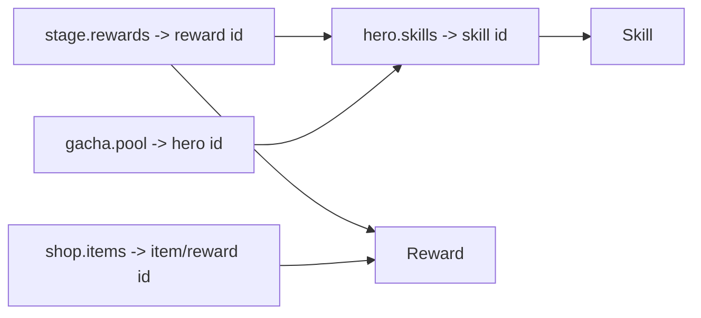

# Configuration & Data — Gameplay Data Model

> Ranh giới dữ liệu data-driven cho gameplay và quan hệ với Configuration Service (ADR-004/005). Mô tả **schema boundary**, không phải giá trị cân bằng (tuning — `../mvp/10` EC).

---

## 1. Nguyên tắc
- **Code phụ thuộc schema, không phụ thuộc giá trị** (ADR-004).
- Nguồn sự thật runtime = **Configuration Service** (server), phân phối bundle versioned cho client (ADR-005).
- Mọi file config validate bằng **JSON Schema** (`shared/config-schema/`) ở CI (`../testing/`).

## 2. Danh mục config gameplay

| Config | Nội dung | Dùng bởi |
|---|---|---|
| `heroes/` | Hero definition | Hero, Combat |
| `skills/` | Skill + effect | Skill, Combat |
| `stages/` | Campaign/tower stage (địch, thưởng, yêu cầu) | Campaign, Combat |
| `gacha/` | Banner + rate + pity | Economy/Summon |
| `shop/` | Shop items + giá | Economy/Shop |
| `rewards/` | Reward tables (AFK, quest, first-clear) | Economy, Quest |
| `economy/` | Đường cong cost (level/sao), energy params | Progression, Economy |
| `quests/` | Quest definition | Quest |
| `liveops/` | Event/season/flag (schedule) — Post-MVP | LiveOps |

## 2b. Ánh xạ schema (phase 06)

Mỗi loại config có một JSON Schema (draft 2020-12) ở `../../shared/config-schema/` — định nghĩa **cấu trúc/kiểu**, không chứa giá trị balance. `common.schema.json` giữ `$defs` dùng lại (id prefix, `combat_int`, enum khớp `GameTeam.Contracts`).

| Config type | Schema | Nguồn gameplay | Tham chiếu chính | Ghi chú |
|---|---|---|---|---|
| hero | `hero.schema.json` | `hero-system.md` | `skills` → skill id | `base_stats` integer; `faction` chuỗi (GP2 chưa chốt) |
| skill | `skill.schema.json` | `skill-framework.md` | `effects[].effect_type` (registry) | effect_type: damage/heal/apply_buff/apply_debuff/shield; `params` mở |
| stage | `stage.schema.json` | `progression-and-economy.md` | `enemies[].hero_id` → hero; `rewards[]` → reward | `energy_cost` integer |
| reward | `reward.schema.json` | `progression-and-economy.md` | `entries[].ref_id` (currency/hero/fragment/item) | `amount` integer |
| gacha | `gacha.schema.json` | `progression-and-economy.md` | `pool[]` → hero; `rates[].rarity` | rate/pity **cấu trúc**, không giá trị |
| shop | `shop.schema.json` | `progression-and-economy.md` | `items[].reward_ref` → reward; `cost.currency` | `cost.amount` integer |
| economy | `economy.schema.json` | `progression-and-economy.md` | `cost_curves`, `energy` | bước đường cong integer, không cố định |
| quest | `quest.schema.json` | `quest-system.md` | `reward_refs[]` → reward; `condition_type` | condition_type: battles_won/summons_done/login |

> **Cấp độ tham chiếu:** JSON Schema chỉ ràng buộc **định dạng/cấu trúc** của ref (prefix id, kiểu). **Kiểm tồn tại id chéo file** (hero→skill…) là việc của validator (phase 07 — §3, §6), không phải schema đơn. Fixture pass/fail ở `../../shared/config-schema/fixtures/`; quy tắc migration ở `../../shared/config-schema/_versions/`.

## 3. Quan hệ id (referential integrity)

- Validator kiểm **id tham chiếu tồn tại** (không trỏ id không có) — chống lỗi config khi live.

## 4. Versioning
- Mỗi file có `schema_version`; bundle có version `config@vN` (ADR-005).
- Đổi giá trị → publish version mới. Đổi cấu trúc → tăng schema_version + migration/compat.
- Client cache theo version; chỉ tải khi có version mới.

## 5. Ranh giới với backend
- Domain/Application đọc config qua `IConfigProvider` (port), **không** đọc file trực tiếp (`../backend/`).
- Combat sim đọc chỉ số từ config version cụ thể (đảm bảo re-sim tất định — ADR-011).

## 6. Tooling
- `tools/config-validator` (Phase 07 — **GATE CI bắt buộc**, .NET 9): validate schema (draft 2020-12) +
  referential integrity + `schema_version` cho `config/**`. Chạy: `bash tools/config-validator/run.sh config
  shared/config-schema`. Report `file:jsonpath:CODE`; mã lỗi (`JSON001`/`MAP001`/`SCH001`/`VER001`/`VER002`/`REF001`/`REF002`)
  ở `../../tools/config-validator/README.md`. Core lib tái dùng cho Config Service (Phase 21).
- `tools/content-importer` (Post-MVP): import bảng (csv/xlsx) → config json.

## 7. Liên kết
- ADR-004 (data-driven), ADR-005 (config strategy)
- Conventions JSON: `../conventions/data-and-docs-conventions.md`
- Backend config service: `../backend/infrastructure.md`
- LiveOps: `../liveops/remote-config.md`
