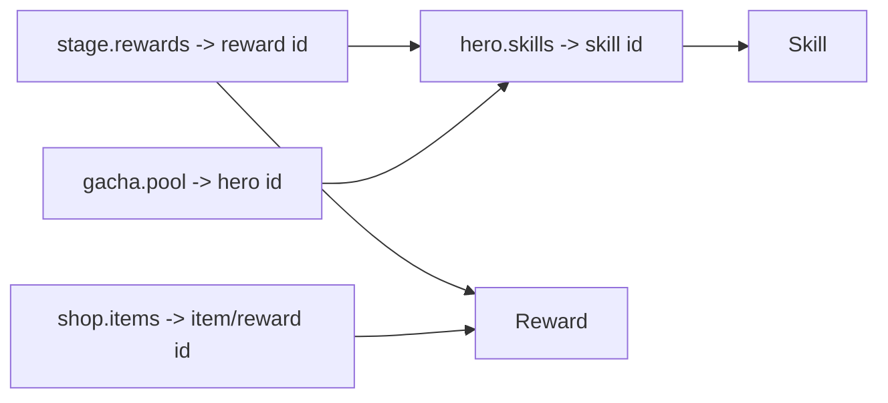

# Configuration & Data — Gameplay Data Model

> Ranh giới dữ liệu data-driven cho gameplay và quan hệ với Configuration Service (ADR-004/005). Mô tả **schema boundary**, không phải giá trị cân bằng (tuning — `../mvp/10` EC).

---

## 1. Nguyên tắc
- **Code phụ thuộc schema, không phụ thuộc giá trị** (ADR-004).
- Nguồn sự thật runtime = **Configuration Service** (server), phân phối bundle versioned cho client (ADR-005).
- Mọi file config validate bằng **JSON Schema** (`shared/config-schema/`) ở CI (`../testing/`).

## 2. Danh mục config gameplay

| Config | Nội dung | Dùng bởi |
|---|---|---|
| `heroes/` | Hero definition | Hero, Combat |
| `skills/` | Skill + effect | Skill, Combat |
| `stages/` | Campaign/tower stage (địch, thưởng, yêu cầu) | Campaign, Combat |
| `gacha/` | Banner + rate + pity | Economy/Summon |
| `shop/` | Shop items + giá | Economy/Shop |
| `rewards/` | Reward tables (AFK, quest, first-clear) | Economy, Quest |
| `economy/` | Đường cong cost (level/sao), energy params | Progression, Economy |
| `quests/` | Quest definition | Quest |
| `liveops/` | Event/season/flag (schedule) — Post-MVP | LiveOps |

## 3. Quan hệ id (referential integrity)

- Validator kiểm **id tham chiếu tồn tại** (không trỏ id không có) — chống lỗi config khi live.

## 4. Versioning
- Mỗi file có `schema_version`; bundle có version `config@vN` (ADR-005).
- Đổi giá trị → publish version mới. Đổi cấu trúc → tăng schema_version + migration/compat.
- Client cache theo version; chỉ tải khi có version mới.

## 5. Ranh giới với backend
- Domain/Application đọc config qua `IConfigProvider` (port), **không** đọc file trực tiếp (`../backend/`).
- Combat sim đọc chỉ số từ config version cụ thể (đảm bảo re-sim tất định — ADR-011).

## 6. Tooling
- `tools/config-validator`: validate schema + referential integrity (CI gate).
- `tools/content-importer` (Post-MVP): import bảng (csv/xlsx) → config json.

## 7. Liên kết
- ADR-004 (data-driven), ADR-005 (config strategy)
- Conventions JSON: `../conventions/data-and-docs-conventions.md`
- Backend config service: `../backend/infrastructure.md`
- LiveOps: `../liveops/remote-config.md`
