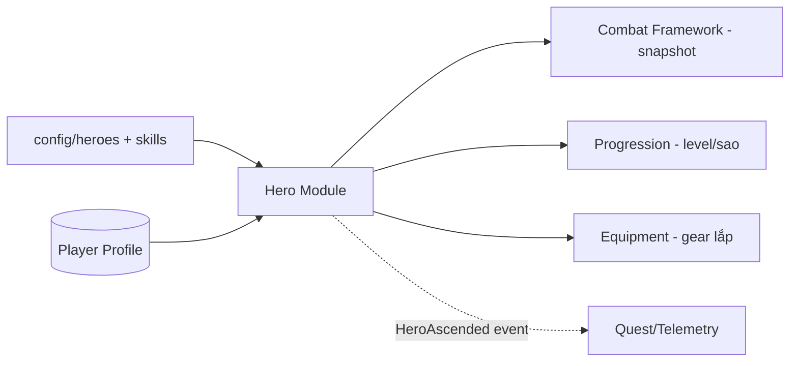

# Hero System — Module Architecture

> Ranh giới & trách nhiệm module Hero. Nguồn: `../mvp/03` §2, `../mvp/05`. Không hiện thực logic; không đổi thiết kế.

---

## 1. Trách nhiệm module
- Định nghĩa **dữ liệu hero** (faction/class/element/role/rarity/base stats/skill refs) — data-driven (ADR-004).
- Quản lý **trạng thái hero của người chơi** (level, sao/ascension, gear lắp) — server-authoritative (ADR-007).
- Cung cấp **snapshot hero** cho combat sim (chỉ số tính từ config + trạng thái).

## 2. Không thuộc module này
- Logic combat (→ `combat-framework.md`).
- Logic skill effect (→ `skill-framework.md`).
- Quy tắc summon (→ `../mvp/03` §9, economy).

## 3. Dữ liệu (schema — data-driven)

| Nhóm | Nội dung | Nơi định nghĩa |
|---|---|---|
| Hero definition (tĩnh) | id, faction, class, element, role, rarity, base_stats, skill refs, asset refs | `config/heroes/` + schema |
| Hero instance (động, per-player) | hero_id, level, star/ascension, equipped gear, exp | DB profile (server) |
| Stat computation | Cách gộp base + level + sao + gear → stats cuối | Domain policy (mechanism), đọc config |

> Danh sách faction/class/element/role & số hero **chưa chốt** — `../mvp/10` GP2/GP4. Module thiết kế **mở** theo enum config, không cứng hoá số lượng.

## 4. Ranh giới client/server

| | Client | Server |
|---|---|---|
| Hiển thị hero, hoạt ảnh | ✅ | — |
| Xem stats (đọc cache) | ✅ | — |
| Thay đổi (level/sao/gear) | Gửi command | ✅ Quyết định + lưu |
| Snapshot cho combat | Dùng để hiển thị | ✅ Nguồn cho re-sim |

## 5. Tương tác module

## 6. Mở rộng tương lai (chừa chỗ)
- Thêm faction/hero mới = thêm **config**, không sửa code (ADR-004).
- Skin/awakening (Future — `../mvp/04` F37): thêm trường config + trạng thái, không phá schema (versioning ADR-005).

## 7. Trạng thái hiện thực (Phase 27 — đã đóng)

Nền tảng Hero data-driven đã hiện thực (ADR-004/007). Chi tiết vận hành:

**Server (chân lý):**
- **HeroDefinition = config, KHÔNG hardcode.** Đọc qua port **`IConfigProvider.Get<HeroConfig>("hero", id)`**
  (`server/src/GameTeam.Application/Features/Heroes/HeroConfig.cs`) — faction/class/element/role/rarity/base_stats/
  skills/art từ `config/heroes/*.json` (schema phase 06, thêm field tuỳ chọn `art`). KHÔNG có nguồn hero thứ hai.
- **`OwnedHero`** (`GameTeam.Domain/Heroes/OwnedHero.cs`, `AggregateRoot<Guid>`): instance động gắn
  **`ProfileId`** (khoá ngoại `player_profiles`), `HeroId` (ref config), `Level`/`Stars` nền. Bảng `owned_heroes`
  (unique `(profile_id, hero_id)`). Chỉ số tĩnh KHÔNG lưu ở đây — đọc từ config.
- **Queries:** `GetMyHeroesQuery` (owner suy TỪ token `sub` qua `ICurrentUser` — chống IDOR; trả
  `MyHeroesResponse` bọc `OwnedHeroDto{heroId,level,stars}`) + `GetHeroDefinitionQuery` (definition từ config →
  `HeroDefinitionDto`). Endpoint: `GET /api/v1/heroes` (protected) + `GET /api/v1/heroes/{heroId}/definition`
  (public catalog).
- **Nhận hero = summon (Phase 33 — đã hiện thực):** guest mới **KHÔNG** sở hữu hero nào; nhận hero thật qua
  **triệu hồi** (`POST /api/v1/summon` → cấp `OwnedHero`; trùng → mảnh, xem `progression-and-economy.md` §5).
  (Seed TẠM "cấp toàn bộ hero khi login" của Phase 27 đã **gỡ** ở Phase 33 — nó chỉ là dữ liệu tạm trước khi có
  summon.)

**Client (hiển thị, không chân lý):**
- **Hero List** (`client/src/ui/hero_list/`): GHÉP hero **owned** (`StateCache.get_heroes()`, server-authoritative)
  + **definition** (`ConfigProvider.get_hero(id)`, data-driven). Đổi config → định nghĩa đổi KHÔNG rebuild.
- **Hero Detail** (`client/src/ui/hero_detail/`): chi tiết một hero (id truyền qua `SceneRouter.route_context()`);
  **art tải LAZY** qua **`AssetLoader`** (`client/src/core/assets/asset_loader.gd`, autoload) — placeholder trước,
  art thật sau (KHÔNG chặn list — ADR-009), đường dẫn art từ config (field `art`), giải phóng khi rời màn.
- Contract→codegen: DTO hero ở `GameTeam.Contracts/Hero/*` → `openapi.json` → GDScript generated (DO-NOT-EDIT).

**Ranh giới quyền:** client KHÔNG tự thêm hero / đổi owner / level / sao / chỉ số. Definition từ config; ownership
từ server/profile. Ngoài phạm vi Phase 27: skill (28), formation (29), battle (30), summon (33), nâng cấp (35/39).

## 8. Formation & Team (Phase 29 — đã đóng)

Đội hình **6 hero + vị trí (formation)** — lựa chọn tactical duy nhất trong combat full-auto (A02/A05/A12).
Lưu **server-authoritative** (ADR-007); vị trí đi vào combat sim, ảnh hưởng target/aggro (ADR-011,
`combat-framework.md` §7/§14). Client chỉ gửi **intent** — server validate + quyết định.

**Server (chân lý):**
- **`Team`** (`GameTeam.Domain/Teams/Team.cs`, `AggregateRoot<Guid>`): gắn **`ProfileId`** (khoá ngoại
  `player_profiles`, **unique** — một đội/profile MVP) + các **`TeamSlot`** (`SlotIndex` 0-based, `HeroId` ref
  config). Bảng `teams` + owned collection `team_slots` (PK `(team_id, slot_index)`), migration `AddTeams`.
  Bất biến **cấu trúc** ở Domain (≥1 ô, không trùng ô, không trùng hero); ràng buộc **phụ thuộc config** ở Application.
- **Lưới = config, KHÔNG hardcode.** Loại config **`formation`** (`shared/config-schema/formation.schema.json`,
  `config/formation/formation_default.json`: `rows`/`cols`) đọc qua **`IConfigProvider.Get<FormationConfig>("formation",
  "formation_default")`** — **số ô (team size) = rows×cols**. Client đọc lưới từ config bundle để dựng UI.
- **`SaveTeamCommand`** (`Features/Teams/Commands/`, `ITransactionalRequest`): owner suy TỪ token `sub`
  (`ICurrentUser` — chống IDOR), validate **server-authoritative**: đúng số ô (`TEAM_INVALID_SIZE`), slot trong lưới
  không trùng (`TEAM_INVALID_SLOT`), không trùng hero (`TEAM_DUPLICATE_HERO`), **mọi hero thuộc sở hữu**
  (`IOwnedHeroRepository`, `TEAM_HERO_NOT_OWNED`) → upsert (`Create`/`Replace`). **`GetMyTeamQuery`**: đọc đội theo
  token; chưa lưu ⇒ đội rỗng (lưới trống). Endpoint: `GET`+`POST /api/v1/team` (protected).
- **Team snapshot** (`Features/Teams/TeamSnapshotFactory.cs`): đội đã lưu → `IReadOnlyList<CombatTeamMember>` bất
  biến (feed `CombatInputResolver`/`BattleRequest.Ally`, phase 30); `SlotIndex` → `slot` combat. Bản sao giá trị,
  KHÔNG giữ tham chiếu profile/team mutable ⇒ sim tất định (ADR-011).

**Client (hiển thị, không chân lý):**
- **Formation** (`client/src/ui/formation/`): `FormationView` (BaseView, network-free) dựng lưới (rows×cols từ
  `ConfigProvider`) + roster hero owned (`StateCache.get_heroes()`); `FormationPresenter` giữ **bản nháp cục bộ**
  (chọn hero → đặt ô → đổi vị trí), khi Lưu → **`NetworkClient.post_json("/team", …)`** (intent) → hiển thị lại theo
  **đội server trả về** (bản nháp bị thay). Mở màn → `GET /team` nạp đội đã lưu. KHÔNG lưu cục bộ rồi coi như server nhận.
- Contract→codegen: DTO team ở `GameTeam.Contracts/Team/*` (`TeamDto`/`TeamSlotDto`/`SaveTeamRequest`) → `openapi.json`
  → GDScript generated (DO-NOT-EDIT); parser `NetworkResponseParser.parse_team`.

**Ranh giới quyền:** client KHÔNG tự quyết ownership / hợp lệ / trùng / slot / đội đã lưu — server validate tất cả.
Ngoài phạm vi Phase 29: battle thật (30), nhiều đội/preset (Post-MVP), bonus vị trí (config/tuning), aggro nâng cao
(CB3, `../mvp/10`).

## 9. Nâng cấp Level (Phase 35 — đã đóng)

Trục nâng cấp **Must** đầu tiên (F06): hero tăng **Level** bằng cách tiêu **Gold**, làm tăng chỉ số combat +
**Power Rating**. **Server-authoritative** (ADR-007) + **data-driven** (ADR-004) + **tất định integer** (ADR-011) +
**atomic** (Phase 31). Quyết định MVP: **gold mỗi cấp, một cấp/lệnh** (không EXP item riêng).

**Đường cong = config (`economy`, KHÔNG hardcode).** `shared/config-schema/economy.schema.json` (mở rộng additive) +
`config/economy/economy_default.json`: `cost_curves.level_up` = chi phí gold mỗi cấp (**số cấp tối đa = 1 + độ dài
mảng**); `level_stat_growth_bp` = tăng trưởng chỉ số/cấp (basis points của chỉ số nền); `power_weights` = trọng số
Power. Đọc qua **`IConfigProvider.Get<EconomyConfig>("economy","economy_default")`**.

**Công thức (một nguồn, `GameTeam.Application/Features/Heroes/HeroStatCalculator.cs`):** `chỉ số(cấp L) = base +
round_half_up(base × growth_bp × (L−1) / 10000)` (cấp 1 ⇒ nền; qua Phase-24 `FixedPoint`, không float);
`Power = Σ chỉ_số_cuối × trọng_số`. **Tính-khi-đọc** (không lưu ⇒ không stale). Bản mirror client
`client/src/shared/hero_stats.gd` cho **cùng** kết quả (hiển thị + replay).

**Server (chân lý):**
- **`OwnedHero.LevelUp()`** (`GameTeam.Domain/Heroes/`): tăng một cấp, raise `OwnedHeroLeveledUp`. Trần cấp phụ thuộc
  config ⇒ kiểm ở Application (Domain chỉ giữ bất biến cấu trúc). **Không lưu chỉ số** — luôn tính từ config + cấp.
- **`LevelUpHeroCommand(heroId)`** (`Features/Heroes/Commands/`, `ITransactionalRequest`): owner từ token
  (`ICurrentUser` — chống IDOR) → `IOwnedHeroRepository.GetByProfileAndHeroForUpdateAsync` (**SELECT … FOR UPDATE**) →
  kiểm trần cấp (`HERO_MAX_LEVEL_CONFLICT`→409) → chi phí = `cost_curves.level_up[cấp-1]` → **`CurrencyWalletService.SpendAsync`**
  (Phase 31, khoá `hero-levelup:{profileId}:{ownedHeroId}:{targetLevel}` + ghi ledger) → `LevelUp()` → tính lại chỉ số +
  Power → trả **`LevelUpHeroResponse{heroId,level,stats,power,goldSpent,goldBalanceAfter}`**. Tất cả **một transaction**:
  thiếu gold (`CURRENCY_INSUFFICIENT_FUNDS`→409) / lỗi ⇒ rollback (không trừ tiền/không tăng cấp). Endpoint
  **`POST /api/v1/heroes/{heroId}/level-up`** (protected).
- **Combat dùng chỉ số theo cấp:** `CombatTeamMember.Level` + `TeamSnapshotFactory.Create(team, levelByHeroId)`;
  `BattleExecutionService` nạp cấp owned (`GetByProfileIdAsync`) → `CombatInputResolver` nhân chỉ số **ally** theo cấp
  (địch = nền, cấp 1). Golden vectors (Phase 26) dùng chỉ số tường minh ⇒ **không đổi** (scaling ở tầng resolver, không
  đụng sim).

**Client (hiển thị, không chân lý):**
- **Hero Detail** (`client/src/ui/hero_detail/`): hiển thị chỉ số **theo cấp** + Power + chi phí + gold; nút "Nâng cấp"
  gửi **intent** → presenter `POST /heroes/{id}/level-up` → refresh hero + ví **AUTHORITATIVE** vào `StateCache`
  (`apply_heroes`/`apply_wallet` → `state_refreshed`). Client **không** tự tăng cấp/chỉ số/Power/trừ gold.
- Contract `LevelUpHeroResponse` → codegen GDScript; parser `NetworkResponseParser.parse_level_up_hero_response`.

**Idempotency:** khoá lần tiêu mã hoá **cấp đích** + khoá dòng hero ⇒ dưới khoá, cấp đích luôn nhất quán trạng thái dòng
(không lên cấp "chùa"); không cần requestId/bảng record mới.

**Ngoài phạm vi Phase 35:** EXP item (dùng gold), batch level-up, power-gate campaign, Sao/Ascension (39), Equipment (38),
Skill level (Post-MVP). Chi tiết: `../roadmap/35-hero-upgrade-level.md`, `progression-and-economy.md` §1.

## 10. Liên kết
- Combat: `combat-framework.md` · Skill: `skill-framework.md`
- Progression: `progression-and-economy.md` · Config: `configuration-and-data.md` · Assets: `../godot/resources-and-assets.md`
- Nguồn: `../mvp/03`, `../mvp/05` · Roadmap: `../roadmap/27-hero-system.md`
