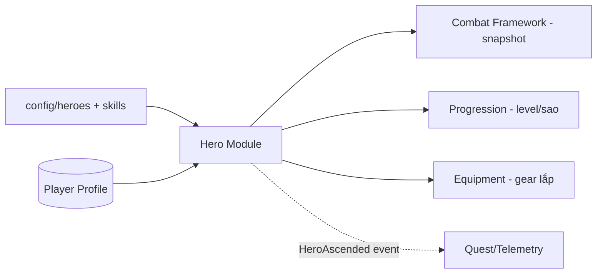

# Hero System — Module Architecture

> Ranh giới & trách nhiệm module Hero. Nguồn: `../mvp/03` §2, `../mvp/05`. Không hiện thực logic; không đổi thiết kế.

---

## 1. Trách nhiệm module
- Định nghĩa **dữ liệu hero** (faction/class/element/role/rarity/base stats/skill refs) — data-driven (ADR-004).
- Quản lý **trạng thái hero của người chơi** (level, sao/ascension, gear lắp) — server-authoritative (ADR-007).
- Cung cấp **snapshot hero** cho combat sim (chỉ số tính từ config + trạng thái).

## 2. Không thuộc module này
- Logic combat (→ `combat-framework.md`).
- Logic skill effect (→ `skill-framework.md`).
- Quy tắc summon (→ `../mvp/03` §9, economy).

## 3. Dữ liệu (schema — data-driven)

| Nhóm | Nội dung | Nơi định nghĩa |
|---|---|---|
| Hero definition (tĩnh) | id, faction, class, element, role, rarity, base_stats, skill refs, asset refs | `config/heroes/` + schema |
| Hero instance (động, per-player) | hero_id, level, star/ascension, equipped gear, exp | DB profile (server) |
| Stat computation | Cách gộp base + level + sao + gear → stats cuối | Domain policy (mechanism), đọc config |

> Danh sách faction/class/element/role & số hero **chưa chốt** — `../mvp/10` GP2/GP4. Module thiết kế **mở** theo enum config, không cứng hoá số lượng.

## 4. Ranh giới client/server

| | Client | Server |
|---|---|---|
| Hiển thị hero, hoạt ảnh | ✅ | — |
| Xem stats (đọc cache) | ✅ | — |
| Thay đổi (level/sao/gear) | Gửi command | ✅ Quyết định + lưu |
| Snapshot cho combat | Dùng để hiển thị | ✅ Nguồn cho re-sim |

## 5. Tương tác module

## 6. Mở rộng tương lai (chừa chỗ)
- Thêm faction/hero mới = thêm **config**, không sửa code (ADR-004).
- Skin/awakening (Future — `../mvp/04` F37): thêm trường config + trạng thái, không phá schema (versioning ADR-005).

## 7. Liên kết
- Combat: `combat-framework.md` · Skill: `skill-framework.md`
- Progression: `progression-and-economy.md` · Config: `configuration-and-data.md`
- Nguồn: `../mvp/03`, `../mvp/05`
