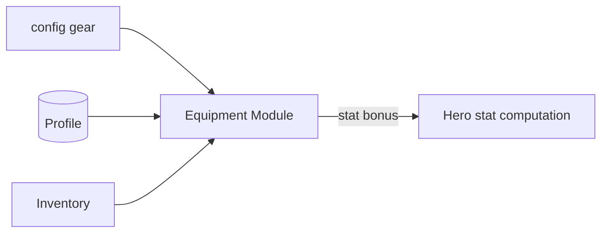

# Inventory & Equipment — Module Architecture

> Ranh giới Inventory (`../mvp/03` §10) và Equipment (`../mvp/03` §11, Should-have). Server-authoritative. Không hiện thực logic.

---

## 1. Inventory

### Trách nhiệm
- Quản lý những gì người chơi **sở hữu**: hero, vật phẩm, mảnh (fragment), material, gear, tiền tệ (tham chiếu economy).
- Nguồn sự thật ở server (ADR-007); client cache đọc để hiển thị.

### Dữ liệu
| Nhóm | Nội dung |
|---|---|
| Owned heroes | tham chiếu Hero instance (`hero-system.md`) |
| Items/materials | id + số lượng (đếm) |
| Fragments | id hero/gear + số lượng |
| Currencies | (thuộc economy, hiển thị chung) |

### Ranh giới
- Không chứa logic nâng cấp (→ progression); chỉ **kho** + thao tác thêm/bớt (qua command server, atomic).
- List lớn → pagination/ảo hoá (`../mvp/08`, `../godot/ui-architecture.md`).

---

## 2. Equipment (Should-have)

### Trách nhiệm
- Định nghĩa **gear** (data-driven): slot, stats cộng thêm, độ hiếm (tối giản MVP).
- Quản lý **lắp/tháo gear** cho hero → ảnh hưởng stats (qua stat computation của Hero).

### Dữ liệu
| Nhóm | Nội dung | Nơi |
|---|---|---|
| Gear definition | id, slot, stat bonus, rarity | `config/` (data-driven) |
| Gear instance | gear_id, owner, hero đang lắp | DB profile |
| Slot rule | hero có những slot nào | Config/policy |

### Ranh giới
- Gear **cơ bản** MVP (cộng stats trực tiếp). Set bonus/forge/reforge = **Won't-have MVP** (`../mvp/01`), thiết kế schema chừa chỗ (versioning ADR-005).
- Không tự cấp gear; drop/mua qua campaign/shop (economy).

## 3. Client/server
| | Client | Server |
|---|---|---|
| Xem kho/gear | ✅ cache | — |
| Lắp/tháo, dùng item | Gửi command | ✅ Quyết định + lưu |

## 4. Liên kết
- Hero (stats): `hero-system.md` · Progression: `progression-and-economy.md`
- Config: `configuration-and-data.md` · Nguồn: `../mvp/03` §10,11
