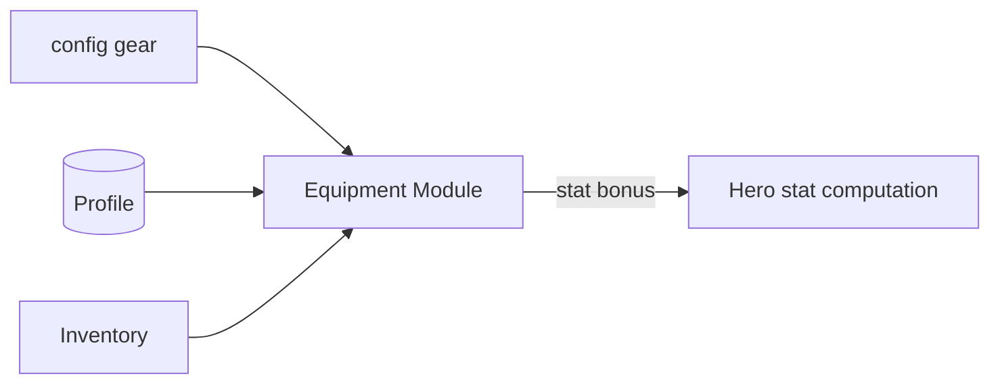

# Inventory & Equipment — Module Architecture

> Ranh giới Inventory (`../mvp/03` §10) và Equipment (`../mvp/03` §11, Should-have). Server-authoritative. Không hiện thực logic.

---

## 1. Inventory (Phase 32 — đã hiện thực)

### Trách nhiệm
- Quản lý những gì người chơi **sở hữu**: hero, vật phẩm (item), mảnh (fragment), (material/gear thêm additive sau), tiền tệ (tham chiếu economy).
- **"Sổ tài sản" thứ hai** bên cạnh ví (`progression-and-economy.md` §2) — server-authoritative (ADR-007); client cache **chỉ đọc/hiển thị**, KHÔNG tự cộng/trừ.

### Mô hình đã hiện thực (server)
- **`Inventory`** (`GameTeam.Domain/Inventory/`) — aggregate gắn **1-1 profile** (unique `profile_id`), chứa các chồng **`ItemStack`** `(item_type, item_id) → quantity`, bất biến **`quantity ≥ 0`** (ADR-011). Lưu JSON cột `stacks` (bảng `inventories`).
- **`InventoryTransaction`** — sổ cái **append-only** (bảng `inventory_transactions`, `idempotency_key` **unique**), chứa nhiều dòng `InventoryChange` (nhiều-item/giao dịch) — audit + idempotency. Tổng quát hoá ledger tiền tệ (Phase 31) cho thao tác nhiều-item.
- **Hero sở hữu KHÔNG lưu trong inventory** — vẫn là aggregate riêng **`OwnedHero`** (Phase 27, bảng `owned_heroes`). Query kho **chiếu** hero owned kèm (không nhân bản aggregate).

### Loại tài sản (item_type) — data-driven (ADR-004)
| Nhóm | item_type | id tham chiếu | Nguồn định nghĩa |
|---|---|---|---|
| Owned heroes | (chiếu OwnedHero) | `hero_id` | aggregate Phase 27 |
| Vật phẩm/material | `item` | `item_id` (`item_*`) | loại config **`item`** (`config/items/`, `item.schema.json`) |
| Fragment (mảnh hero) | `fragment` | `hero_id` (mảnh của hero) | loại config **`hero`** |
| Currencies | — | — | economy (ví riêng — Phase 31) |

`item_type` khớp `reward_type` (reward.schema) trừ `currency`/`hero`. Server kiểm id qua `IConfigProvider` (item→catalog, fragment→hero) — id lạ ⇒ `INVENTORY_UNKNOWN_ITEM`.

### Thao tác (Application — dùng chung, atomic + idempotent)
- **`InventoryService`** là cơ chế DUY NHẤT (mẫu Phase 31): idempotency-key → **khoá dòng** `SELECT … FOR UPDATE` → kiểm config → **nhiều-item ATOMIC** (khi consume, kiểm đủ MỌI item TRƯỚC khi trừ; một item thiếu ⇒ toàn bộ fail, không mutate một phần) → ghi MỘT dòng ledger.
- **`AddItemsCommand`/`RemoveItemsCommand`** (`ITransactionalRequest`) — chủ sở hữu suy từ token `sub` (chống IDOR); **KHÔNG endpoint HTTP công khai** (một endpoint "cấp/tiêu item" cho client là lỗ hổng kinh tế — như tiền tệ). Nguồn/sink (gacha 33, shop 40, mail 42, equipment 38) là **caller** của các command này — KHÔNG dựng cơ chế thứ hai.
- **`GetInventoryQuery`** → **`GET /api/v1/inventory`** (protected, chỉ ĐỌC): lọc `itemType` (`item`/`fragment`), **phân trang** (`page`/`pageSize`, trần 200), thứ tự tất định `(item_type, item_id)`; chiếu hero owned kèm; chưa có ⇒ kho rỗng (không lỗi).

### Ranh giới
- Không chứa logic nâng cấp/lắp gear/tiêu nghiệp vụ (→ progression/equipment 38/ascension 39); chỉ **kho** + thêm/bớt (qua command server, atomic + idempotent).
- List lớn → phân trang (query trên stacks per-profile; nếu về sau cực lớn cân nhắc tách bảng dòng). Client: `client/src/ui/inventory/` + `StateCache.apply_inventory` (offline-view, nhãn KHÔNG im lặng).

---

## 2. Equipment (Should-have)

### Trách nhiệm
- Định nghĩa **gear** (data-driven): slot, stats cộng thêm, độ hiếm (tối giản MVP).
- Quản lý **lắp/tháo gear** cho hero → ảnh hưởng stats (qua stat computation của Hero).

### Dữ liệu
| Nhóm | Nội dung | Nơi |
|---|---|---|
| Gear definition | id, slot, stat bonus, rarity | `config/` (data-driven) |
| Gear instance | gear_id, owner, hero đang lắp | DB profile |
| Slot rule | hero có những slot nào | Config/policy |

### Ranh giới
- Gear **cơ bản** MVP (cộng stats trực tiếp). Set bonus/forge/reforge = **Won't-have MVP** (`../mvp/01`), thiết kế schema chừa chỗ (versioning ADR-005).
- Không tự cấp gear; drop/mua qua campaign/shop (economy).

## 3. Client/server
| | Client | Server |
|---|---|---|
| Xem kho/gear | ✅ cache | — |
| Lắp/tháo, dùng item | Gửi command | ✅ Quyết định + lưu |

## 4. Liên kết
- Hero (stats): `hero-system.md` · Progression: `progression-and-economy.md`
- Config: `configuration-and-data.md` · Nguồn: `../mvp/03` §10,11
