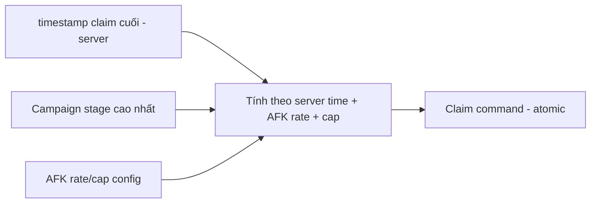

# Progression & Economy — Module Architecture

> Ranh giới Progression (`../mvp/05`) và Economy (`../mvp/06`), gồm AFK/Energy/Currencies. Server-authoritative + atomic (ADR-007). Data-driven cân bằng (ADR-004). Không hiện thực logic; không đổi con số (tuning là việc khác — `../mvp/10` EC).

---

## 1. Progression module

### Trách nhiệm
- Các "cần gạt" nâng cấp hero: **Level (Must)**, **Sao/Ascension (Should)**, **Equipment (Should)** (`../mvp/13` A06).
- Tính **stat computation** & **Power Rating** (từ config + trạng thái).

### Ranh giới
- Nhận yêu cầu nâng cấp → **kiểm tài nguyên + áp công thức config** → cập nhật hero instance (atomic).
- Không chứa số cân bằng (đường cong cost ở config — `../mvp/10` EC4).

## 2. Economy module

### Currencies & tài nguyên (MVP)
| Loại | Vai trò | Nguồn/Sink |
|---|---|---|
| Gold (soft) | Level hero, shop | AFK/campaign → level (`../mvp/06`) |
| Gem (premium) | Summon, tiện ích | Quest/first-clear → summon |
| Summon Ticket | Gacha | Quest/shop → summon |
| Fragment | Nâng sao/mở hero | Gacha dup/campaign → ascension |
| Material | Nâng cấp | Campaign → progression |
| Energy | Nhịp cày | Regen (server time) → battle |

### Nguyên tắc giao dịch
- Mọi thay đổi tài nguyên là **giao dịch atomic** (TransactionBehavior, ADR-007), **idempotent** (chống double).
- **Source/sink** cân bằng qua config (`../mvp/06` §10) — tune không cần build (ADR-004).

### Ví tiền tệ + giao dịch (Phase 31 — đã hiện thực)

MVP nền có **3 loại tiền**: **Gold** (soft), **Gem** (premium), **Summon Ticket** — loại tiền theo enum dùng
chung `GameTeam.Contracts.Currency` (phase 05); trong ví lưu bằng **mã chuỗi** (`gold`/`gem`/`ticket`), ánh xạ
enum↔mã ở ranh giới Application (`CurrencyCode`). Số dư là **số nguyên không âm** (ADR-011).

**Server-authoritative tuyệt đối (ADR-007):** ví gắn 1-1 với `PlayerProfile` (gốc save); MỌI thay đổi số dư đi
qua **server**. Client **chỉ hiển thị** số dư (đọc `GET /api/v1/wallet` → `StateCache`); **không** có endpoint
"cấp tiền" công khai (một endpoint như vậy là lỗ hổng kinh tế) — cấp/tiêu là **command nội bộ** dùng bởi
feature khác (battle 30, và sau này gacha 33, AFK 37, shop 40).

**Cơ chế giao dịch dùng chung** `CurrencyWalletService` (Application) — một chỗ duy nhất cho mọi nguồn/sink:
1. **Idempotency**: mỗi giao dịch mang một `idempotency_key`. Key đã xử lý ⇒ **trả lại kết quả cũ**, KHÔNG áp
   dụng lần hai (chống double-grant/double-spend). Backstop tầng DB: **unique index** trên `idempotency_key`.
2. **Concurrency**: khoá dòng ví `SELECT … FOR UPDATE` để tuần tự hoá cấp/tiêu đồng thời ⇒ **không lost-update,
   không số dư âm** (hai spend song song: đúng một thành công, cái còn lại bị chặn vì thiếu tiền).
3. **Grant** cộng số dư; **Spend** kiểm đủ tiền trước — thiếu ⇒ từ chối (`CURRENCY_INSUFFICIENT_FUNDS`, số dư
   KHÔNG đổi). Số dư không bao giờ âm (bất biến ở Domain `Wallet`/`WalletBalance`).
4. **Atomic + audit**: đổi số dư và ghi **một dòng sổ cái** `CurrencyTransaction` (audit: profile/loại tiền/biến
   động có dấu/số dư sau/nguồn-sink/thời điểm server/idempotency key) trong **một transaction** — cả hai cùng
   commit hoặc cùng rollback (`TransactionBehavior` + `UnitOfWork`). Lỗi giữa chừng ⇒ số dư + ledger +
   idempotency đều rollback (không đánh dấu thành công giả).

**Đọc số dư**: `GetWalletQuery` → `GET /api/v1/wallet` (protected, owner suy từ token `sub` — chống IDOR); chưa
có ví ⇒ ví rỗng, không lỗi.

**Liên hệ battle reward (Phase 30)**: thắng trận → server cấp Gold **qua chính `CurrencyWalletService`** (ghi
ledger, idempotent) trong cùng transaction đánh trận; client refresh `GET /wallet` → `StateCache` để hub hiện
số dư mới — **không tự cộng**. Retry cùng `attemptId` ⇒ không cấp lần hai.

**Nền cho phase sau**: gacha (33 — tiêu ticket/gem), AFK (37 — cấp gold), shop (40 — sink), mail (42 — claim)
tái dùng đúng cơ chế này; **không** dựng cơ chế giao dịch/idempotency thứ hai. Số tiền/tỉ lệ vẫn là **config**
(ADR-004), không nằm trong code.

## 3. AFK / Idle rewards (đặc trưng thể loại)

| Yêu cầu | Chi tiết |
|---|---|
| Tính **server-side khi claim** | Chống gian lận chỉnh giờ (ADR-007/008) |
| Dựa **server time** + timestamp claim cuối | Không tin client time |
| Rate & cap từ config | `../mvp/06` §5, `../mvp/10` EC2 |
| AFK = nguồn nền chính | `../mvp/13` A07 |
| Client hiển thị **ước lượng** | Chỉ UI; server quyết khi claim |

## 4. Energy
- Regen theo **server time**; max/tốc độ/chi phí từ config (`../mvp/10` EC3).
- Energy = "bonus cày chủ động", không mâu thuẫn AFK (`../mvp/13` A07).

## 5. Gacha (economy-linked)
- **RNG server-side**, rate + pity từ config; trùng hero → fragment (`../mvp/13` A08/A09).
- Kết quả atomic + idempotent; pity state per-player server-side.

## 6. Client/server
| | Client | Server |
|---|---|---|
| Hiển thị số dư/power/AFK ước lượng | ✅ cache | — |
| Nâng cấp/summon/claim/mua | Gửi command | ✅ Quyết định + atomic |

## 7. Bottleneck & cân bằng
- Thiết kế nhiều nguồn fragment/gold để tránh nút thắt (`../mvp/05` §8) — bằng **config**, không code.
- Kinh tế **sẽ sai bản đầu** → phải tune nhanh (`../mvp/06` §11, ADR-004).

## 8. Liên kết
- Hero stats: `hero-system.md` · Config: `configuration-and-data.md`
- Save/atomic: ADR-007 · Nguồn: `../mvp/05`, `../mvp/06`
