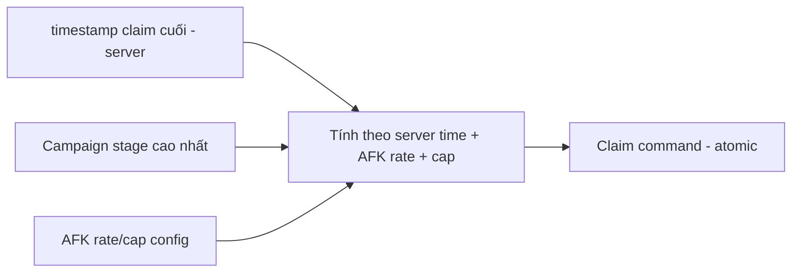

# Progression & Economy — Module Architecture

> Ranh giới Progression (`../mvp/05`) và Economy (`../mvp/06`), gồm AFK/Energy/Currencies. Server-authoritative + atomic (ADR-007). Data-driven cân bằng (ADR-004). Không hiện thực logic; không đổi con số (tuning là việc khác — `../mvp/10` EC).

---

## 1. Progression module

### Trách nhiệm
- Các "cần gạt" nâng cấp hero: **Level (Must)**, **Sao/Ascension (Should)**, **Equipment (Should)** (`../mvp/13` A06).
- Tính **stat computation** & **Power Rating** (từ config + trạng thái).

### Ranh giới
- Nhận yêu cầu nâng cấp → **kiểm tài nguyên + áp công thức config** → cập nhật hero instance (atomic).
- Không chứa số cân bằng (đường cong cost ở config — `../mvp/10` EC4).

## 2. Economy module

### Currencies & tài nguyên (MVP)
| Loại | Vai trò | Nguồn/Sink |
|---|---|---|
| Gold (soft) | Level hero, shop | AFK/campaign → level (`../mvp/06`) |
| Gem (premium) | Summon, tiện ích | Quest/first-clear → summon |
| Summon Ticket | Gacha | Quest/shop → summon |
| Fragment | Nâng sao/mở hero | Gacha dup/campaign → ascension |
| Material | Nâng cấp | Campaign → progression |
| Energy | Nhịp cày | Regen (server time) → battle |

### Nguyên tắc giao dịch
- Mọi thay đổi tài nguyên là **giao dịch atomic** (TransactionBehavior, ADR-007), **idempotent** (chống double).
- **Source/sink** cân bằng qua config (`../mvp/06` §10) — tune không cần build (ADR-004).

## 3. AFK / Idle rewards (đặc trưng thể loại)

| Yêu cầu | Chi tiết |
|---|---|
| Tính **server-side khi claim** | Chống gian lận chỉnh giờ (ADR-007/008) |
| Dựa **server time** + timestamp claim cuối | Không tin client time |
| Rate & cap từ config | `../mvp/06` §5, `../mvp/10` EC2 |
| AFK = nguồn nền chính | `../mvp/13` A07 |
| Client hiển thị **ước lượng** | Chỉ UI; server quyết khi claim |

## 4. Energy
- Regen theo **server time**; max/tốc độ/chi phí từ config (`../mvp/10` EC3).
- Energy = "bonus cày chủ động", không mâu thuẫn AFK (`../mvp/13` A07).

## 5. Gacha (economy-linked)
- **RNG server-side**, rate + pity từ config; trùng hero → fragment (`../mvp/13` A08/A09).
- Kết quả atomic + idempotent; pity state per-player server-side.

## 6. Client/server
| | Client | Server |
|---|---|---|
| Hiển thị số dư/power/AFK ước lượng | ✅ cache | — |
| Nâng cấp/summon/claim/mua | Gửi command | ✅ Quyết định + atomic |

## 7. Bottleneck & cân bằng
- Thiết kế nhiều nguồn fragment/gold để tránh nút thắt (`../mvp/05` §8) — bằng **config**, không code.
- Kinh tế **sẽ sai bản đầu** → phải tune nhanh (`../mvp/06` §11, ADR-004).

## 8. Liên kết
- Hero stats: `hero-system.md` · Config: `configuration-and-data.md`
- Save/atomic: ADR-007 · Nguồn: `../mvp/05`, `../mvp/06`
