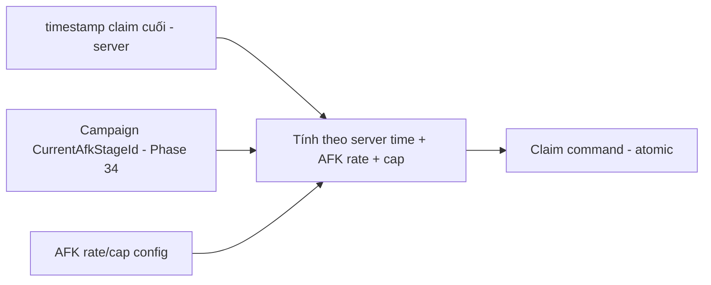

# Progression & Economy — Module Architecture

> Ranh giới Progression (`../mvp/05`) và Economy (`../mvp/06`), gồm AFK/Energy/Currencies. Server-authoritative + atomic (ADR-007). Data-driven cân bằng (ADR-004). Không hiện thực logic; không đổi con số (tuning là việc khác — `../mvp/10` EC).

---

## 1. Progression module

### Trách nhiệm
- Các "cần gạt" nâng cấp hero: **Level (Must)**, **Sao/Ascension (Should)**, **Equipment (Should)** (`../mvp/13` A06).
- Tính **stat computation** & **Power Rating** (từ config + trạng thái).

### Ranh giới
- Nhận yêu cầu nâng cấp → **kiểm tài nguyên + áp công thức config** → cập nhật hero instance (atomic).
- Không chứa số cân bằng (đường cong cost ở config — `../mvp/10` EC4).

### Nâng cấp Level + Power Rating (Phase 35 — đã hiện thực)
Trục **Level (Must)** đã hiện thực (F06): `LevelUpHeroCommand` tiêu **Gold** atomic (Phase 31, `CurrencyWalletService` +
`SELECT … FOR UPDATE` + `TransactionBehavior`) mỗi cấp; **stat computation** + **Power Rating** = một nguồn tất định
integer (`HeroStatCalculator`, round-half-up) đọc đường cong/tăng-trưởng/trọng-số từ **`economy` config** (data-driven —
`cost_curves.level_up`, `level_stat_growth_bp`, `power_weights`; ADR-004). Chỉ số theo cấp đi vào combat qua team snapshot
(nâng cấp ⇒ đánh mạnh hơn). Server-authoritative; client chỉ gửi intent + hiển thị. `cost_curves.level_up` là **sink Gold**
chính giai đoạn đầu. Chi tiết: `hero-system.md` §9, `../roadmap/35-hero-upgrade-level.md`.

## 2. Economy module

### Currencies & tài nguyên (MVP)
| Loại | Vai trò | Nguồn/Sink |
|---|---|---|
| Gold (soft) | Level hero, shop | AFK/campaign → level (`../mvp/06`) |
| Gem (premium) | Summon, tiện ích | Quest/first-clear → summon |
| Summon Ticket | Gacha | Quest/shop → summon |
| Fragment | Nâng sao/mở hero | Gacha dup/campaign → ascension |
| Material | Nâng cấp | Campaign → progression |
| Energy | Nhịp cày | Regen (server time) → battle |

### Nguyên tắc giao dịch
- Mọi thay đổi tài nguyên là **giao dịch atomic** (TransactionBehavior, ADR-007), **idempotent** (chống double).
- **Source/sink** cân bằng qua config (`../mvp/06` §10) — tune không cần build (ADR-004).

### Ví tiền tệ + giao dịch (Phase 31 — đã hiện thực)

MVP nền có **3 loại tiền**: **Gold** (soft), **Gem** (premium), **Summon Ticket** — loại tiền theo enum dùng
chung `GameTeam.Contracts.Currency` (phase 05); trong ví lưu bằng **mã chuỗi** (`gold`/`gem`/`ticket`), ánh xạ
enum↔mã ở ranh giới Application (`CurrencyCode`). Số dư là **số nguyên không âm** (ADR-011).

**Server-authoritative tuyệt đối (ADR-007):** ví gắn 1-1 với `PlayerProfile` (gốc save); MỌI thay đổi số dư đi
qua **server**. Client **chỉ hiển thị** số dư (đọc `GET /api/v1/wallet` → `StateCache`); **không** có endpoint
"cấp tiền" công khai (một endpoint như vậy là lỗ hổng kinh tế) — cấp/tiêu là **command nội bộ** dùng bởi
feature khác (battle 30, và sau này gacha 33, AFK 37, shop 40).

**Cơ chế giao dịch dùng chung** `CurrencyWalletService` (Application) — một chỗ duy nhất cho mọi nguồn/sink:
1. **Idempotency**: mỗi giao dịch mang một `idempotency_key`. Key đã xử lý ⇒ **trả lại kết quả cũ**, KHÔNG áp
   dụng lần hai (chống double-grant/double-spend). Backstop tầng DB: **unique index** trên `idempotency_key`.
2. **Concurrency**: khoá dòng ví `SELECT … FOR UPDATE` để tuần tự hoá cấp/tiêu đồng thời ⇒ **không lost-update,
   không số dư âm** (hai spend song song: đúng một thành công, cái còn lại bị chặn vì thiếu tiền).
3. **Grant** cộng số dư; **Spend** kiểm đủ tiền trước — thiếu ⇒ từ chối (`CURRENCY_INSUFFICIENT_FUNDS`, số dư
   KHÔNG đổi). Số dư không bao giờ âm (bất biến ở Domain `Wallet`/`WalletBalance`).
4. **Atomic + audit**: đổi số dư và ghi **một dòng sổ cái** `CurrencyTransaction` (audit: profile/loại tiền/biến
   động có dấu/số dư sau/nguồn-sink/thời điểm server/idempotency key) trong **một transaction** — cả hai cùng
   commit hoặc cùng rollback (`TransactionBehavior` + `UnitOfWork`). Lỗi giữa chừng ⇒ số dư + ledger +
   idempotency đều rollback (không đánh dấu thành công giả).

**Đọc số dư**: `GetWalletQuery` → `GET /api/v1/wallet` (protected, owner suy từ token `sub` — chống IDOR); chưa
có ví ⇒ ví rỗng, không lỗi.

**Liên hệ battle reward (Phase 30)**: thắng trận → server cấp Gold **qua chính `CurrencyWalletService`** (ghi
ledger, idempotent) trong cùng transaction đánh trận; client refresh `GET /wallet` → `StateCache` để hub hiện
số dư mới — **không tự cộng**. Retry cùng `attemptId` ⇒ không cấp lần hai.

**Nền cho phase sau**: gacha (33 — tiêu ticket/gem), AFK (37 — cấp gold), shop (40 — sink), mail (42 — claim)
tái dùng đúng cơ chế này; **không** dựng cơ chế giao dịch/idempotency thứ hai. Số tiền/tỉ lệ vẫn là **config**
(ADR-004), không nằm trong code.

## 2b. Campaign PvE (Phase 34 — đã hiện thực) — TRỤC TIẾN ĐỘ CHÍNH

Campaign là **trục tiến độ chính** (F05) và **nguồn AFK-stage** cho phase 37 — server-authoritative + data-driven
(ADR-004/007/011).

**Data-driven (ADR-004):** chuỗi campaign = loại config **`chapter`** (`chapter.schema.json`: `order` + `stages[]`
theo thứ tự) nhóm các **stage** (`stage.schema.json`: `enemies`, `rewards`, `combat_rules`). Chuỗi tổng = các
chapter theo `order` (tie-break id) rồi `stages` theo thứ tự liệt kê. Thêm chapter/stage = **chỉ config**, không
sửa business logic. Số liệu (địch/thưởng/độ khó) là tuning.

**Tiến độ server-authoritative (ADR-007):** aggregate **`CampaignProgress`** (gắn 1-1 `PlayerProfile`, unique DB)
lưu **tập stage đã clear** + **`CurrentAfkStageId`** = stage đã clear **xa nhất** theo thứ tự chuỗi. Client KHÔNG
gửi/không tự suy tiến độ — chỉ hiển thị.

**Đánh stage (reuse battle flow 30):** `POST /api/v1/campaign/battles {teamId, stageId, attemptId}` →
`StartCampaignBattleCommand`:
1. chủ sở hữu từ token (chống IDOR); validate stage thuộc chuỗi campaign + có config (`CAMPAIGN_STAGE_NOT_FOUND`);
2. **anti-skip**: stage phải đã **mở khoá tuần tự** (`CampaignChain.IsUnlocked`: stage đầu, hoặc stage liền trước đã
   clear) — nếu khoá → `CAMPAIGN_STAGE_LOCKED` (403) TRƯỚC mọi mutation;
3. chạy trận qua cơ chế dùng chung **`BattleExecutionService`** (một sim/reward path với battle thường — KHÔNG fork):
   snapshot đội (29) + seed server + re-sim (24) + ghi `BattleRecord`;
4. **chỉ khi VICTORY & first-clear**: cấp thưởng config qua **`StageRewardService`**→`CurrencyWalletService`
   (Phase 31, khoá idempotency per-profile `campaign:{profileId}:{stageId}`) + đánh dấu clear + đặt `CurrentAfkStageId`
   — **tất cả trong MỘT transaction** (atomic). Trả `BattleResultDto`; client refresh tiến độ qua
   `GET /api/v1/campaign/progress`.

**First-clear only:** clear lại một stage đã qua ⇒ trận vẫn chạy (server-authoritative) nhưng **không cấp thưởng lần
hai**, **không lùi tiến độ** (repeatable farm là việc của AFK — §3). Thua ⇒ không tiến độ/thưởng/mở khoá. Retry cùng
`attemptId` ⇒ kết quả đã lưu (idempotent, không double-grant).

## 3. AFK / Idle rewards (đặc trưng thể loại)

| Yêu cầu | Chi tiết |
|---|---|
| Tính **server-side khi claim** | Chống gian lận chỉnh giờ (ADR-007/008) |
| Dựa **server time** + timestamp claim cuối | Không tin client time |
| Rate & cap từ config | `../mvp/06` §5, `../mvp/10` EC2 |
| **AFK stage = `CampaignProgress.CurrentAfkStageId`** (Phase 34 đã persist) | Phase 37 đọc để tính rate |
| AFK = nguồn nền chính | `../mvp/13` A07 |
| Client hiển thị **ước lượng** | Chỉ UI; server quyết khi claim |

## 4. Energy
- Regen theo **server time**; max/tốc độ/chi phí từ config (`../mvp/10` EC3).
- Energy = "bonus cày chủ động", không mâu thuẫn AFK (`../mvp/13` A07).

## 5. Gacha (economy-linked)
- **RNG server-side**, rate + pity từ config; trùng hero → fragment (`../mvp/13` A08/A09).
- Kết quả atomic + idempotent; pity state per-player server-side.

### Summon/Gacha (Phase 33 — đã hiện thực)

**Triệu hồi là đường nhận hero thật** (thay seed tạm "cấp toàn bộ hero khi login" đã gỡ — xem `hero-system.md`
§7). Server-authoritative tuyệt đối (ADR-004/007/011): client chỉ gửi **intent**, **server** quyết
RNG/rate/pity/hero/thưởng.

**Endpoint duy nhất** `POST /api/v1/summon` (protected; owner suy từ token `sub` — chống IDOR). Body
`SummonRequest{bannerId, count(1|10), requestId}`. Trả `SummonResultDto{bannerId, count, pityAfter, pulls[]}`
với mỗi `pull{heroId, rarity, isNew, fragments}` — **seed KHÔNG trả client** (gacha không replay ở client; seed
chỉ lưu server để audit). Danh sách banner client đọc từ **config bundle** (`ConfigProvider.get_all("gacha")`) —
không có endpoint liệt kê banner riêng.

**Data-driven (ADR-004):** banner đọc từ `gacha.schema.json` (Phase 06 + mở rộng additive Phase 33) — `pool`
(hero id), `rates[{rarity, weight}]`, `pity{enabled, threshold, target_rarity?}`, `cost{currency, amount}` (giá
một lần quay), `dupe_fragments[{rarity, amount}]` (số mảnh khi trùng, theo rarity). **Rarity của một hero đọc từ
hero config** (`hero.rarity`), KHÔNG lặp ở banner. Đổi rate/pity/cost trong config ⇒ hành vi đổi, KHÔNG sửa code.

**Quyết định kết quả (`SummonRoller` — lõi thuần, tất định theo seed, dùng PCG32 như combat):**
1. **Rate**: bốc rarity theo trọng số (`weight`); rồi chọn đồng đều một hero trong pool có rarity đó.
2. **Pity server-side** theo `(profile, banner)`, **persistent** (bảng `gacha_pity`, unique `(profile_id, banner_id)`):
   bộ đếm = số lần quay liên tiếp chưa trúng rarity mục tiêu; khi `count + 1 ≥ threshold` ⇒ lần quay này **đảm
   bảo** rarity mục tiêu; trúng mục tiêu (tự nhiên hoặc do pity) ⇒ reset 0, ngược lại +1. 10-pull xử lý pity
   **từng lần theo thứ tự** (tương đương 10 lần quay đơn trong một thao tác atomic).

**Luồng handler (`SummonCommand`, `ITransactionalRequest` — một transaction):** owner từ token → kiểm count(1/10)
+ banner hợp lệ (mọi rarity có thể sinh ra đều có hero trong pool + có `dupe_fragments`) → **idempotency** (retry
cùng `requestId` ⇒ trả kết quả đã lưu, KHÔNG quay/tiêu/cấp lại) → **khoá dòng pity** (`FOR UPDATE`) → seed server →
`SummonRoller` → **tiêu tiền** qua `CurrencyWalletService` (Phase 31, idempotent, key `gacha:{requestId}:spend`) →
hero **mới** ⇒ cấp `OwnedHero` (Phase 27); **trùng** (đã sở hữu HOẶC đã trúng trước trong cùng lượt) ⇒ gộp mảnh cấp
qua `InventoryService` (Phase 32, key `gacha:{requestId}:grant`, `item_type=fragment`) → cập nhật pity + ghi
`SummonRecord` (unique `(profile_id, request_id)`, lưu seed để audit). Thiếu tiền ⇒ `CURRENCY_INSUFFICIENT_FUNDS`
(409) và **rollback toàn bộ** (không cấp gì). 10-pull **atomic** — tất cả hoặc không.

**Tái dùng, không dựng mới:** summon **không** có cơ chế giao dịch/idempotency riêng — nó **compose**
`CurrencyWalletService` + `InventoryService` + `OwnedHero` + seed server (`IBattleSeedSource`) + `Pcg32`. Client
(`client/src/ui/summon/`) chỉ gửi intent (`requestId` sinh cục bộ chỉ để idempotent — KHÔNG dùng để random) và
hiển thị kết quả server; sau summon refresh ví + kho từ server vào `StateCache`.

**Ngoài phạm vi (nợ/định hướng):** banner rotation, limited banner, LiveOps/tuning rate ngoài config, ascension
tiêu fragment (Phase 39), shop redesign — đều **không** làm ở Phase 33.

## 6. Client/server
| | Client | Server |
|---|---|---|
| Hiển thị số dư/power/AFK ước lượng | ✅ cache | — |
| Nâng cấp/summon/claim/mua | Gửi command | ✅ Quyết định + atomic |

## 7. Bottleneck & cân bằng
- Thiết kế nhiều nguồn fragment/gold để tránh nút thắt (`../mvp/05` §8) — bằng **config**, không code.
- Kinh tế **sẽ sai bản đầu** → phải tune nhanh (`../mvp/06` §11, ADR-004).

## 8. Liên kết
- Hero stats: `hero-system.md` · Config: `configuration-and-data.md`
- Save/atomic: ADR-007 · Nguồn: `../mvp/05`, `../mvp/06`
