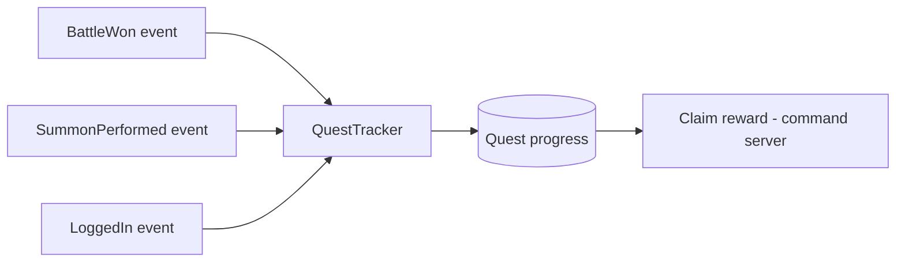

# Quest System — Module Architecture

> Ranh giới Quest (`../mvp/03` §12, Should-have). Daily quest MVP; weekly Post-MVP. Data-driven, event-driven. Không hiện thực logic.

---

## 1. Trách nhiệm
- Định nghĩa **quest dưới dạng dữ liệu**: điều kiện (đếm sự kiện), phần thưởng, reset (daily/weekly).
- Theo dõi **tiến độ** người chơi bằng cách **lắng nghe domain event** (không hard-couple với từng hệ thống).

## 2. Mô hình event-driven (tránh coupling)

| Khái niệm | Mô tả |
|---|---|
| Quest definition | id, loại điều kiện, mục tiêu (N lần), reward refs, reset cycle | 
| Condition type | vd `battles_won`, `summons_done`, `login` — mỗi loại là **data**, xử lý bởi handler đăng ký (không switch phình — ADR-004) |
| Progress | per-player, tăng theo event |
| Reset | theo server time (daily/weekly) — ADR-006/008 |

> **Không** để mỗi hệ thống tự biết về quest; hệ thống chỉ **phát event**, Quest **lắng nghe** → low coupling (`../architecture/dependency-graph.md`).

## 3. Ranh giới
| Thuộc module | Không thuộc |
|---|---|
| Định nghĩa/tiến độ/claim quest | Logic của hệ thống phát event (battle/summon...) |
| Reset theo lịch | Cấp phát reward chi tiết (→ economy/reward table) |

## 4. Client/server
| | Client | Server |
|---|---|---|
| Hiển thị quest/tiến độ | ✅ cache | — |
| Cập nhật tiến độ | — | ✅ (theo event, server-side) |
| Claim reward | Gửi command | ✅ Quyết định + cấp (atomic) |

## 5. MVP vs tương lai
- MVP: Daily quest + vài mốc. Weekly = Post-MVP (`../mvp/01`).
- Tương lai: achievement, battle pass (`../mvp/04` F29) — thêm loại điều kiện + config.

## 6. Liên kết
- Economy/reward: `progression-and-economy.md` · Config: `configuration-and-data.md`
- Domain events: `../backend/domain-and-application.md` · Nguồn: `../mvp/03` §12
