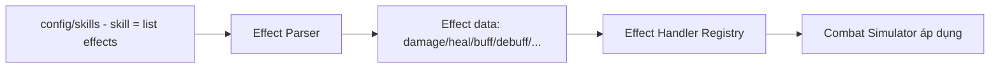

# Skill Framework — Module Architecture

> Skill/effect **data-driven, không switch** (ADR-004). Nguồn: `../mvp/03` §3. Combat MVP full-auto (skill tự kích). Không hiện thực effect cụ thể.

---

## 1. Trách nhiệm
- Định nghĩa **skill & effect dưới dạng dữ liệu** (config), không code cứng từng skill.
- Cung cấp **cơ chế thực thi effect** cho combat sim (áp dụng lên battle state, tất định).

## 2. Mô hình data-driven (effect + handler registry)

**Vấn đề cần tránh:** `switch(skillId)` khổng lồ (đề bài cấm). 

**Giải pháp:** skill = tổ hợp **effect nguyên thủy** (data), mỗi loại effect có một **handler đăng ký (registry)**:

| Khái niệm | Mô tả |
|---|---|
| Skill definition | id, target rule, trigger (energy/cooldown), danh sách effect | 
| Effect (nguyên thủy) | vd `damage`, `heal`, `apply_buff`, `apply_debuff`, `shield`... — mỗi loại có schema |
| Effect handler | Code thực thi **một loại** effect (mechanism), đăng ký theo `effect_type` |
| Thêm skill mới | Thêm **config** ghép effect có sẵn; chỉ thêm code khi có **loại effect mới** |

> Mở rộng bằng **thêm handler mới cho loại effect mới** (đăng ký registry) + config — **không** sửa switch trung tâm (OCP, ADR-004).

## 3. Determinism
- Effect thực thi trong sim tất định (integer/fixed-point, thứ tự ổn định — ADR-011).
- Không random ngoài seeded PRNG (crit... nếu có — `../mvp/10` CB5).

## 4. Ranh giới
| Thuộc module | Không thuộc |
|---|---|
| Schema skill/effect + registry handler | Rendering VFX (client visual) |
| Áp effect lên battle state | Cấp thưởng (economy) |
| Trigger rule (data) | Aggro/target (combat framework dùng, chi tiết `../mvp/10` CB3/CB4) |

## 5. MVP vs tương lai
- MVP: full-auto, tập effect cơ bản (damage/heal/buff/debuff).
- Post-MVP: ultimate thủ công (`../mvp/13` A02), skill level, combo/synergy — thêm effect type + config, không phá kiến trúc.

## 6. Liên kết
- Combat: `combat-framework.md` · Hero: `hero-system.md`
- Data-driven: ADR-004 · Config: `configuration-and-data.md`
- Nguồn: `../mvp/03` §3, `../mvp/10` CB
