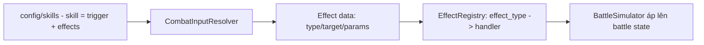

# Skill Framework — effect-data + handler registry

> Skill/effect **data-driven, không switch** (ADR-004); thực thi trong sim tất định (ADR-011). Nguồn nghiệp vụ: `../mvp/03` §3.
> Combat MVP full-auto (skill tự kích). **Phase 28 hiện thực** khung này ở cả hai sim (server .NET §21, client GDScript §21.6
> của `combat-framework.md`), khớp golden vector. Cơ chế chi tiết + thứ tự sự kiện: `combat-framework.md` **§23** (+ §15/§16/§17).

---

## 1. Trách nhiệm
- Định nghĩa **skill & effect dưới dạng dữ liệu** (config), không code cứng từng skill.
- Cung cấp **cơ chế thực thi effect** cho combat sim (áp lên battle state, tất định — fixed-point + thứ tự ổn định).

## 2. Mô hình data-driven (effect + handler registry)

**Vấn đề cần tránh:** `switch(skillId)`/`switch(effect_type)` khổng lồ để mở rộng (đề bài + ADR-004 cấm).

**Giải pháp:** skill = tổ hợp **effect nguyên thủy** (data); mỗi `effect_type` có một **handler đăng ký (registry)**. Lõi sim
**resolve handler theo `effect_type`** rồi `apply` — không biết hiện thực cụ thể của từng handler.

| Khái niệm | Mô tả |
|---|---|
| Skill definition | `id`, target rule, `trigger` (energy/cooldown), `cooldown`, danh sách `effects` |
| Effect (nguyên thủy) | `{ effect_type, target?, params }` — `effect_type` có handler đăng ký |
| Effect handler | Code thực thi **một loại** effect (mechanism), đăng ký theo `effect_type` |
| Thêm skill mới | Thêm **config** ghép effect_type có sẵn — **KHÔNG sửa code lõi** |
| Thêm loại effect mới | Thêm **1 handler** + đăng ký registry (2 phía) + config + test |

## 3. Schema skill (`shared/config-schema/skill.schema.json`, Phase 06/28)

Bắt buộc: `schema_version`, `id` (prefix `skill_`), `target`, `trigger`, `effects` (≥1). `additionalProperties:false`.

| Trường | Kiểu | Ý nghĩa |
|---|---|---|
| `target` | string | Target rule của skill (vd `single_enemy`/`single_ally`/`self`). Enum chưa khoá (tránh invent gameplay). |
| `trigger` | `{ type: "energy"\|"cooldown", value: combat_int }` | Cơ chế kích hoạt. `type=energy` ⇒ `value` = energy_cost. |
| `cooldown` | combat_int (tuỳ chọn) | Số vòng hồi chiêu sau cast (mặc định 0). |
| `effects[]` | array | `{ effect_type, target?(ghi đè), params? }`. |
| `effects[].effect_type` | enum | `damage`, `heal`, `apply_buff`, `apply_debuff`, `shield` (registry MVP; thêm loại = enum additive + handler). |
| `effects[].params` | object | Structural, ràng kiểu khi có mặt (mở cho loại tương lai): `coeff_fixed`, `amount_fixed`, `atk`, `def`, `spd`, `duration` (đều `combat_int`). |

**KHÔNG số balance trong schema** (magnitude/energy/cooldown thật = tuning, ADR-004). Đổi schema là **additive** (thêm field/enum
tuỳ chọn = không bump `schema_version`); siết kiểu/bỏ field = breaking ⇒ bump + migration `_versions/` + validator (Phase 06/07).

## 4. Effect nền (Phase 28 — đã hiện thực)

Đơn vị fixed-point: `FIXED_SCALE=1000` (magnitude fixed dùng cho damage/heal); chỉ số buff/debuff là **integer phẳng**.

| effect_type | params | Ngữ nghĩa | Sự kiện |
|---|---|---|---|
| `damage` | `coeff_fixed`? (mặc định lấy từ skill) | Divisive DEF-ratio (§17); crit sau mitigation | `DamageApplied` (+`Death` nếu hp=0) |
| `heal` | `amount_fixed` | Hồi máu, kẹp MaxHp; lượng thực = sau kẹp | `Healed` |
| `apply_buff` | `atk?`/`def?`/`spd?` (độ lớn dương) + `duration` | Cộng modifier chỉ số | `BuffApplied` (amount dương) |
| `apply_debuff` | `atk?`/`def?`/`spd?` + `duration` | Trừ modifier chỉ số (delta âm) | `BuffApplied` (amount âm) |
| `shield` | — | **Nợ** (giữ enum, chưa handler) — Post-MVP | — |

- **Modifier chỉ số:** hiệu dụng = `clamp(nền + Σ delta, 0, +∞)`. Khoá `(source_skill_id, stat)` ⇒ áp lại **refresh** (không chồng
  vô hạn). Giảm 1 tại `RoundStarted`, hết ở 0 ⇒ `BuffExpired` (thứ tự: stat atk→def→spd; rồi source ordinal).
- **Ultimate theo năng lượng (§15):** `energy` nạp `on_attack`/`on_hit` (config), đủ `energy_cost` & hết cooldown ⇒ cast ultimate
  thay đòn thường; `EnergyChanged` chỉ phát khi giá trị đổi (mặc định gain=0 ⇒ tắt). Số liệu = config (CB4 `[OPEN]`).

## 5. Điều kiện (conditions)
- Cơ chế điều kiện hiện tại = **`trigger`** (energy/cooldown) + chọn skill mỗi lượt (§23.1). **Không** có hệ điều kiện biểu thức
  tổng quát ở MVP (tránh tự vẽ hệ phức tạp) — nếu cần, thêm theo mô hình registry/data-driven ở phase sau (**nợ tài liệu**).

## 6. Determinism (ADR-011)
- Mọi effect chạy trong sim tất định: **integer/fixed-point** (không `float`), thứ tự effect trong skill = thứ tự khai báo, thứ
  tự lượt/target/RNG theo §13/§14/§16. RNG chỉ từ 1 `Pcg32` stream/trận. Không wall-clock, không RNG global.
- Skill thuần heal/buff **không tiêu RNG** (chỉ attack roll hit/crit) ⇒ stream không lệch.

## 7. Hiện thực (reuse — KHÔNG dựng song song)
- **Server** `GameTeam.Domain/Combat/`: `Effects/EffectRegistry`(+`IEffectHandler`, `DamageEffectHandler`/`HealEffectHandler`/
  `ApplyBuffEffectHandler`/`ApplyDebuffEffectHandler`/`StatModifierCore`), `Model/{SkillDef,EffectDef,UnitSkillSet}`, `State/{UnitState,StatModifier}`,
  `Events/{Healed,BuffApplied,BuffExpired,EnergyChanged}`, `BattleSimulator`; data-driven `GameTeam.Application/Combat/{SkillCombatConfig,HeroCombatConfig,CombatInputResolver}`.
- **Client** `client/src/combat/` song ánh bit-for-bit: `effects/*` (registry + 4 handler + `stat_modifier_core.gd`), `model/*`
  (`unit_skill_set.gd`…), `state/combat_unit_state.gd`, `events/combat_events.gd`, `battle_simulator.gd`, `combat_input_resolver.gd`.

## 8. Cách mở rộng
- **Skill mới dùng effect có sẵn:** chỉ **config** (`config/skills/*.json` + `hero.skills[]`), KHÔNG sửa lõi. (Test chứng minh:
  `CombatDataDrivenTests.New_skill_via_config_only_runs_without_core_change` + client `test_new_skill_via_config_only_runs`.)
- **Loại effect mới:** thêm `effect_type` vào enum schema (additive) + 1 handler mỗi phía đăng ký `create_default()`/`CreateDefault()`
  + config + test + (nếu vào golden) vector. **Không** đụng `switch` trung tâm (OCP).

## 9. Golden vector (chống drift — §22)
- `shared/combat-vectors/vector_10..14` phủ heal/buff/debuff/ultimate-energy/multi-effect; định dạng skill riêng của unit trong
  `config_excerpt.skills` + `team_snapshot[].skills` (README). Baseline sinh từ server ⇒ **server ≡ client ≡ baseline** (gate `golden-vector`).

## 10. Ranh giới
| Thuộc module | Không thuộc |
|---|---|
| Schema skill/effect + registry handler + áp effect lên state + trigger rule (data) | Rendering VFX (client visual); cấp thưởng (economy); battle endpoint + wiring hero.skills[] thật (phase 30); aggro nâng cao (CB3) |

## 11. Liên kết
- Combat: `combat-framework.md` §15/§16/§17/§23 · Hero: `hero-system.md` · Config: `configuration-and-data.md`
- Data-driven: `../adr/ADR-004-data-driven-design.md` · Authority/determinism: `../adr/ADR-011-combat-authority-and-determinism.md`
- Golden: `../../shared/combat-vectors/README.md` · Baseline: `../../tools/combat-baseline/README.md`
- Nguồn: `../mvp/03` §3, `../mvp/10` CB3/CB4/CB5
