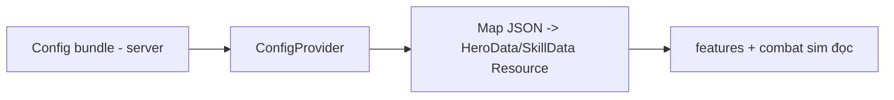

# Resources & Asset Loading (Client)

> Dùng Godot `Resource` cho data-driven, và chiến lược nạp/giải phóng asset. Theo ADR-004 (data-driven) và ADR-009 (asset loading).

---

## 1. Resource cho data-driven

| Chủ đề | Thiết kế |
|---|---|
| Custom Resource | Định nghĩa class `Resource` (vd `HeroData`, `SkillData`) làm **khuôn** cho config |
| Nguồn dữ liệu | Config runtime đến từ **server** (ConfigProvider, ADR-005); `.tres` cục bộ dùng cho editor/test/fallback |
| Id ổn định | Id resource khớp id config (ADR-004, `../conventions/naming.md`) |
| Không hardcode số | Chỉ số gameplay từ config, không nhét trong scene/script |

> Client **phụ thuộc schema**, không phụ thuộc giá trị — đổi cân bằng không cần build client (ADR-004/005).

> **Hai họ model — đừng lẫn:** (1) **Resource config-driven** ở trên (khuôn cho `shared/config-schema`, có `.tres`)
> — do người viết. (2) **Read-model contract** ở `client/src/data/generated/` — **SINH TỰ ĐỘNG** (Phase 08) bởi
> `shared/codegen` từ `shared/contracts/openapi.json` (DTO API + enum dùng chung; enum giữ số C#). File generated có
> header `AUTO-GENERATED — DO NOT EDIT` — **không sửa tay, không tự định nghĩa DTO trùng**; đổi ⇒ sửa
> `GameTeam.Contracts` → regenerate. Chi tiết: `../../shared/codegen/README.md`, ADR-008.

### 1.1 ConfigProvider — cửa đọc config versioned (Phase 16 — đã chốt)

> Nguồn: `client/src/core/config/config_provider.gd` (autoload node `ConfigProvider`, đăng ký trong
> `client/project.godot`; bỏ `class_name` — trùng tên singleton, truy cập qua global `ConfigProvider`).
> **Cửa đọc config DUY NHẤT** của client — feature **không** tự tải/nạp raw bundle (ADR-005/004).

| Trách nhiệm | Chi tiết |
|---|---|
| Nhận bundle | `apply_bundle(bundle: Dictionary)` — nhận bundle envelope `config-bundle.schema.json` (`config_version` "config@vN" + `schema_version` + `data` per-type). Từ NetworkClient (`check_for_update()`) hoặc nguồn khác. |
| Cache đĩa **BẤT BIẾN** | Ghi `user://config_cache/config@vN.json` **ghi-một-lần** — **không bao giờ ghi đè** version cũ (`config@vN` immutable, ADR-005). Con trỏ `active.json` trỏ version đang dùng. |
| Boot | `_ready()` nạp con trỏ + bundle version tương ứng từ đĩa (offline-view); thiếu/hỏng ⇒ trạng thái rỗng, không crash. |
| Truy vấn (data-driven) | `get_entry(type, id)`, `get_all(type)`, `has_entry(type,id)`, `get_hero(id)`, `current_version()`, `config_label()`, `has_config()` — đọc theo schema phase 06, **KHÔNG nhúng số gameplay**; trả **BẢN SAO** ⇒ caller không sửa được cache. |
| So version | `check_for_update()` (coroutine) hỏi server version qua `NetworkClient`; version mới hơn ⇒ tải bundle mới ⇒ `apply_bundle`. Endpoint `/api/v1/config/...` là placeholder wire — Config Service hoàn thiện **phase 21**, bundle e2e **phase 22**. Mất mạng ⇒ giữ cache, không bịa. |
| Sự kiện | Phát `config_updated` (`{version, config_version}`, §`state-and-signals.md` §3.1) khi active version **đổi**. Áp lại đúng version đang dùng = no-op. |

**Luồng đọc config:** `Server → NetworkClient → ConfigProvider (cache config@vN) → Feature/UI`. Đổi
version ⇒ tạo cache version mới, phát `config_updated`, feature nạp lại — **không rebuild client**
(ADR-004/005). Runtime SSOT của config vẫn ở server (Config Service, phase 21); ConfigProvider chỉ
**cache đọc bất biến** theo version.

---

## 2. Asset loading (ADR-009)

| Kỹ thuật | Áp dụng |
|---|---|
| Async load | Asset nặng (hero art/anim/VFX) nạp nền, không chặn UI |
| Lazy load | Nạp theo nhu cầu (vào battle/summon mới nạp hero liên quan) |
| Object pooling | VFX/đối tượng combat tái sử dụng (`../mvp/09` PF1) |
| Atlas/nén | Sprite atlas + nén texture mobile |
| Mapping | id → asset path/atlas trong config, không rải rác |
| Giải phóng | Free asset khi rời scene; tránh rò rỉ |

---

## 3. Memory management

| Nguyên tắc | Chi tiết |
|---|---|
| Vòng đời rõ | Sở hữu asset gắn với scene/feature; free khi thoát |
| Pool có trần | Giới hạn kích thước pool; tránh phình RAM |
| Tránh giữ ref thừa | Không cache asset nặng toàn cục vô thời hạn |
| Profiling | Đo RAM/FPS ở giai đoạn hardening (`../architecture/implementation-order.md` S13) |
| Battery/nhiệt | Giới hạn frame khi idle; tối ưu tua (`../mvp/09` PF4) |

---

## 4. Localization asset
- Bản dịch runtime nạp từ `client/localization/` (sinh từ `localization/` gốc) — chuẩn bị đa ngôn ngữ (`../mvp/10` UX4).
- Text qua khoá i18n, không hardcode chuỗi hiển thị.

## 5. Liên kết
- Data-driven: ADR-004; Config: ADR-005
- Asset loading: ADR-009
- Scene: `scene-architecture.md`
- Configuration & data (gameplay): `../gameplay/configuration-and-data.md`
