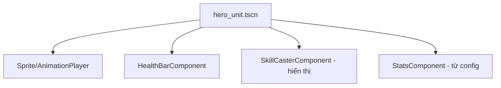
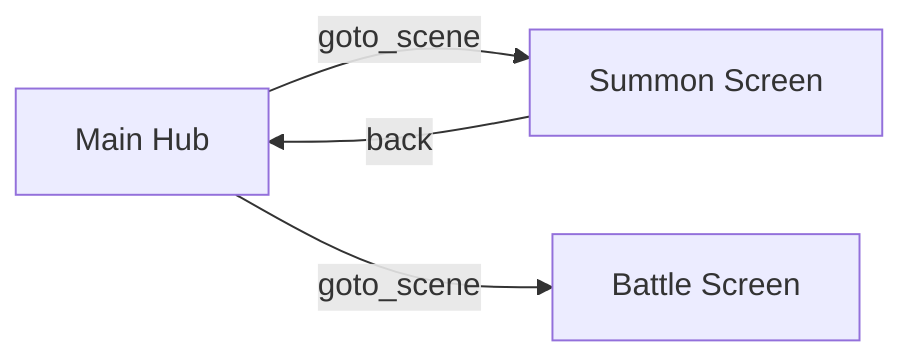
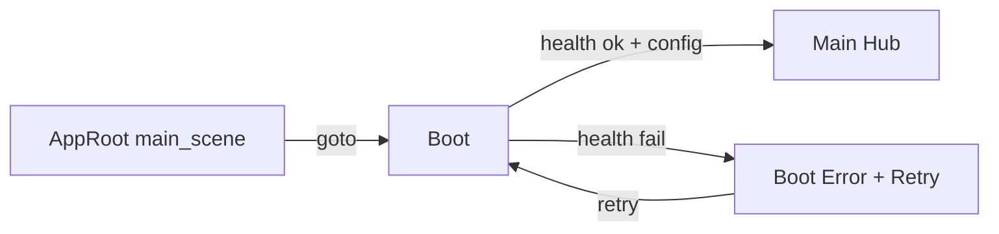

# Scene Architecture (Kiến trúc scene)

> Cách tổ chức scene, composition, feature module, chuyển scene, và autoload. Theo ADR-002.

---

## 1. Phân loại scene

| Loại | Vai trò | Ví dụ |
|---|---|---|
| Screen | Màn hình đầy đủ (một "trang") | `main_hub_screen`, `summon_screen`, `battle_screen` |
| Widget | Thành phần UI tái sử dụng | `hero_card`, `currency_bar` |
| Feature root | Điểm vào của một feature | `battle/battle.tscn` |
| Entity/visual | Đối tượng hiển thị (hero visual) | `hero_unit.tscn` |
| Service (không scene) | Logic thuần (autoload/script) | `combat_sim.gd`, `network_client.gd` |

**WHY:** phân loại rõ giúp composition & tái sử dụng, tránh scene "khổng lồ" ôm mọi thứ.

---

## 2. Composition over inheritance



- Ghép **component (node con)** thay vì kế thừa (`FireHero extends Hero`...).
- Hành vi khác nhau đến từ **dữ liệu (config)**, không từ subclass (ADR-004).
- Component nhỏ, một-trách-nhiệm (SRP).

> **Lưu ý:** visual/hiển thị ở client; **logic combat quyết định** nằm ở sim thuần (ADR-011), không ở node visual.

---

## 3. Feature module (tự chứa)

```text
features/summon/
├── summon.tscn            # feature root
├── summon.gd              # điều phối feature (view-model)
├── summon_screen.tscn     # UI màn hình
├── widgets/               # widget riêng feature
├── resources/             # Resource riêng feature (nếu có)
└── README.md              # mục đích, event công khai, ranh giới
```

- Feature **không import chéo** feature khác; phối hợp qua Event Bus/Scene Router (`state-and-signals.md`).
- Mỗi feature có README ngắn (hỗ trợ AI context — `../ai/context-strategy.md`).

---

## 4. Scene transition (chuyển màn)

| Chủ đề | Thiết kế |
|---|---|
| Router | `SceneRouter` autoload quản lý chuyển screen tập trung (feature **không** tự điều hướng rải rác) |
| Transition | Phase 14: tối giản (tráo tức thời). Fade/loading chuẩn hoá + async load screen nặng (ADR-009) = **phase UI sau** |
| State giữa scene | Không nhét state vào scene tree; đọc từ `StateCache`/service |
| Deep link | Router hỗ trợ mở thẳng một screen (vd từ notification — Post-MVP) |



### 4.1 SceneRouter — API điều hướng (Phase 14 — đã chốt)

> Nguồn: `client/src/core/scene/scene_router.gd` (autoload node `SceneRouter`). Trách nhiệm **duy nhất**:
> điều hướng scene + back stack. **Không** chứa logic feature.

| Hàm | Ý nghĩa |
|---|---|
| `goto_scene(path: String, context := {}) -> bool` | Chuyển tới scene tại `path`, đẩy scene hiện tại vào back stack. `false` + `push_error` nếu path lỗi (không ném, không nuốt lỗi). **`context`** (tuỳ chọn, **additive — Phase 27**): dữ liệu điều hướng cho presenter scene đích (vd `{"hero_id": ...}`). |
| `route_context() -> Dictionary` | (**Phase 27**) Ngữ cảnh điều hướng của scene hiện tại (bản sao; `{}` nếu không có). Presenter scene đích đọc tại đây (vd `SceneRouter.route_context().get("hero_id")`) — vì mô hình scene-host không truyền tham số qua ctor scene. Đặt **trước** khi instantiate (⇒ `_ready` đọc được ngay); `back()` reset về `{}`. |
| `back() -> bool` | Quay lại scene trước trong back stack. `false` nếu stack rỗng. |
| `stack_depth() -> int` | Số phần tử back stack (kiểm thử/gỡ lỗi). |
| `clear_history()` | Xoá back stack (không đổi scene hiện tại) — dùng khi reset điều hướng (boot/logout). |
| `current_path` / `current_scene` | Đường dẫn + node scene đang hiển thị (`""`/`null` nếu chưa có). |

- **Mô hình "scene-host":** router giữ scene hiện tại làm **node con** và tráo tại chỗ. Khi tráo, scene cũ
  được **`queue_free()`** ⇒ giải phóng đúng cách, **không giữ tham chiếu scene cũ** (chống rò rỉ — ADR-009).
- **Transition tối giản:** tráo tức thời (không animation). Hiệu ứng chuyển cảnh nâng cao = nợ kỹ thuật để
  **phase UI sau** (không dựng framework transition ở Phase 14).
- **Back stack:** `goto_scene` = *push*; `back` = *pop*. `replace` (thay không đẩy stack), async-load màn
  nặng, và deep-link là **mở rộng tương lai** (phase UI/boot), chưa hiện thực ở Phase 14.
- **Sự kiện:** sau mỗi lần đổi scene, router phát `scene_changed` qua `EventBus` (payload
  `{ "to", "from" }`) ⇒ feature phản ứng mà **không import** `SceneRouter` (`state-and-signals.md` §3.1).

### 4.2 Boot flow + app-shell (Phase 17 — đã chốt)

> Nguồn: `client/src/ui/app_root.{gd,tscn}` (main scene), `client/src/ui/boot/` (`BootController` + `BootView` +
> `BootErrorView`), `client/src/ui/main_hub/`. `run/main_scene = res://src/ui/app_root.tscn`.

**App-shell:** main scene = `AppRoot` (Control RỖNG, không UI riêng). `AppRoot._ready` → `SceneRouter.goto(boot)`
⇒ **SceneRouter làm CHỦ SỞ HỮU mọi screen hiển thị ngay từ frame đầu** (boot → hub, tráo tại chỗ + `queue_free`
scene cũ — không chồng lớp, không giữ tham chiếu). Không để boot làm main scene tự-`queue_free` (footgun); mọi
screen đi qua router đồng nhất.



**Hợp đồng boot** (`BootController` = presenter, root của `boot.tscn`):
1. **Health = cổng kết nối BẮT BUỘC:** `NetworkClient.get_json("/health", parse_health)`. Mất mạng/non-2xx →
   `BootErrorView` (thông báo an toàn) + retry.
2. **Config = BEST-EFFORT:** `ConfigProvider.check_for_update()`. Config Service thật = phase 21 ⇒ endpoint vắng/
   lỗi hôm nay là **bình thường** (giữ cache, KHÔNG chặn boot). Siết cổng config khi phase 21/22 sẵn sàng.
3. **Vào hub:** `SceneRouter.goto(main_hub)` + `clear_history()` (không quay lại boot). Emit `boot_succeeded`.

**Main hub = shell điều hướng/bố cục** (`MainHubView` + `MainHubPresenter`): tiêu đề + nút placeholder phát intent;
**chưa** chứa nghiệp vụ (feature thật = phase sau). Điều hướng feature sẽ qua `SceneRouter` tại presenter.
Auth (guest login) chèn vào boot ở **phase 20** (giữa config và hub).

---

## 5. Autoload (dịch vụ nền — tối giản)

| Autoload | Trách nhiệm (một việc) |
|---|---|
| `EventBus` | Pub/sub sự kiện toàn cục |
| `NetworkClient` | Gọi API REST + JWT |
| `ConfigProvider` | Cache & cung cấp config versioned |
| `StateCache` | Cache trạng thái đọc (hiển thị/offline-view) |
| `SceneRouter` | Điều hướng scene |
| `AudioManager` | Nhạc/SFX (tối giản) |

**Cấm:** autoload "God" ôm nhiều trách nhiệm. Mỗi autoload SRP, có interface rõ (ADR-002).

> **Trạng thái:** `EventBus` + `SceneRouter` (Phase 14), `NetworkClient` (Phase 15), `ConfigProvider` +
> `StateCache` (Phase 16) **đã hiện thực** (5 autoload độc lập, đăng ký trong `client/project.godot`).
> **Boot + UI base = Phase 17** (đã hiện thực dưới dạng **scene**, KHÔNG phải autoload — `src/ui/app_root` →
> `boot` → `main_hub`; xem §4.2). **`AudioManager` = HOÃN** (không thuộc checklist Phase 17 — chưa có audio
> content; thêm khi cần nhạc/SFX, mỗi autoload một trách nhiệm — không gộp thành "manager").

## 6. Liên kết
- State & signals: `state-and-signals.md`
- UI: `ui-architecture.md`
- Asset: `resources-and-assets.md`, ADR-009
- ADR-002
