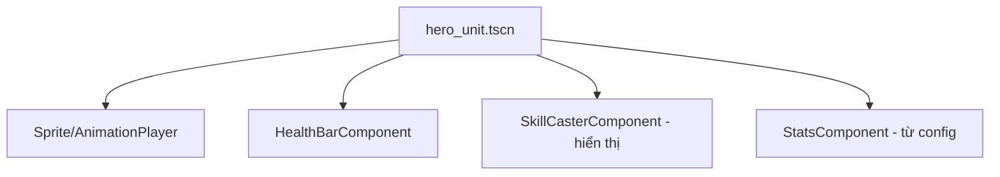
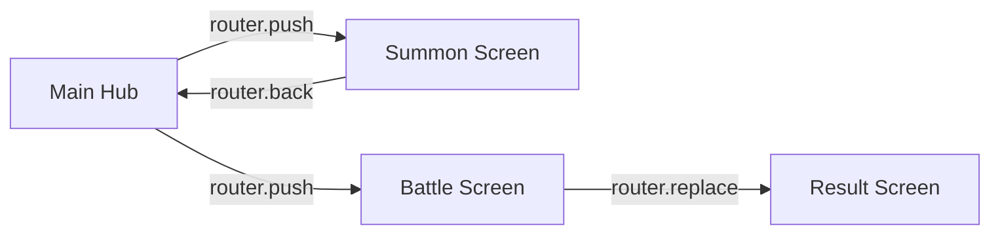

# Scene Architecture (Kiến trúc scene)

> Cách tổ chức scene, composition, feature module, chuyển scene, và autoload. Theo ADR-002.

---

## 1. Phân loại scene

| Loại | Vai trò | Ví dụ |
|---|---|---|
| Screen | Màn hình đầy đủ (một "trang") | `main_hub_screen`, `summon_screen`, `battle_screen` |
| Widget | Thành phần UI tái sử dụng | `hero_card`, `currency_bar` |
| Feature root | Điểm vào của một feature | `battle/battle.tscn` |
| Entity/visual | Đối tượng hiển thị (hero visual) | `hero_unit.tscn` |
| Service (không scene) | Logic thuần (autoload/script) | `combat_sim.gd`, `network_client.gd` |

**WHY:** phân loại rõ giúp composition & tái sử dụng, tránh scene "khổng lồ" ôm mọi thứ.

---

## 2. Composition over inheritance



- Ghép **component (node con)** thay vì kế thừa (`FireHero extends Hero`...).
- Hành vi khác nhau đến từ **dữ liệu (config)**, không từ subclass (ADR-004).
- Component nhỏ, một-trách-nhiệm (SRP).

> **Lưu ý:** visual/hiển thị ở client; **logic combat quyết định** nằm ở sim thuần (ADR-011), không ở node visual.

---

## 3. Feature module (tự chứa)

```text
features/summon/
├── summon.tscn            # feature root
├── summon.gd              # điều phối feature (view-model)
├── summon_screen.tscn     # UI màn hình
├── widgets/               # widget riêng feature
├── resources/             # Resource riêng feature (nếu có)
└── README.md              # mục đích, event công khai, ranh giới
```

- Feature **không import chéo** feature khác; phối hợp qua Event Bus/Scene Router (`state-and-signals.md`).
- Mỗi feature có README ngắn (hỗ trợ AI context — `../ai/context-strategy.md`).

---

## 4. Scene transition (chuyển màn)

| Chủ đề | Thiết kế |
|---|---|
| Router | `SceneRouter` autoload quản lý chuyển screen (push/replace) |
| Transition | Fade/loading chuẩn hoá; async load screen nặng (ADR-009) |
| State giữa scene | Không nhét state vào scene tree; đọc từ `StateCache`/service |
| Deep link | Router hỗ trợ mở thẳng một screen (vd từ notification — Post-MVP) |



---

## 5. Autoload (dịch vụ nền — tối giản)

| Autoload | Trách nhiệm (một việc) |
|---|---|
| `EventBus` | Pub/sub sự kiện toàn cục |
| `NetworkClient` | Gọi API REST + JWT |
| `ConfigProvider` | Cache & cung cấp config versioned |
| `StateCache` | Cache trạng thái đọc (hiển thị/offline-view) |
| `SceneRouter` | Điều hướng scene |
| `AudioManager` | Nhạc/SFX (tối giản) |

**Cấm:** autoload "God" ôm nhiều trách nhiệm. Mỗi autoload SRP, có interface rõ (ADR-002).

## 6. Liên kết
- State & signals: `state-and-signals.md`
- UI: `ui-architecture.md`
- Asset: `resources-and-assets.md`, ADR-009
- ADR-002
