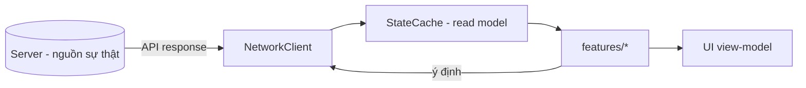

# State Management & Signals

> Quản lý trạng thái client (cache đọc), giao tiếp qua signals/Event Bus, và network client. Client **không** giữ nguồn sự thật (ADR-007).

---

## 1. Mô hình trạng thái client

| Nguyên tắc | Chi tiết |
|---|---|
| Read-only cache | `StateCache` giữ bản sao để hiển thị/offline-view; không tự sửa quyền lực |
| Ghi qua server | Mọi thay đổi state gửi command lên server, nhận lại state mới (ADR-007) |
| Single source per domain | Mỗi loại dữ liệu có một chỗ cache; UI đọc từ đó |
| Optimistic UI (thận trọng) | Cho phép hiển thị lạc quan **chỉ** cho thao tác nhẹ; kết quả nhạy cảm chờ server (ADR-011) |

---

## 2. Signals (nội bộ scene/feature)
- Dùng signal cho giao tiếp **trong** feature/scene (node ↔ node cha).
- Đặt tên theo sự kiện (`hero_selected`, `battle_finished`) — `../conventions/naming.md`.
- Kết nối signal trong code (`.connect`) hoặc editor, nhất quán trong dự án.

## 3. Event Bus (cross-feature)
- `EventBus` autoload cho sự kiện **liên feature** (vd `currency_changed` → cập nhật nhiều UI).
- **Kỷ luật:** event công khai phải tài liệu hoá (README feature) để tránh "kênh ngầm" God (`../architecture/dependency-graph.md`).
- Không lạm dụng cho luồng nội bộ (dùng signal thường).

| Khi nào dùng gì |
|---|
| Trong scene/feature → **signal** |
| Giữa các feature không biết nhau → **Event Bus** |
| Cần dữ liệu server → **NetworkClient** (không qua Event Bus) |

### 3.1 EventBus — hợp đồng nội bộ client (Phase 14 — đã chốt)

> Nguồn: `client/src/core/events/event_bus.gd` (autoload node `EventBus`). Đây là **hợp đồng nội bộ
> client** — mọi event dùng trong code phải xuất hiện ở danh mục dưới (không "event chui").

**API** (single-responsibility, không "God channel"):

| Hàm | Ý nghĩa |
|---|---|
| `emit(event: StringName, payload: Variant = null)` | Phát `event` đã đăng ký kèm `payload` tới mọi subscriber. |
| `subscribe(event: StringName, callback: Callable)` | Đăng ký `callback`; an toàn khi gọi lặp (không nối trùng). |
| `unsubscribe(event: StringName, callback: Callable)` | Huỷ đăng ký — **luôn gọi khi teardown/free** để tránh rò rỉ subscriber. |
| `is_known(event: StringName) -> bool` | True nếu `event` nằm trong danh mục (định tuyến an toàn). |

- **Cơ chế:** danh mục = hằng `EVENTS: Array[StringName]` + một `signal <name>(payload)` khai báo cho mỗi
  event. Danh mục **đóng**: `emit`/`subscribe` `assert` event ∈ `EVENTS` ⇒ event chưa đăng ký = fail sớm.
  Dùng signal Godot chuẩn ⇒ Godot **tự ngắt kết nối** khi subscriber node bị free (chống rò rỉ), kèm
  `unsubscribe` tường minh.
- **Payload:** quy ước **một** tham số `payload` dạng `Dictionary` cho mọi event (đồng nhất `emit`/`subscribe`).
- **Truy cập:** feature/service tham chiếu singleton toàn cục `EventBus` trực tiếp (không import chéo).

**Danh mục event nền:**

| Event (`snake_case`, past-tense) | Ý nghĩa | Payload | Producer | Consumer |
|---|---|---|---|---|
| `scene_changed` | Điều hướng scene đã hoàn tất | `{ "to": String, "from": String }` | `SceneRouter` | feature bất kỳ cần phản ứng khi đổi scene |

> Phase 14 chỉ có **một** event nền (`scene_changed`) — event nghiệp vụ (vd `battle_finished`,
> `currency_changed`) do **phase sở hữu feature** thêm về sau.

**Thêm event mới (quy trình bắt buộc):**
1. Đặt tên `snake_case`, **thể quá khứ/sự kiện** (không mệnh lệnh) — `../conventions/naming.md` §6.
2. Khai báo `signal <name>(payload)` **và** thêm tên vào `EVENTS` trong `event_bus.gd`.
3. Ghi một dòng vào **bảng danh mục** trên (ý nghĩa/payload/producer/consumer).
4. Không thêm event chỉ để "cho đủ"; nếu chỉ dùng trong một feature → dùng **signal thường**, không EventBus.

## 4. NetworkClient
| Trách nhiệm | Chi tiết |
|---|---|
| Gọi REST + JWT | Wrap HTTP, gắn token, xử lý refresh (ADR-008) |
| Serialize/deserialize | Dùng model sinh từ contracts (codegen) |
| Idempotency | Gửi `Idempotency-Key` cho command nhạy cảm |
| Lỗi mạng | Trả Result rõ ràng; UI hiển thị cache + retry/thông báo (`../mvp/10` UX3) |
| Không quyết nghiệp vụ | Chỉ truyền tải; kết quả do server (ADR-011) |

## 5. Combat state (đặc thù)
- Client chạy sim **để hiển thị** dựa trên `seed` server trả; state kết quả/thưởng lấy từ server response.
- Sim client đọc từ `ConfigProvider`; đồng nhất ruleset server (ADR-011).

## 6. Liên kết
- Scene/autoload: `scene-architecture.md`
- Resource/config: `resources-and-assets.md`
- Networking: `../backend/api-and-versioning.md`, ADR-008
- Save: ADR-007
