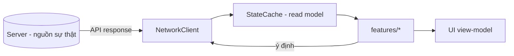

# State Management & Signals

> Quản lý trạng thái client (cache đọc), giao tiếp qua signals/Event Bus, và network client. Client **không** giữ nguồn sự thật (ADR-007).

---

## 1. Mô hình trạng thái client

| Nguyên tắc | Chi tiết |
|---|---|
| Read-only cache | `StateCache` giữ bản sao để hiển thị/offline-view; không tự sửa quyền lực |
| Ghi qua server | Mọi thay đổi state gửi command lên server, nhận lại state mới (ADR-007) |
| Single source per domain | Mỗi loại dữ liệu có một chỗ cache; UI đọc từ đó |
| Optimistic UI (thận trọng) | Cho phép hiển thị lạc quan **chỉ** cho thao tác nhẹ; kết quả nhạy cảm chờ server (ADR-011) |

### 1.1 StateCache — read-cache trạng thái người chơi (Phase 16 — đã chốt)

> Nguồn: `client/src/core/state/state_cache.gd` (autoload node `StateCache`, đăng ký trong
> `client/project.godot`; bỏ `class_name` — trùng tên singleton, truy cập qua global `StateCache`).
> **CHỈ HIỂN THỊ (display-only), KHÔNG phải chân lý** — nguồn sự thật luôn ở server (ADR-007).

| Trách nhiệm | Chi tiết |
|---|---|
| Read-cache | Giữ bản sao đọc của `profile`/`currencies`/`heroes`/`progress` để UI hiển thị + offline-view. `const IS_DISPLAY_ONLY = true`. |
| Đường ghi DUY NHẤT | `apply_snapshot(snapshot: Dictionary)` — thay **toàn bộ** cache bằng snapshot từ **server response** (invalidate dữ liệu cũ). **KHÔNG** có mutator chân lý (không `add_currency`/`spend_currency`/`set_progress`…). |
| API đọc | `get_currency(code)`, `get_currencies()`, `get_heroes()`, `get_hero(id)`, `get_progress(key)`, `get_all_progress()`, `get_profile()` — **trả BẢN SAO** ⇒ caller không sửa được cache. |
| Nhãn nguồn | `source()` = `"empty"｜"server"｜"cache"`; `is_offline()` (nguồn=cache ⇒ UI gắn nhãn "offline/cached"); ưu tiên server khi online. |
| Cache đĩa | Lưu snapshot xuống `user://state_cache/snapshot.json`; boot nạp lại với nhãn `"cache"` (offline-view dữ liệu cũ) tới khi server refresh lật về `"server"`. Chỉ dữ liệu hiển thị — **không bí mật**. |
| Sự kiện | Phát `state_refreshed` (§3.1) sau mỗi `apply_snapshot`. |

**Luồng thay đổi state (bắt buộc):** `Feature/UI → NetworkClient → Server (command) → response → StateCache.apply_snapshot`.
Client **không** tự cộng/trừ currency, **không** tự tính reward/kết quả/progress (ADR-007/011). StateCache
**không bao giờ** là nguồn quyết định hành động nhạy cảm.

---

## 2. Signals (nội bộ scene/feature)
- Dùng signal cho giao tiếp **trong** feature/scene (node ↔ node cha).
- Đặt tên theo sự kiện (`hero_selected`, `battle_finished`) — `../conventions/naming.md`.
- Kết nối signal trong code (`.connect`) hoặc editor, nhất quán trong dự án.

## 3. Event Bus (cross-feature)
- `EventBus` autoload cho sự kiện **liên feature** (vd `currency_changed` → cập nhật nhiều UI).
- **Kỷ luật:** event công khai phải tài liệu hoá (README feature) để tránh "kênh ngầm" God (`../architecture/dependency-graph.md`).
- Không lạm dụng cho luồng nội bộ (dùng signal thường).

| Khi nào dùng gì |
|---|
| Trong scene/feature → **signal** |
| Giữa các feature không biết nhau → **Event Bus** |
| Cần dữ liệu server → **NetworkClient** (không qua Event Bus) |

### 3.1 EventBus — hợp đồng nội bộ client (Phase 14 — đã chốt)

> Nguồn: `client/src/core/events/event_bus.gd` (autoload node `EventBus`). Đây là **hợp đồng nội bộ
> client** — mọi event dùng trong code phải xuất hiện ở danh mục dưới (không "event chui").

**API** (single-responsibility, không "God channel"):

| Hàm | Ý nghĩa |
|---|---|
| `emit(event: StringName, payload: Variant = null)` | Phát `event` đã đăng ký kèm `payload` tới mọi subscriber. |
| `subscribe(event: StringName, callback: Callable)` | Đăng ký `callback`; an toàn khi gọi lặp (không nối trùng). |
| `unsubscribe(event: StringName, callback: Callable)` | Huỷ đăng ký — **luôn gọi khi teardown/free** để tránh rò rỉ subscriber. |
| `is_known(event: StringName) -> bool` | True nếu `event` nằm trong danh mục (định tuyến an toàn). |

- **Cơ chế:** danh mục = hằng `EVENTS: Array[StringName]` + một `signal <name>(payload)` khai báo cho mỗi
  event. Danh mục **đóng**: `emit`/`subscribe` `assert` event ∈ `EVENTS` ⇒ event chưa đăng ký = fail sớm.
  Dùng signal Godot chuẩn ⇒ Godot **tự ngắt kết nối** khi subscriber node bị free (chống rò rỉ), kèm
  `unsubscribe` tường minh.
- **Payload:** quy ước **một** tham số `payload` dạng `Dictionary` cho mọi event (đồng nhất `emit`/`subscribe`).
- **Truy cập:** feature/service tham chiếu singleton toàn cục `EventBus` trực tiếp (không import chéo).

**Danh mục event nền:**

| Event (`snake_case`, past-tense) | Ý nghĩa | Payload | Producer | Consumer |
|---|---|---|---|---|
| `scene_changed` | Điều hướng scene đã hoàn tất | `{ "to": String, "from": String }` | `SceneRouter` | feature bất kỳ cần phản ứng khi đổi scene |
| `network_error` | Một request mạng thất bại (HTTP 4xx/5xx, JSON/parse lỗi, timeout, mất mạng) | `{ "kind": int (NetResult.Kind), "code": String, "message": String, "trace_id": Variant, "status": int }` | `NetworkClient` | UI/feature hiển thị lỗi, retry, thông báo |
| `unauthorized` | Request bị từ chối do chưa/không còn xác thực (HTTP 401) — phát **kèm** `network_error` | `{ "kind": int, "code": String, "message": String, "trace_id": Variant, "status": 401 }` | `NetworkClient` | lớp auth (phase 18/20) kích hoạt đăng nhập lại / refresh |
| `config_updated` | Active config version đã đổi thành công (ConfigProvider nạp/áp bundle version mới) | `{ "version": int, "config_version": String ("config@vN") }` | `ConfigProvider` | feature/UI nạp lại dữ liệu config theo version mới |
| `state_refreshed` | StateCache vừa refresh snapshot đọc từ server response | `{ "source": String ("server") }` | `StateCache` | UI cập nhật hiển thị currency/hero/progress từ cache mới |

> Phase 14 seed một event nền (`scene_changed`). **Phase 15** thêm `network_error` + `unauthorized`
> (producer = `NetworkClient`). **Phase 16** thêm `config_updated` (producer = `ConfigProvider`) +
> `state_refreshed` (producer = `StateCache`). Event nghiệp vụ (vd `battle_finished`, `currency_changed`)
> do **phase sở hữu feature** thêm về sau. Mọi thất bại mạng đi qua **một kênh** `network_error`; 401
> phát **thêm** `unauthorized` để lớp auth phản ứng riêng.

**Thêm event mới (quy trình bắt buộc):**
1. Đặt tên `snake_case`, **thể quá khứ/sự kiện** (không mệnh lệnh) — `../conventions/naming.md` §6.
2. Khai báo `signal <name>(payload)` **và** thêm tên vào `EVENTS` trong `event_bus.gd`.
3. Ghi một dòng vào **bảng danh mục** trên (ý nghĩa/payload/producer/consumer).
4. Không thêm event chỉ để "cho đủ"; nếu chỉ dùng trong một feature → dùng **signal thường**, không EventBus.

## 4. NetworkClient (Phase 15 — đã chốt)

> Nguồn: `client/src/core/net/` (autoload node `NetworkClient`, đăng ký trong `client/project.godot`).
> **Kênh giao tiếp server DUY NHẤT của client** — UI/feature **không** gọi `HTTPRequest` trực tiếp
> (§ `ui-architecture.md` §1). Autoload bỏ `class_name` (trùng tên singleton) — truy cập qua global
> `NetworkClient`. Các lớp phụ trợ (không autoload) có `class_name`: `HttpTransport`/`GodotHttpTransport`
> (seam vận chuyển — nơi DUY NHẤT chạm `HTTPRequest`), `TokenStore` (kho JWT tối giản), `NetResult`
> (kết quả chuẩn hoá), `NetworkResponseParser` (JSON → model generated).

| Trách nhiệm | Chi tiết |
|---|---|
| Gọi REST + JWT | `get_json(path, parser)` / `post_json(path, body, parser)`; base URL từ env `GAME_TEAM_API_BASE_URL` (mặc định `http://localhost:8080`), path dưới `/api/v1`; header `Authorization: Bearer <jwt>` chỉ khi `TokenStore` có token (đăng nhập/refresh thật = phase 18/20). **Không log token/Authorization.** |
| Serialize/deserialize | Body → JSON; response → model generated (phase 08) qua `parser: Callable` (vd `NetworkResponseParser.parse_server_time`, `parse_health` — phase 17 dùng cho cổng boot `/health` → `HealthResponse`). Model generated là DO-NOT-EDIT (không `from_dict`) ⇒ parser sống ở `core/net/response_parser.gd`; thêm DTO mới = thêm một hàm parse ở đó. **Không thêm event EventBus** cho phase 17 (danh mục §3.1 giữ nguyên 5 event). |
| Chuẩn hoá lỗi | Map `ErrorResponse` `{code, message, traceId}` (hoặc tổng hợp phía client) → `NetResult` (`ok`/`value`/`error`/`status_code`/`kind`). Phân biệt: 2xx, 4xx, 5xx, 401, JSON không hợp lệ, parse lệch model, timeout, mất mạng. |
| Sự kiện lỗi | Mọi thất bại phát `network_error` qua EventBus (một kênh nhất quán); **401 phát thêm `unauthorized`** (§3.1). |
| Timeout + retry | Timeout mỗi request (`request_timeout_seconds`, mặc định 10s). Retry **chỉ GET/idempotent-safe** trên lỗi vận chuyển tạm thời (timeout/mất kết nối), tối đa `MAX_GET_RETRIES`. **POST không bao giờ tự retry** (tránh double-effect; `Idempotency-Key` cho command nhạy cảm = server phase 31). |
| Không quyết nghiệp vụ | Chỉ truyền tải; mất mạng → **báo lỗi, KHÔNG bịa kết quả/phần thưởng** (ADR-008/011). |

> **Ngoài phạm vi phase 15 (nợ có chủ đích):** đăng nhập/lấy token thật + refresh (phase 18/20),
> lưu token bền, offline queue nâng cao (phase 20/48), `Idempotency-Key` POST (server phase 31),
> SignalR realtime (Post-MVP). Config bundle caching = **phase 16** (§1.1 `StateCache` +
> `resources-and-assets.md` §1.1 `ConfigProvider`, đã chốt).

## 5. Combat state (đặc thù)
- Client chạy sim **để hiển thị** dựa trên `seed` server trả; state kết quả/thưởng lấy từ server response.
- Sim client đọc từ `ConfigProvider`; đồng nhất ruleset server (ADR-011).

## 6. Liên kết
- Scene/autoload: `scene-architecture.md`
- Resource/config: `resources-and-assets.md`
- Networking: `../backend/api-and-versioning.md`, ADR-008
- Save: ADR-007
