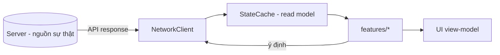

# State Management & Signals

> Quản lý trạng thái client (cache đọc), giao tiếp qua signals/Event Bus, và network client. Client **không** giữ nguồn sự thật (ADR-007).

---

## 1. Mô hình trạng thái client

| Nguyên tắc | Chi tiết |
|---|---|
| Read-only cache | `StateCache` giữ bản sao để hiển thị/offline-view; không tự sửa quyền lực |
| Ghi qua server | Mọi thay đổi state gửi command lên server, nhận lại state mới (ADR-007) |
| Single source per domain | Mỗi loại dữ liệu có một chỗ cache; UI đọc từ đó |
| Optimistic UI (thận trọng) | Cho phép hiển thị lạc quan **chỉ** cho thao tác nhẹ; kết quả nhạy cảm chờ server (ADR-011) |

---

## 2. Signals (nội bộ scene/feature)
- Dùng signal cho giao tiếp **trong** feature/scene (node ↔ node cha).
- Đặt tên theo sự kiện (`hero_selected`, `battle_finished`) — `../conventions/naming.md`.
- Kết nối signal trong code (`.connect`) hoặc editor, nhất quán trong dự án.

## 3. Event Bus (cross-feature)
- `EventBus` autoload cho sự kiện **liên feature** (vd `currency_changed` → cập nhật nhiều UI).
- **Kỷ luật:** event công khai phải tài liệu hoá (README feature) để tránh "kênh ngầm" God (`../architecture/dependency-graph.md`).
- Không lạm dụng cho luồng nội bộ (dùng signal thường).

| Khi nào dùng gì |
|---|
| Trong scene/feature → **signal** |
| Giữa các feature không biết nhau → **Event Bus** |
| Cần dữ liệu server → **NetworkClient** (không qua Event Bus) |

## 4. NetworkClient
| Trách nhiệm | Chi tiết |
|---|---|
| Gọi REST + JWT | Wrap HTTP, gắn token, xử lý refresh (ADR-008) |
| Serialize/deserialize | Dùng model sinh từ contracts (codegen) |
| Idempotency | Gửi `Idempotency-Key` cho command nhạy cảm |
| Lỗi mạng | Trả Result rõ ràng; UI hiển thị cache + retry/thông báo (`../mvp/10` UX3) |
| Không quyết nghiệp vụ | Chỉ truyền tải; kết quả do server (ADR-011) |

## 5. Combat state (đặc thù)
- Client chạy sim **để hiển thị** dựa trên `seed` server trả; state kết quả/thưởng lấy từ server response.
- Sim client đọc từ `ConfigProvider`; đồng nhất ruleset server (ADR-011).

## 6. Liên kết
- Scene/autoload: `scene-architecture.md`
- Resource/config: `resources-and-assets.md`
- Networking: `../backend/api-and-versioning.md`, ADR-008
- Save: ADR-007
