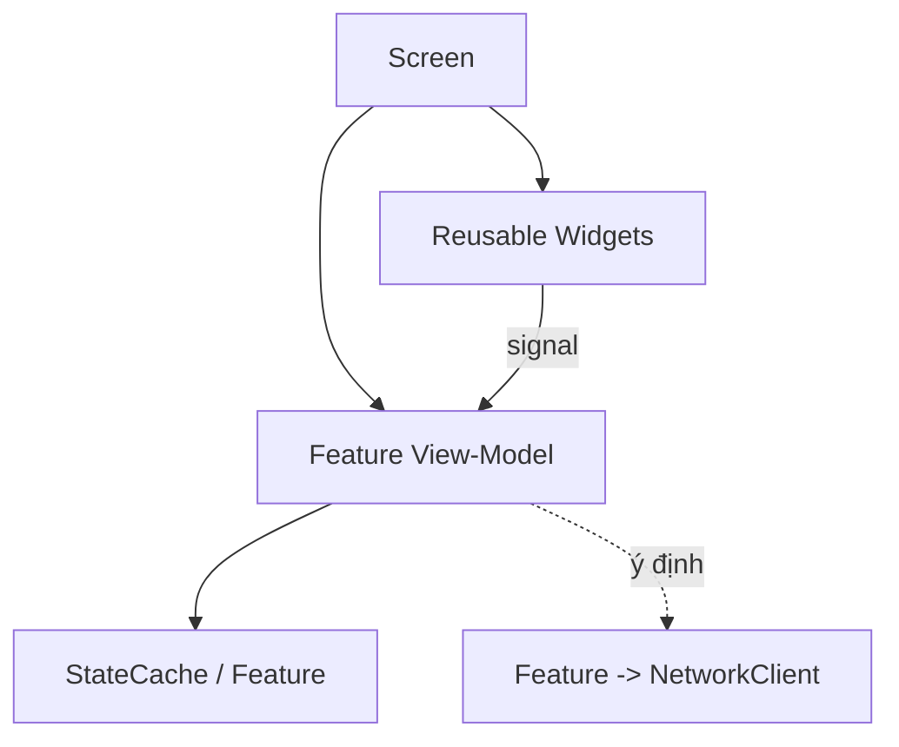

# UI Architecture (Client)

> UI layer landscape, tách khỏi logic, tái sử dụng widget. UI **không** gọi network trực tiếp (ADR-002).

---

## 1. Nguyên tắc UI

| Nguyên tắc | Chi tiết |
|---|---|
| Tách UI ↔ logic | UI hiển thị + nhận input; logic ở feature/view-model |
| Không gọi network | UI → feature (view-model) → **`NetworkClient`** (Phase 15). **Cấm** `HTTPRequest`/REST trực tiếp trong UI/feature; `HTTPRequest` chỉ tồn tại trong `client/src/core/net/` (grep guard). Chi tiết kênh mạng: `state-and-signals.md` §4. |
| Widget tái sử dụng | `ui/` chứa widget dùng chung (card, bar, dialog) |
| Landscape-first | Bố cục ngang (`../mvp/00`); dùng anchor/container co giãn |
| Data-binding nhẹ | View-model cập nhật UI qua signal/observable |
| Theme thống nhất | Theme resource dùng chung (font, màu, style) |

---

## 2. Lớp UI

| Lớp | Vai trò |
|---|---|
| Screen | Màn hình đầy đủ, bố cục, điều phối widget |
| Widget | Thành phần tái sử dụng (hero_card, currency_bar) |
| View-Model | Chuẩn bị dữ liệu hiển thị + xử lý input → gọi feature |

---

## 3. Responsive & landscape
- Dùng `Control` anchor + `Container` (HBox/VBox/Grid) để co giãn theo độ phân giải.
- Safe area cho tai thỏ/điện thoại; test nhiều tỉ lệ (`../mvp/10` AR3).
- Ưu tiên thao tác vùng ngón cái (`../mvp/10` UI3).

## 4. Navigation & feedback
- Điều hướng qua `SceneRouter` (`scene-architecture.md`).
- Badge/notification (chấm đỏ) qua Event Bus (vd có mail/quest xong) — schema thông báo (`../mvp/10` UI4).
- Loading/skeleton khi chờ network; hiển thị lỗi thân thiện (`../mvp/10` UX3).

## 5. Accessibility & localization
- Text qua khoá i18n (`resources-and-assets.md`); tránh chữ nhúng trong ảnh.
- Kích thước chạm tối thiểu; tương phản đủ.

## 6. Liên kết
- Scene/router: `scene-architecture.md`
- State/signals: `state-and-signals.md`
- UX nguồn: `../mvp/02`, `../mvp/10`
