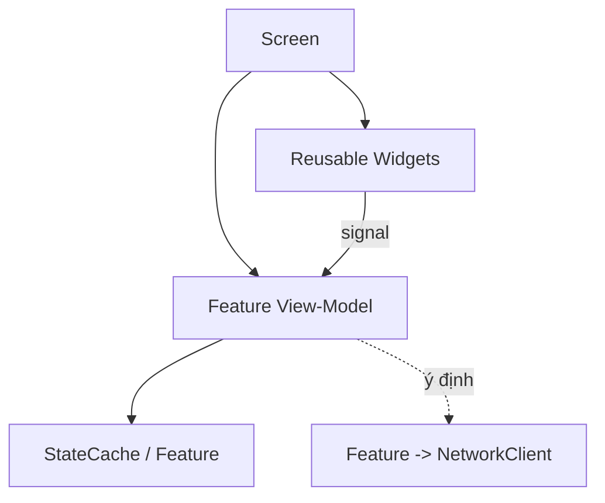

# UI Architecture (Client)

> UI layer landscape, tách khỏi logic, tái sử dụng widget. UI **không** gọi network trực tiếp (ADR-002).

---

## 1. Nguyên tắc UI

| Nguyên tắc | Chi tiết |
|---|---|
| Tách UI ↔ logic | UI hiển thị + nhận input; logic ở feature/view-model |
| Không gọi network | UI → feature (view-model) → **`NetworkClient`** (Phase 15). **Cấm** `HTTPRequest`/REST trực tiếp trong UI/feature; `HTTPRequest` chỉ tồn tại trong `client/src/core/net/` (grep guard). Chi tiết kênh mạng: `state-and-signals.md` §4. |
| Widget tái sử dụng | `ui/` chứa widget dùng chung (card, bar, dialog) |
| Landscape-first | Bố cục ngang (`../mvp/00`); dùng anchor/container co giãn |
| Data-binding nhẹ | View-model cập nhật UI qua signal/observable |
| Theme thống nhất | Theme resource dùng chung (font, màu, style) |

---

## 2. Lớp UI



| Lớp | Vai trò |
|---|---|
| Screen | Màn hình đầy đủ, bố cục, điều phối widget |
| Widget | Thành phần tái sử dụng (hero_card, currency_bar) |
| View-Model | Chuẩn bị dữ liệu hiển thị + xử lý input → gọi feature |

### 2.1 BaseView + presenter — hợp đồng UI (Phase 17 — đã chốt)

> Nguồn: `client/src/ui/base/base_view.gd` (`class_name BaseView extends Control`). Mọi view UI kế thừa
> `BaseView`. Hợp đồng **một chiều** rõ ràng, tách UI khỏi logic/mạng (ADR-002 §6):

```text
DỮ LIỆU VÀO → view → render → Ý ĐỊNH RA → presenter → (SceneRouter / feature / EventBus)
```

| Thành phần | API | Ý nghĩa |
|---|---|---|
| Dữ liệu vào | `set_data(data: Dictionary)` → `_render(data)` | Presenter đẩy dữ liệu hiển thị; subclass override `_render` để vẽ. Chỉ dữ liệu vào — không side-effect. |
| Ý định ra | `emit_intent(name, payload)` → `signal intent(name, payload)` | View phát ý định người dùng (bấm nút…). Side-effect DUY NHẤT = signal. |
| Vòng đời | `bind()` / `unbind()` (gọi ở `_enter_tree`/`_exit_tree`) | Hook gắn/huỷ subscription (vd EventBus) — tránh rò rỉ. Mặc định no-op. |

**View ĐƯỢC PHÉP:** nhận dữ liệu (`set_data`), render, phát intent (`emit_intent`), bind/unbind sự kiện UI, quản
lý trạng thái hiển thị.
**View KHÔNG được:** gọi `NetworkClient`/`HTTPRequest`/`core/net`; chứa logic nghiệp vụ; tự quyết trạng thái
ứng dụng; tự tải dữ liệu remote; bypass presenter/EventBus.

**Presenter/view-model** (vd `BootController`, `MainHubPresenter`) là nơi DUY NHẤT chạm mạng/điều hướng: nghe
`intent`, ĐỌC dữ liệu hiển thị (`StateCache`/`ConfigProvider` — đọc-cache, không network), gọi `NetworkClient`
qua cổng (không `HTTPRequest`), điều hướng qua `SceneRouter`, và **chỉ** phát EventBus cho sự kiện toàn cục
thật (không thêm event/nút — danh mục EventBus ĐÓNG, `state-and-signals.md` §3.1). **Grep guard:** không
`NetworkClient`/`HTTPRequest`/`core/net` trong file **view**; `HTTPRequest` chỉ ở `client/src/core/net/`.

---

## 3. Responsive & landscape
- Dùng `Control` anchor + `Container` (HBox/VBox/Grid) để co giãn theo độ phân giải.
- Safe area cho tai thỏ/điện thoại; test nhiều tỉ lệ (`../mvp/10` AR3).
- Ưu tiên thao tác vùng ngón cái (`../mvp/10` UI3).

## 4. Navigation & feedback
- Điều hướng qua `SceneRouter` (`scene-architecture.md`).
- Badge/notification (chấm đỏ) qua Event Bus (vd có mail/quest xong) — schema thông báo (`../mvp/10` UI4).
- Loading/skeleton khi chờ network; hiển thị lỗi thân thiện (`../mvp/10` UX3).

### 4.1 Boot / loading + màn lỗi (Phase 17 — đã chốt)

- **Boot splash** (`BootView`): view tối giản hiển thị trạng thái kết nối; không block (boot chạy async trong
  `BootController`). Luồng (Phase 17 + auth/profile Phase 20): **health → auth/profile → config → hub**
  (`scene-architecture.md` §4.2, `state-and-signals.md` §4.1).
- **Auth + profile trong boot (Phase 20):** sau cổng `health`, `BootController` gọi `AuthProfileFlow.run()`
  (guest login/dùng token lưu → `GET /profile` → `StateCache`); vòng đời auth TẬP TRUNG ở boot/AuthProfileFlow,
  **view/hub KHÔNG chứa auth logic**. Hub (`MainHubPresenter`) đọc `StateCache.get_profile()` hiển thị tên·level
  (currency = placeholder tới phase 31).
- **Màn lỗi boot** (`BootErrorView`): khi health/auth fail/mất mạng **và KHÔNG có cache** → hiển thị **thông báo
  AN TOÀN** (KHÔNG lộ stack/chi tiết nội bộ — không client-authority) + nút **retry**. Nút nối MỘT LẦN (không nối
  lại mỗi lần lỗi ⇒ không trùng listener); presenter chạy lại flow sạch với khoá chống tái nhập. Transition/animation
  nâng cao = phase 52.
- **Offline-fallback (Phase 20):** nếu mất kết nối NHƯNG có **profile cache cũ** (StateCache `source="cache"`),
  boot **vào hub chế độ offline** (nhãn `[offline]`) thay vì màn lỗi — hiển thị cache có nhãn, KHÔNG bịa dữ liệu
  (ADR-007/011). Chỉ hiện màn lỗi khi không có cache dùng được.

## 5. Accessibility & localization
- Text qua khoá i18n (`resources-and-assets.md`); tránh chữ nhúng trong ảnh.
- Kích thước chạm tối thiểu; tương phản đủ.

## 6. Liên kết
- Scene/router: `scene-architecture.md`
- State/signals: `state-and-signals.md`
- UX nguồn: `../mvp/02`, `../mvp/10`
