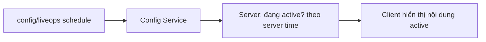

# Content Scheduling (Events, Banner, Shop Rotation, Season)

> Lịch nội dung có thời hạn. **Post-MVP** về vận hành, nhưng schema "chừa chỗ" từ MVP (ADR-006). Dựa **server time**. Nguồn: `../mvp/07`.

---

## 1. Mô hình chung: content có thời hạn

Mọi nội dung lịch chia sẻ khung: `start_time`, `end_time`, `version`, `payload` (data-driven).

| Trường | Vai trò |
|---|---|
| id, type | Loại nội dung (event/banner/shop/season) |
| start_time/end_time | Cửa sổ hoạt động (server time — ADR-008) |
| version | Versioned bundle (ADR-005) |
| payload | Dữ liệu riêng loại (rate banner, shop items...) |

## 2. Các loại nội dung

| Loại | Mô tả | Nguồn MVP | Phụ thuộc |
|---|---|---|---|
| Events | Sự kiện thưởng/mode tạm (x2 drop...) | `../mvp/07` L02 (Post) | Reward table, flag |
| Limited Banner | Gacha rate-up giới hạn | `../mvp/07` L03 (Post) | Gacha config (`../gameplay/progression-and-economy.md`) |
| Shop Rotation | Cửa hàng đổi hàng định kỳ | `../mvp/07` L09 (Post) | Shop config |
| Season | Mùa dài (meta/thưởng) | `../mvp/07` L04 (Post) | Nhiều hệ + reset |

## 3. Nguyên tắc
- **Server quyết định** nội dung nào active (chống chỉnh giờ).
- Nội dung = **config versioned**, không code cứng từng event (ADR-004).
- Reset/rotation theo lịch server (background job — `../backend/infrastructure.md` §6).
- MVP: định nghĩa schema + có thể để trống lịch; bật khi Post-MVP.

## 4. Rủi ro & giảm nhẹ
| Rủi ro | Giảm nhẹ |
|---|---|
| Lịch chồng chéo/sai giờ | Server time + validate lịch ở CI |
| Ảnh hưởng kinh tế (bơm/rút tài nguyên) | Theo dõi source/sink (`../mvp/06`), telemetry |
| Content-hungry (`../mvp/09` SC3) | Template + content pipeline (`../gameplay/configuration-and-data.md`) |

## 5. Liên kết
- Remote config: `remote-config.md` · Mail: `mail-system.md`
- ADR-005/006 · Nguồn: `../mvp/07`, `../mvp/06`
