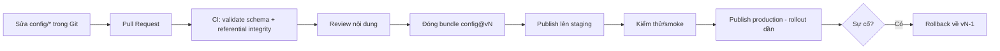

# Content Update & Admin Workflow

> Quy trình cập nhật nội dung (config) an toàn và công cụ admin. Workflow cơ bản MVP → CMS đầy đủ Post-MVP (`../mvp/07` §3.3). Nền: ADR-005.

---

## 1. Content Update Workflow (an toàn)

| Bước | Bảo đảm |
|---|---|
| Git + PR | Lịch sử, review, traceability |
| Validate CI | Chặn config sai (schema/id) — `../testing/` |
| Staging trước prod | Giảm rủi ro |
| Versioned + rollback | An toàn khi sai (ADR-005) |
| Rollout dần (Post-MVP) | Giới hạn ảnh hưởng |

## 2. Admin Workflow / Tools

| Chức năng | MVP | Post-MVP |
|---|---|---|
| Gửi mail/đền bù | Qua script/endpoint bảo vệ | CMS UI |
| Publish config | Qua pipeline (Git → CI) | CMS + phê duyệt |
| Bật/tắt feature flag | Config | CMS toggle |
| Xem telemetry | — | Dashboard |
| Quản lý banner/event | Config | CMS lịch |
| Ban/hỗ trợ người chơi | Endpoint cơ bản | CMS support |

## 3. Bảo mật admin
- Endpoint admin tách, **authz chặt** (role admin), audit log mọi hành động (`../backend/cross-cutting.md`).
- Không expose admin ra client thường.
- Phân quyền publish config/gửi mail.

## 4. Nguyên tắc
- MVP: workflow dựa **Git + pipeline + endpoint bảo vệ** (đủ vận hành, rẻ).
- CMS đầy đủ là **Post-MVP → Future** (`../mvp/07` §3.3); kiến trúc chừa chỗ (Config Service + flag).

## 5. Liên kết
- Remote config: `remote-config.md` · Deploy/rollback: `../deployment/release-operations.md`
- CI validate: `../deployment/ci-cd-pipeline.md`, `../testing/`
- ADR-005/006
