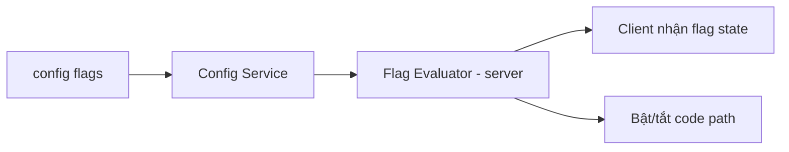

# Feature Flags & A/B Testing

> Feature toggle (bật/tắt tính năng) và A/B testing. Feature flag cơ bản ở MVP; A/B testing Post-MVP (`../mvp/07`, `../mvp/10` AL3). Nền: ADR-006.

---

## 1. Feature Flags

| Chủ đề | Thiết kế |
|---|---|
| Mục đích | Bật/tắt tính năng không cần deploy; kill-switch khi sự cố; rollout dần |
| Nguồn | Config (Configuration Service, ADR-005) |
| Phạm vi | Global, theo version, (Post-MVP) theo segment/% người chơi |
| Đánh giá | Backend đánh giá (server-authoritative); client nhận trạng thái flag |
| MVP | Hạ tầng cờ cơ bản (bật/tắt module, SignalR optional...) |

**Nguyên tắc:** flag là **cấu hình**, code kiểm `if flag_enabled(x)` ở ranh giới rõ; dọn flag chết định kỳ (tránh nợ kỹ thuật).

## 2. A/B Testing (Post-MVP)

| Chủ đề | Thiết kế |
|---|---|
| Mục đích | So sánh biến thể (vd đường cong kinh tế, UX onboarding) |
| Assignment | Server gán người chơi vào nhóm (ổn định theo id), lưu để nhất quán |
| Đo lường | Cần **telemetry** (retention/funnel/source-sink — `../mvp/09` LO2) |
| Ranh giới | Biến thể là **config**, không nhánh code cứng |
| Điều kiện | Chỉ có ý nghĩa khi đủ người chơi (Post-MVP) |

## 3. Quan hệ với determinism/anti-cheat
- Flag/A-B không được mở lỗ hổng: quyết định nhạy cảm vẫn server-authoritative (ADR-011).

## 4. Liên kết
- Remote config: `remote-config.md` · ADR-006
- Telemetry: `../backend/cross-cutting.md`, `../mvp/09` LO2
