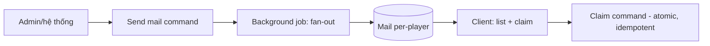

# Mail System

> Kênh trao thưởng/đền bù/thông báo. **MVP cơ bản** (công cụ vận hành sống còn — `../mvp/07` §2). Server-authoritative.

---

## 1. Trách nhiệm
- Gửi mail (hệ thống → người chơi) kèm đính kèm (thưởng/đền bù).
- Người chơi: xem, claim đính kèm, xóa.
- Gửi **hàng loạt** (broadcast) hoặc **cá nhân** (targeted).

## 2. Dữ liệu
| Trường | Vai trò |
|---|---|
| id, recipient (all/segment/player) | Đích gửi |
| title, body | Nội dung (i18n) |
| attachments | Danh sách reward refs |
| expire_at | Hạn nhận (server time) |
| claimed/read state | Per-player |

## 3. Luồng

## 4. Nguyên tắc
- Claim đính kèm là **giao dịch atomic + idempotent** (chống double — ADR-007).
- Gửi hàng loạt qua **background job** (tránh nghẽn — `../backend/infrastructure.md`).
- Hạn nhận theo **server time**; dọn mail hết hạn (job).
- Thông báo client qua Event Bus/badge (`../godot/ui-architecture.md`); realtime tuỳ chọn SignalR (ADR-008).

## 5. Vai trò vận hành
- Đền bù sự cố, phát quà sự kiện, thông báo — cần **ngay từ MVP** dù ít người (`../mvp/09` LO3).

## 6. Liên kết
- Reward: `../gameplay/progression-and-economy.md` · Admin: `content-update-and-admin-workflow.md`
- ADR-006/007 · Nguồn: `../mvp/07` §2
