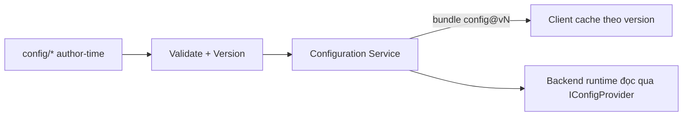

# Remote Configuration

> Nền tảng cấu hình từ xa cho LiveOps, dựa trên Configuration Service (ADR-005). Phân biệt data-driven (MVP) vs live-config (Post-MVP) theo `../mvp/07` §4.

---

## 1. Hai mức độ (theo `../mvp/07`)
| Mức | Mô tả | Giai đoạn |
|---|---|---|
| Data-driven | Config đọc từ bundle versioned khi deploy/khởi động | MVP |
| Live-config | Đổi bundle "live" không cần update app | Post-MVP (nền đặt sẵn) |

## 2. Kiến trúc

## 3. Phạm vi cấu hình được (lâu dài)
- Hero/skill/stage/gacha/shop/reward/economy (`../gameplay/configuration-and-data.md`).
- Event schedule, feature flags, A/B assignment (Post-MVP).

## 4. Versioning & rollout
- Bundle bất biến, versioned; rollout tăng dần (Post-MVP: theo % người chơi).
- Rollback = trỏ về version trước (ADR-005, `../deployment/release-operations.md`).
- Client cache + kiểm version khi vào game; tải delta khi có version mới.

### 4.1 Configuration Service (Phase 21 — đã hiện thực)
Backend là **SSOT runtime** cho config (`../backend/infrastructure.md §3.1`). Pipeline chốt: `config/ → validate (tái
dùng validator phase 07) → build bundle bất biến config@vN (checksum SHA-256 xác định) → persist DB (`config_bundles`) +
cache Redis theo version → flip con trỏ "current" nguyên tử → phục vụ`. Đọc backend qua `IConfigProvider`
(`RuntimeConfigProvider`) — Domain/Application **không** đọc file. **Publish khi deploy (MVP)** qua hosted service; đổi
config → version mới **không rebuild client**; validator-fail ⇒ **không** publish (current giữ nguyên); dedup theo checksum
(config không đổi ⇒ không bump). **Endpoint** (public): `GET /api/v1/config/current` + `GET /api/v1/config/bundle?bundleVersion=N`.
Giữ version cũ (immutable) = **nền rollback**. **Live swap không cần deploy** = Post-MVP (nền versioning/rollback đã đặt).
Client cache bundle e2e = **phase 22**; feature flags/A-B = **phase 49**.

## 5. An toàn
- Validate schema + referential integrity trước publish (CI gate).
- Không publish config chưa qua validator (`../testing/`).
- Phân quyền publish (admin — `content-update-and-admin-workflow.md`).

> **Schema là hợp đồng, config là giá trị.** JSON Schema per-type (`../../shared/config-schema/`, phase 06) định nghĩa **cấu trúc** — không chứa balance. Đổi schema breaking ⇒ tăng `schema_version` + migration trong `shared/config-schema/_versions/` + doc-sync. **Validator** (schema + referential integrity, CI gate) là phase 07; **Configuration Service** nạp/publish bundle runtime là **phase 21 (đã hiện thực — §4.1)**.

## 6. Liên kết
- ADR-005, ADR-006 · Config data: `../gameplay/configuration-and-data.md`
- Feature flags: `feature-flags-and-ab-testing.md`
