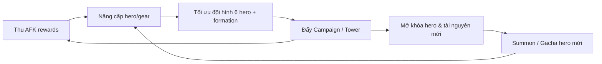

# 00 — Tổng Quan Dự Án (Project Overview)

> **Tài liệu SSOT — Giai đoạn Product Discovery / MVP.** Viết ngày 1 của dự án. Đây là tài liệu nền tảng để định hình tầm nhìn game trước khi bước vào thiết kế kiến trúc.

---

## 1. Vision (Tầm nhìn)

Xây dựng một **game mobile 2D Idle Squad RPG theo mô hình Hero Collection**, vận hành như một **live-service dài hạn**: liên tục bổ sung hero, sự kiện, banner và game mode mới **mà không cần refactor lớn**. Người chơi thu thập hero qua Gacha, xây đội hình 6 hero, và không ngừng nâng cấp sức mạnh để chinh phục nội dung ngày càng khó.

**Tuyên ngôn một câu:** *"Sưu tầm anh hùng, xây đội hình, và để họ tự động chinh phục thế giới — kể cả khi bạn offline."*

**North star tham chiếu:** **Idle Heroes** — idle sâu, nhiều lớp hệ thống nuôi hero chồng lên nhau (level, sao/ascension, enhancement, artifact/gear...), thiên hardcore/grind hơn là casual thuần. Tham chiếu phụ về "cảm giác dễ tiếp cận & AFK reward" lấy từ AFK Arena.

| Trụ cột tầm nhìn | Diễn giải | WHY (vì sao quan trọng) |
|---|---|---|
| Idle-first | Tiến trình chạy cả khi offline (AFK rewards) | Phù hợp mobile mid-core bận rộn; giảm áp lực "phải online" nhưng vẫn có lý do quay lại |
| Collection depth | Nhiều hero, nhiều lớp nâng cấp | Tạo mục tiêu dài hạn & động lực chi tiêu (gacha) |
| Live-service ready | Nội dung config được từ backend | Kéo dài vòng đời game nhiều năm mà không viết lại code |
| Solo/small-team khả thi | Combat full-auto, scope MVP gọn | Giảm rủi ro dev cho đội nhỏ + AI-assisted |

---

## 2. Game Identity (Bản sắc game)

| Thuộc tính | Giá trị |
|---|---|
| Engine (client) | Godot Engine 4.7.x |
| Backend | .NET 9 |
| Platform | Mobile (iOS/Android) |
| Hướng màn hình | Landscape (ngang) |
| Thể loại | 2D Idle Squad RPG |
| Phong cách | Hero Collection · Auto Battle · Formation Strategy · Gacha · Live Service |
| Đối tượng | Mid-core & Casual mobile players |
| Mô hình kinh doanh | Free-to-Play (F2P) + Gacha / IAP (monetization chi tiết là Post-MVP) |

**Điểm nhận diện cốt lõi:** đội hình **đúng 6 hero**, phân loại theo **Faction / Class / Element / Role**, combat **full-auto** (người chơi chỉ set formation, không điều khiển skill trong trận ở MVP).

---

## 3. Core Fantasy (Ảo tưởng cốt lõi người chơi theo đuổi)

> *"Tôi là một nhà chỉ huy/triệu hồi sư. Tôi sưu tầm những anh hùng mạnh mẽ, sắp xếp họ thành đội hình tối ưu, và chứng kiến họ nghiền nát kẻ thù — sức mạnh của tôi tăng đều mỗi ngày, kể cả khi tôi không cầm máy."*

Ba tầng fantasy:
1. **Collector fantasy** — "sở hữu" và hoàn thiện bộ sưu tập hero hiếm.
2. **Strategist fantasy** — tìm ra tổ hợp faction/team/formation "phá đảo" nội dung.
3. **Power-progression fantasy** — cảm giác mạnh lên không ngừng (số to hơn, sao nhiều hơn, chặng xa hơn).

---

## 4. Target Audience (Đối tượng mục tiêu)

| Nhóm | Đặc điểm | Nhu cầu chính |
|---|---|---|
| Casual | Chơi 5–15 phút/ngày, ngại combat khó | Idle reward, tiến trình tự động, ít thao tác |
| Mid-core | Chơi 20–45 phút/ngày, thích tối ưu team | Chiều sâu team-building, min-max, leaderboard |
| Collector/Whale (tiềm năng) | Sẵn sàng chi tiêu | Hero hiếm, banner giới hạn, flex sức mạnh |

**Chân dung chính (primary persona):** người chơi mid-core mobile 20–35 tuổi, từng chơi Idle Heroes / AFK Arena / Summoners War, thích "để game tự chạy" nhưng vẫn muốn có quyết định chiến thuật mỗi ngày.

---

## 5. Core Gameplay Experience (Trải nghiệm chơi cốt lõi)

Vòng trải nghiệm ngắn gọn (chi tiết ở `02-core-game-loop.md`):

Cốt lõi: **thu tài nguyên (chủ yếu idle) → nâng sức mạnh → vượt chặng khó hơn → mở khóa nhiều hơn → lặp lại**. Combat diễn ra tự động; giá trị quyết định của người chơi nằm ở **chọn hero, nâng cấp gì trước, và sắp formation**.

---

## 6. Why Players Keep Playing (Vì sao người chơi ở lại)

| Động lực giữ chân | Cơ chế hỗ trợ | Tầng thời gian |
|---|---|---|
| "Bỏ lỡ phần thưởng nếu không vào" | AFK rewards tích lũy có trần | Hằng ngày |
| Tiến trình sức mạnh rõ ràng | Power rating tăng, vượt stage mới | Hằng ngày → tuần |
| Mục tiêu sưu tầm dài hạn | Hero mới, sao/ascension, gear | Tuần → tháng |
| So kè xã hội | Ranking/Arena, Guild (Post-MVP phần lớn) | Tuần |
| Nội dung mới liên tục | LiveOps: event, banner, season | Tháng+ |
| Cảm giác "gần đạt mục tiêu tiếp theo" | Pity gacha, mảnh hero, milestone | Liên tục |

---

## 7. Similar Games (Game tương tự & bài học rút ra)

| Game | Điểm giống | Bài học áp dụng |
|---|---|---|
| **Idle Heroes** (north star) | Idle sâu, nhiều lớp nuôi hero, faction, gacha | Lấy chiều sâu progression; **cảnh báo:** tránh làm hệ thống quá rối ở MVP |
| **AFK Arena / AFK Journey** | AFK rewards, formation, combat auto, faction advantage | Lấy sự "dễ tiếp cận" và UX AFK mượt |
| **Summoners War** | Team-building, rune/gear, arena PvP | Tham chiếu chiều sâu gear & PvP (Post-MVP) |
| **Seven Knights / Seven Deadly Sins** | Hero collection gacha, formation | Tham khảo trình bày hero & banner |

---

## 8. Strengths (Điểm mạnh của hướng đi)

| Điểm mạnh | Diễn giải |
|---|---|
| Combat full-auto | Giảm mạnh chi phí dev (không cần input real-time phức tạp), hợp đội nhỏ/AI-assisted |
| Idle model | Người chơi khoan dung với "ít nội dung" hơn game action; dễ giữ chân |
| Data-driven | Hero/stage/gacha config được → LiveOps mạnh, tái sử dụng cao |
| Thị trường đã kiểm chứng | Thể loại có tệp người chơi & mô hình doanh thu rõ ràng |
| Mở rộng module hóa | Thêm hero/mode không đụng core → scale nội dung tốt |

---

## 9. Weaknesses (Điểm yếu / thách thức)

| Điểm yếu | Diễn giải | Xử lý ở đâu |
|---|---|---|
| Thị trường bão hòa | Cạnh tranh gay gắt với ông lớn | Cần USP rõ (xem `10-open-questions.md`) |
| Cân bằng kinh tế khó | Nhiều lớp nuôi hero dễ lạm phát/tắc nghẽn | `06-game-economy.md`, `09-risk-analysis.md` |
| Rủi ro "content-hungry" | Live-service cần dòng nội dung đều | `07-liveops-planning.md` |
| Combat auto dễ nhàm | Thiếu tương tác nếu không có chiều sâu team-building | Chiều sâu formation/faction; ultimate thủ công (Post-MVP) |
| Solo/AI dev | Rủi ro scope creep, chất lượng không đồng đều | `09-risk-analysis.md`, roadmap chia nhỏ |

---

## 10. Long-term Direction (Định hướng dài hạn)

| Giai đoạn | Trọng tâm |
|---|---|
| MVP | Core loop chơi được: Gacha → Team 6 → Formation → Auto Battle → Campaign → Nâng cấp → AFK rewards |
| Post-MVP gần | Tower, Equipment sâu hơn, Quest/Mail/Shop hoàn chỉnh, PvP Arena cơ bản |
| Live-service | Guild, Raid, Season, Event/Banner rotation, backend-config toàn diện |
| Trưởng thành | Nhiều faction/hệ thống meta, cross-content, analytics-driven balancing |

> **Nguyên tắc xuyên suốt:** mọi hệ thống gameplay **cuối cùng phải config được từ backend**. Ở MVP chỉ cần thiết kế "hướng tới" điều đó, chưa cần hiện thực hóa toàn bộ (chi tiết ở `07` và `08`).

---

### Liên kết
- MVP scope: `01-mvp-definition.md`
- Vòng lặp: `02-core-game-loop.md`
- Giả định định hướng (north star, combat): `13-assumptions.md`
- Câu hỏi mở (USP, monetization...): `10-open-questions.md`
