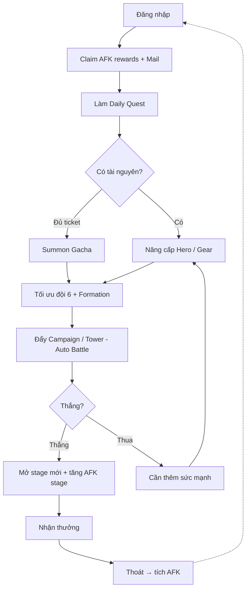
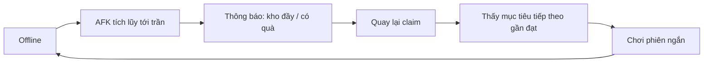
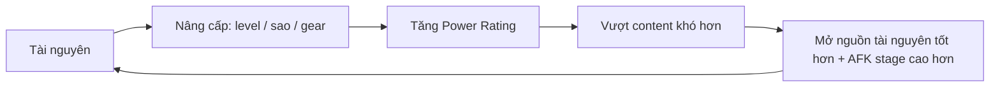

# 02 — Vòng Lặp Cốt Lõi (Core Game Loop)

> Mô tả các vòng lặp ở mọi tầng thời gian: từ lần đăng nhập đầu tiên đến vòng lặp tháng. Đây là "nhịp tim" của game — mọi feature phải phục vụ một vòng lặp nào đó.

---

## 1. Sơ đồ vòng lặp tổng (Master Loop)

**Cốt lõi:** người chơi **online ngắn** để ra quyết định (nâng cấp gì, summon, sắp team, đẩy stage), rồi **offline** để AFK tích lũy. Đây là bản chất idle.

---

## 2. First Login (Lần đầu vào game)

| Bước | Nội dung | WHY |
|---|---|---|
| 1 | Splash / tạo tài khoản (guest/ẩn danh ở MVP) | Vào game nhanh nhất, giảm ma sát |
| 2 | Cắt cảnh/hook ngắn giới thiệu bối cảnh (tối giản) | Tạo context cho fantasy |
| 3 | Tặng hero khởi đầu + tài nguyên mồi | Người chơi có ngay "đồ chơi" |
| 4 | Vào thẳng trận đầu (scripted, dễ thắng) | Cho cảm giác thành công tức thì |
| 5 | Free summon đầu (đảm bảo ra hero tốt) | "First pull dopamine" — hook thu thập |

**Mục tiêu First Login:** trong ~5 phút, người chơi đã: thắng 1 trận, có ≥5–6 hero, hiểu nút chính. Xem tiêu chí ở `01-mvp-definition.md`.

---

## 3. Tutorial (Onboarding)

| Nguyên tắc | Diễn giải |
|---|---|
| Dạy bằng làm, không bằng đọc | Ép thao tác thật (kéo hero vào đội, bấm summon, upgrade) |
| Từng bước, có gating | Chỉ mở tính năng khi tới lượt (progressive unlock) tránh ngợp |
| Có thể bỏ qua phần lặp | Người chơi cũ không bị tra tấn |

**MVP tutorial tối thiểu dạy:** vào trận, xây đội 6, đổi formation, summon, nâng cấp hero, claim AFK. Các hệ thống nâng cao mở dần theo cấp tài khoản/level campaign.

---

## 4. Daily Loop (Vòng lặp ngày)

| Hoạt động | Mục đích | Tần suất/ngày |
|---|---|---|
| Claim AFK rewards | Thu tài nguyên chính | 1–3 lần |
| Claim Mail | Thưởng/đền bù | 1 |
| Daily Quest | Nhiệm vụ ngày (đăng nhập, đánh N trận, summon...) | 1 set |
| Tiêu Energy đẩy Campaign/farm | Tiến trình + tài nguyên | Tới khi hết energy |
| Nâng cấp hero/gear | Chuyển tài nguyên thành sức mạnh | Nhiều lần |
| Summon (nếu đủ ticket) | Thu thập hero | Tùy tài nguyên |
| (Post-MVP) Fast reward/quick battle | Tiện lợi cày | — |

**Session length kỳ vọng (ngày):** 2–4 phiên × 5–12 phút. Tổng ~15–35 phút/ngày. Idle model cho phép người chơi "vào nhanh, ra nhanh".

---

## 5. Weekly Loop (Vòng lặp tuần)

| Hoạt động | Mục đích | Ghi chú MVP |
|---|---|---|
| Weekly Quest / mốc thưởng tuần | Giữ chân trung hạn | Should-have MVP (đơn giản) |
| Reset Shop / gói tuần | Tiêu tài nguyên | Shop cơ bản MVP |
| (Post-MVP) Guild hoạt động, Arena mùa | Social/PvP | Ngoài MVP |
| Đẩy mốc Tower / leaderboard | Mục tiêu đua | Could/Post-MVP |

---

## 6. Monthly Loop (Vòng lặp tháng)

| Hoạt động | Mục đích | Ghi chú |
|---|---|---|
| (Post-MVP) Season/Event/Banner mới | Làm mới meta & nội dung | LiveOps — `07` |
| Mốc sưu tầm dài hạn (đủ sao hero, hoàn thành campaign) | Mục tiêu lớn | Một phần MVP (campaign) |
| Đăng nhập tháng / lịch login | Retention | Post-MVP |

---

## 7. Retention Loop (Vòng lặp giữ chân)

| Cơ chế giữ chân | Tầng | MVP? |
|---|---|---|
| AFK cap (kho đầy thì phí → thúc quay lại) | Ngày | Must |
| Daily quest reset | Ngày | Should |
| "Sắp đủ mảnh nâng sao hero" | Liên tục | Should |
| Pity gacha ("còn X lần tới chắc chắn ra") | Liên tục | Must |
| Push notification (kho đầy/energy đầy) | Ngày | Could (Post-MVP nếu kẹt) |
| Event/login lịch | Tuần/tháng | Post-MVP |

---

## 8. Reward Loop (Vòng lặp thưởng)

| Nguồn thưởng | Loại thưởng | Nhịp |
|---|---|---|
| AFK rewards | Soft currency, EXP, gear-mat | Liên tục (idle) |
| Campaign clear | Currency, mảnh hero, mở stage | Mỗi stage |
| Daily/Weekly quest | Ticket, premium, mat | Ngày/tuần |
| Mail | Đền bù/thưởng vận hành | Bất kỳ |
| First-clear bonus | Thưởng lớn 1 lần/stage | Mỗi stage mới |

**Nguyên tắc:** luôn có "phần thưởng nhỏ liên tục" (AFK) xen "phần thưởng lớn thỉnh thoảng" (first-clear, pity 5★) — giữ dopamine đều + đỉnh. Chi tiết cân bằng ở `06-game-economy.md`.

---

## 9. Power Growth Loop (Vòng lặp tăng sức mạnh)

Đây là **động cơ dài hạn** của game. Mỗi lớp nâng cấp (level → sao → gear → ...) là một "cần gạt" tiêu tài nguyên. Chi tiết ở `05-player-progression.md`.

---

## 10. Player Motivation (Động lực người chơi)

| Loại người chơi | Động lực chính | Vòng lặp phục vụ |
|---|---|---|
| Casual | "Vào claim quà, thấy mạnh lên" | AFK + power growth |
| Mid-core | "Tối ưu team, đẩy xa nhất" | Formation + campaign/tower + ranking |
| Collector | "Đủ bộ hero, full sao" | Gacha + ascension |
| Competitor | "Top bảng" | Ranking (Post-MVP: Arena) |

---

## 11. Expected Session Length (Độ dài phiên kỳ vọng)

| Kiểu phiên | Thời lượng | Mô tả |
|---|---|---|
| Micro (claim & go) | 1–3 phút | Vào claim AFK/mail, thoát |
| Standard | 5–12 phút | Claim + quest + nâng cấp + đẩy vài stage |
| Deep | 15–30 phút | Summon nhiều, tối ưu team, đẩy mạnh sau khi có hero mới |

Idle model tối ưu cho **nhiều micro-session** + vài deep-session khi có "sự kiện cá nhân" (đủ ticket, lên cấp lớn).

---

### Liên kết
- Chi tiết từng cơ chế: `03-core-gameplay.md`
- Progression & bottleneck: `05-player-progression.md`
- Kinh tế thưởng/tiêu: `06-game-economy.md`
- LiveOps mở rộng loop: `07-liveops-planning.md`
