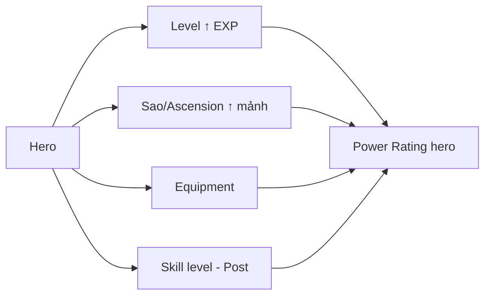
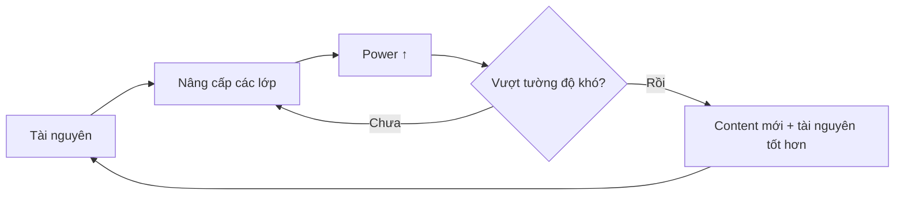

# 05 — Tiến Trình Người Chơi (Player Progression)

> Phân tích các trục tiến trình: tài khoản, hero, sức mạnh, trang bị; tiêu thụ tài nguyên; tiến trình ngày & dài hạn; và các **điểm tắc nghẽn (bottleneck)** tiềm năng. North star **Idle Heroes** → progression **nhiều lớp chồng nhau**.

---

## 1. Account Progression (Tiến trình tài khoản)

| Yếu tố | Mô tả | MVP? | WHY |
|---|---|---|---|
| Player Level (cấp tài khoản) | Tăng qua hoạt động; mở khóa tính năng & tăng trần energy | ✅ | Gate tính năng theo tiến trình, tránh ngợp người mới |
| Feature unlock theo mốc | Mở dần Shop/Equipment/Tower... | ✅ | Onboarding tuần tự |
| Campaign progress | Chương/stage cao nhất đạt | ✅ | Cột mốc tiến trình chính; ảnh hưởng AFK |
| VIP/loyalty | Theo chi tiêu | ⬜ Post | Monetization |

**WHY:** cấp tài khoản là "khung xương" điều phối nhịp mở khóa — dùng để không đổ hết hệ thống lên người mới.

---

## 2. Hero Progression (Tiến trình hero) — nhiều lớp

Đây là trọng tâm của thể loại Idle-Heroes-like. Các "cần gạt" nâng cấp xếp chồng:

| Lớp | Cơ chế | Nguồn tài nguyên | MVP? | WHY |
|---|---|---|---|---|
| Level (EXP) | Tăng cấp hero bằng EXP | AFK, campaign, EXP item | ✅ Must | Trục power cơ bản, tăng đều |
| Nâng sao / Ascension | Nâng bậc bằng mảnh/bản sao hero | Gacha dup, fragment, campaign | 🟡 Should | Mục tiêu trung hạn, "hút" gacha |
| Skill level | Nâng cấp kỹ năng riêng | Mat chuyên biệt | 🔵 Could/Post | Chiều sâu, nhưng có thể hoãn |
| Equipment | Lắp trang bị | Drop/mat | 🟡 Should | Trục power song song |
| Awakening/Enhancement cao | Thăng cấp bậc cao (glyph, aspen...) | Mat hiếm | ⬜ Future | Endgame Idle-Heroes-like |

> **Cảnh báo thiết kế:** north star có **rất nhiều lớp**. MVP chỉ nên mở **Level (Must)** + **Sao & Equipment (Should)**. Mở thêm lớp là Post-MVP để tránh ngợp & bùng nổ cân bằng (xem `09`).

---

## 3. Power Growth (Tăng sức mạnh tổng)

| Khái niệm | Mô tả |
|---|---|
| Power Rating | Một con số tổng hợp sức mạnh hero/đội (từ stats + level + sao + gear) |
| Team Power | Tổng/tổ hợp power 6 hero + bonus formation/faction |
| Gate độ khó | Stage/tower yêu cầu power ngưỡng → tạo "tường" cần vượt |

**WHY dùng Power Rating:** cho người chơi một tín hiệu tiến bộ đơn giản ("số to hơn = mạnh hơn") và cho phép so sánh nhanh với yêu cầu content. Là "đồng hồ đo" động lực.

---

## 4. Equipment Growth (Tiến trình trang bị)

| Yếu tố | MVP | Post-MVP/Future |
|---|---|---|
| Lắp gear tăng stats | ✅ cơ bản | — |
| Độ hiếm gear | 🟡 tối giản | Nhiều bậc |
| Cường hóa/enhance | ⬜ | Có |
| Set bonus | ⬜ | Có |
| Reforge/random stats | ⬜ | Có (rủi ro cân bằng cao) |

**WHY tách riêng gear:** tạo trục power **song song** với level/sao → nhiều "việc để làm" mỗi ngày & nhiều sink tài nguyên hơn. Nhưng gear sâu là nguồn phức tạp lớn → hoãn.

---

## 5. Resource Consumption (Tiêu thụ tài nguyên)

| Tài nguyên | Dùng để | Nguồn chính |
|---|---|---|
| Soft currency (gold) | Level hero, mua shop, cường hóa | AFK, campaign |
| EXP item/tinh chất | Level hero | AFK, campaign |
| Hero fragment/shard | Nâng sao/mở hero | Gacha dup, campaign, shop |
| Upgrade material | Skill/ascension | Campaign, quest, event |
| Equipment/mat gear | Chế/nâng gear | Campaign drop |
| Premium currency (gem) | Summon, mua energy, tiện ích | Quest, mail, first-clear, (IAP sau) |
| Summon ticket | Summon | Quest, shop, event |
| Energy | Chơi stage tốn energy | Hồi theo thời gian, mua |

> Ma trận **nguồn ↔ sink** chi tiết & rủi ro lạm phát ở `06-game-economy.md`.

---

## 6. Daily Progression (Tiến trình mỗi ngày)

Một ngày "chuẩn" của người chơi tạo ra:
1. AFK rewards (nguồn nền, tăng theo campaign stage).
2. Energy → vài lần đẩy campaign/farm → mảnh + gold + mat.
3. Daily quest → ticket/gem/mat.
4. → Đủ để **nâng 1–vài cấp hero** hoặc **tiến gần 1 mốc sao/gear**.

**WHY:** mỗi ngày phải cảm thấy "tiến được một chút" — dù nhỏ. Đây là điều kiện giữ chân của idle game.

---

## 7. Long-term Progression (Tiến trình dài hạn)

| Mốc | Thời gian ước lượng | Cảm giác |
|---|---|---|
| Hoàn tất tutorial + đội 6 đầu | Ngày 1 | "Đã bắt đầu" |
| Full sao đội chủ lực đầu | Tuần 1–2 | "Đội tôi thành hình" |
| Vượt "tường" campaign đầu tiên | Tuần 2–4 | "Cần chiến lược/gacha" |
| Đủ hero cho nhiều đội chuyên biệt | Tháng 1+ | "Meta cá nhân" |
| Endgame (ascension cao, tower sâu) | Tháng 2+ (Post-MVP) | "Tối ưu vô tận" |

---

## 8. Potential Bottlenecks (Điểm tắc nghẽn tiềm năng)

| Bottleneck | Nguyên nhân | Tác động | Hướng giảm nhẹ |
|---|---|---|---|
| Thiếu mảnh nâng sao | Fragment ra chậm | Kẹt power, chán | Nhiều nguồn mảnh (campaign/shop/quest), pity gacha |
| "Tường" độ khó campaign | Power không kịp | Bỏ game | Cân đường cong độ khó, gợi ý nâng cấp, alternate farm |
| Thiếu gold để level | Sink gold quá lớn | Kẹt toàn cục | Cân AFK gold, gold stage riêng |
| Energy quá ít | Không đủ farm chủ động | Bực bội | Cân energy + nhấn mạnh AFK là nguồn chính |
| Quá nhiều lớp nâng cấp | Ngợp lựa chọn | Tê liệt quyết định | MVP giới hạn lớp; mở dần |
| AFK cap quá thấp | Người bận thiệt thòi | Rời bỏ | Cap hợp lý theo nhịp session |

> **WHY quan trọng:** trong idle game, cảm giác "tắc" = lý do #1 bỏ game. Mỗi bottleneck phải có ít nhất một "lối thoát" (nguồn thay thế / pity / gợi ý).

---

### Liên kết
- Kinh tế & cân bằng nguồn/sink: `06-game-economy.md`
- Vòng power growth: `02-core-game-loop.md`
- Rủi ro cân bằng: `09-risk-analysis.md`
- Câu hỏi về con số cụ thể (rate, cap, đường cong): `10-open-questions.md`
