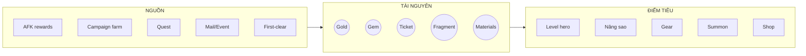

# 06 — Kinh Tế Game (Game Economy)

> Phân tích hệ tiền tệ, tài nguyên, nguồn (source) và điểm tiêu (sink), cùng các **rủi ro cân bằng**. Đây là "hệ tuần hoàn" của live-service; sai kinh tế = chết game dù gameplay tốt.

> **Lưu ý:** MVP **không** chốt con số chính xác (rate, giá, cap). Tài liệu này định nghĩa **cấu trúc & nguyên tắc**; con số cụ thể là việc cân bằng/tuning và nằm ở `10-open-questions.md`. Nguyên tắc thiết kế: mọi giá trị này **phải config được** (data-driven) để tuning về sau.

---

## 1. Currencies (Hệ tiền tệ)

| Tiền tệ | Loại | Vai trò | Kiếm bằng | Tiêu vào | MVP? |
|---|---|---|---|---|---|
| Gold | Soft | Tiền phổ thông, level hero, shop, cường hóa | AFK, campaign, quest | Level hero, gear, shop | ✅ |
| Gem/Đá quý | Premium | Tiền cao cấp, summon, tiện ích | Quest, mail, first-clear, (IAP Post-MVP) | Summon, mua energy, mở slot | ✅ |
| Summon Ticket | Vé | Rút gacha không tốn gem | Quest, event, shop | Summon | ✅ |
| Hero Fragment/Shard | Bán-tiền tệ | Nâng sao/mở hero | Gacha dup, campaign, shop | Ascension/mở hero | 🟡 Should |
| Energy | Tài nguyên nhịp | Chơi stage tốn energy | Hồi theo giờ, mua, quà | Battle chủ động | ✅ |
| Guild/Arena/Event coin | Chuyên biệt | Đổi shop riêng | Mode tương ứng | Shop riêng | ⬜ Post |

**Nguyên tắc phân tách:** Soft (dễ kiếm, tiêu nhiều) vs Premium (khan hiếm, giá trị cao) là trục monetization kinh điển — giữ tách bạch để tuning độc lập.

---

## 2. Premium Currency (Tiền cao cấp)

| Khía cạnh | MVP | Post-MVP |
|---|---|---|
| Nguồn free | Quest, first-clear, mail, mốc | + Login lịch, event, battle pass |
| Nguồn trả phí | — (không bán IAP ở MVP) | Gói nạp, first-purchase x2, sub |
| Tiêu chính | Summon (chủ yếu), mua energy | + skin, gói tiện ích |

> **WHY hoãn IAP:** để kiểm chứng loop, không cần dòng tiền thật; tránh phức tạp thanh toán/pháp lý sớm. Nhưng thiết kế phải "chừa chỗ" cho premium currency vận hành đúng như thật.

---

## 3. Soft Currency (Tiền phổ thông)

- **Nguồn chính:** AFK rewards + campaign farm.
- **Sink chính:** level hero (sink lớn nhất), shop, cường hóa gear.
- **Rủi ro:** vừa dư (chán) vừa thiếu (kẹt) — cần cân đường cong sink theo cấp hero (cấp càng cao càng ngốn gold).

---

## 4. Summon Tickets (Vé triệu hồi)

| Khía cạnh | Nội dung |
|---|---|
| Vai trò | Cho phép người F2P vẫn summon đều mà không tốn gem |
| Nguồn | Daily/weekly quest, campaign mốc, shop, event |
| Nhịp mong muốn | Đủ để F2P rút "một chút mỗi ngày" (giữ dopamine gacha) |
| Rủi ro | Quá nhiều → mất giá gacha; quá ít → F2P nản |

---

## 5. Energy (Năng lượng)

| Khía cạnh | Nội dung |
|---|---|
| Vai trò | Điều tiết **cày chủ động** (AFK là nguồn nền, energy là "bonus farm") |
| Nguồn | Hồi theo thời gian (regen), quà ngày, mua bằng gem |
| Sink | Mỗi lần đánh campaign/farm tốn energy |
| Rủi ro | Nếu energy là nguồn duy nhất → mâu thuẫn với idle; nếu quá rộng → mất nhịp |

> **WHY quan trọng:** trong idle game, phải làm rõ **AFK vs Energy** ai là nguồn chính. Giả định MVP: **AFK là nguồn nền chính, energy chỉ tăng tốc cày mảnh/mat**. (Ghi ở `13`.)

---

## 6. Upgrade Materials (Nguyên liệu nâng cấp)

| Loại mat | Dùng cho | Nguồn | MVP? |
|---|---|---|---|
| EXP item/tinh chất | Level hero | AFK, campaign | ✅ |
| Ascension mat / mảnh | Nâng sao | Campaign, gacha dup, shop | 🟡 |
| Skill mat | Nâng skill | Campaign/event | ⬜ Post |
| Gold | Mọi nâng cấp | AFK, campaign | ✅ |

---

## 7. Equipment Materials (Nguyên liệu trang bị)

| Loại | Dùng cho | Nguồn | MVP? |
|---|---|---|---|
| Gear cơ bản | Lắp cho hero | Campaign drop, shop | 🟡 |
| Mat cường hóa gear | Nâng gear | Campaign/event | ⬜ Post |
| Mảnh gear/forge mat | Chế gear hiếm | Event/dungeon | ⬜ Future |

---

## 8. Rewards — Daily (Thưởng ngày)

| Nguồn | Nội dung điển hình |
|---|---|
| AFK claim | Gold, EXP item, gear mat |
| Daily quest | Ticket, gem nhỏ, mat |
| Đăng nhập ngày | Gem/ticket (Post-MVP: lịch tháng) |
| First-clear stage mới | Gem/mảnh (thưởng lớn 1 lần) |

---

## 9. Rewards — Weekly (Thưởng tuần)

| Nguồn | Nội dung | MVP? |
|---|---|---|
| Weekly quest/mốc | Gem, ticket, mat hiếm | 🟡/Post |
| Reset shop tuần | Món giá tốt | Post |
| (Post-MVP) Rank/Arena tuần | Coin, gem | Post |

---

## 10. Resource Sources vs Sinks (Nguồn vs Điểm tiêu)

| Tài nguyên | Nguồn chính | Sink chính | Áp lực cân bằng |
|---|---|---|---|
| Gold | AFK, campaign | Level hero | Sink lớn nhất — dễ thiếu ở mid-game |
| Gem | Quest, first-clear | Summon | Dễ thiếu (F2P) — cần đủ để "mơ" gacha |
| Ticket | Quest, shop | Summon | Điều tiết nhịp gacha F2P |
| Fragment | Gacha dup, campaign | Nâng sao | Bottleneck sao — cần nhiều nguồn |
| Energy | Regen, quà | Farm | Cân với AFK để không mâu thuẫn idle |

---

## 11. Balance Risks (Rủi ro cân bằng)

| Rủi ro | Mô tả | Tác động | Giảm nhẹ |
|---|---|---|---|
| Lạm phát soft currency | Gold dư thừa | Mất giá trị quyết định | Sink lũy tiến theo cấp; gold-gate |
| Khan hiếm premium | Gem quá ít | F2P nản, không "mơ" gacha | Đủ nguồn free có kiểm soát |
| Gacha "cảm giác tệ" | Rate/pity kém | Mất niềm tin, bỏ game | Pity minh bạch, rate công bố |
| Bottleneck fragment | Nâng sao quá chậm | Kẹt progression | Nhiều nguồn mảnh, event bù |
| Mâu thuẫn AFK vs Energy | Không rõ nguồn chính | Nhịp lệch | Chốt AFK = nền, energy = bonus |
| Power creep (Post-MVP) | Hero/gear mới quá mạnh | Hỏng cân bằng cũ | Chuẩn power, kiểm soát release |
| Không tune được | Con số hard-code | Không sửa được khi live | **Data-driven ngay từ MVP** |

> **WHY nhấn mạnh data-driven:** kinh tế **chắc chắn sẽ sai** ở bản đầu — điều quyết định sống còn là **có sửa được nhanh không**. Vì vậy mọi hệ số kinh tế phải nằm ở cấu hình, không nằm trong code (liên kết `08`, `15`).

---

### Liên kết
- Tiêu thụ tài nguyên theo progression: `05-player-progression.md`
- Reward loop: `02-core-game-loop.md`
- LiveOps (event/shop rotation bơm/rút tài nguyên): `07-liveops-planning.md`
- Con số cụ thể cần chốt: `10-open-questions.md`
