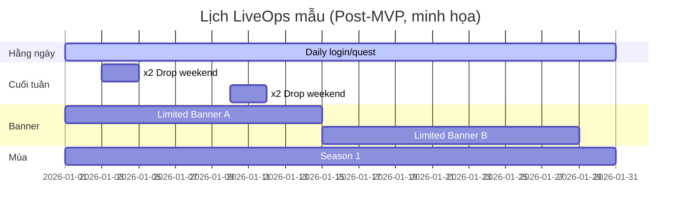

# 07 — Kế Hoạch LiveOps (LiveOps Planning)

> Phân tích các hoạt động vận hành trực tiếp (LiveOps) tương lai. Mục tiêu: **tách rõ MVP vs Post-MVP** và ghi nhận **những "móc treo" (hooks) mà thiết kế MVP nên chừa sẵn** để không phải refactor lớn khi triển khai LiveOps.

> **Nguyên tắc nền:** LiveOps sống nhờ **backend-configurable content**. MVP **chưa** làm CMS/LiveOps thật, nhưng phải thiết kế dữ liệu **data-driven** để sau này "cắm" LiveOps vào được.

---

## 1. Bảng tổng LiveOps

| # | Hoạt động | Mô tả | MVP? | Hook cần chừa ở MVP |
|---|---|---|---|---|
| L01 | Daily Login | Thưởng đăng nhập hằng ngày | 🟡 tối giản / ⬜ lịch tháng | Hệ thống "grant reward theo ngày" |
| L02 | Events | Sự kiện có thời hạn (thưởng/mode tạm) | ⬜ Post | Content có start/end time |
| L03 | Limited Banner | Banner rate-up giới hạn thời gian | ⬜ Post | Banner data-driven + rate config |
| L04 | Season | Mùa dài (meta/thưởng theo mùa) | ⬜ Post | Mốc thời gian & reset |
| L05 | Raid Rotation | Boss raid xoay vòng | ⬜ Post | Phụ thuộc Guild/Raid |
| L06 | Tower Reset | Reset tháp định kỳ | ⬜ Post (nếu có Tower) | Cơ chế reset theo lịch |
| L07 | Mail Rewards | Phát thưởng/đền bù qua mail | 🟡 cơ bản (MVP) | Mail system + gửi hàng loạt |
| L08 | Weekend Events | Sự kiện cuối tuần (x2 drop...) | ⬜ Post | Modifier hệ số theo thời gian |
| L09 | Shop Rotation | Cửa hàng đổi hàng định kỳ | ⬜ Post | Shop data-driven + lịch refresh |
| L10 | Backend Configuration | Cấu hình nội dung từ backend | ⬜ Post → Future | Toàn bộ config tách khỏi client |

---

## 2. MVP LiveOps (những gì có trong MVP)

| Hoạt động | Mức độ MVP | WHY chỉ mức này |
|---|---|---|
| Mail cơ bản | Nhận/claim/xóa; phát thủ công từ backend | Cần để đền bù lỗi & phát quà ngay từ bản đầu |
| Daily quest reset | Reset mốc theo ngày | Nhịp retention ngày tối thiểu |
| Daily login (tối giản) | Thưởng đăng nhập đơn giản | Rẻ, tăng D1–D7 rõ rệt |
| Data-driven content | Hero/stage/gacha/shop nạp từ cấu hình | **Nền tảng bắt buộc** cho mọi LiveOps sau |

> **Ranh giới:** MVP **không** có event/banner rotation/season/CMS. Chỉ có "khả năng phát thưởng" (mail) + "nội dung data-driven".

---

## 3. Post-MVP LiveOps (lộ trình vận hành)

### 3.1 Giai đoạn 1 (ngay sau MVP)
| Hoạt động | Giá trị |
|---|---|
| Daily login lịch tháng | Retention chuẩn ngành |
| Event thưởng đơn giản (x2 drop cuối tuần) | Bơm hoạt động, rẻ để làm |
| Shop rotation cơ bản | Sink tài nguyên linh hoạt |
| Analytics/telemetry | **Điều kiện để LiveOps có dữ liệu ra quyết định** |

### 3.2 Giai đoạn 2
| Hoạt động | Giá trị |
|---|---|
| Limited Banner / rate-up | Doanh thu & làm mới meta |
| Event mode tạm (mini-game/stage sự kiện) | Nội dung tươi mới |
| Battle Pass / Season | Monetization & mục tiêu tháng |

### 3.3 Giai đoạn 3 (live-service trưởng thành)
| Hoạt động | Giá trị |
|---|---|
| Guild → Raid rotation | Social retention sâu |
| PvP/Arena mùa | Endgame cạnh tranh |
| Backend LiveOps CMS đầy đủ | Vận hành không cần build client |

---

## 4. Backend Configuration (Cấu hình từ backend)

| Cái gì nên config được (lâu dài) | MVP làm gì |
|---|---|
| Hero stats/skill data | Nạp từ file/cấu hình data-driven |
| Stage/campaign data | Data-driven |
| Gacha banner & rate | Data-driven (đọc cấu hình) |
| Shop items & giá | Data-driven |
| Reward tables | Data-driven |
| Event schedule & modifier | **Post-MVP** (chưa cần ở MVP) |

> **WHY:** phân biệt "**data-driven ở MVP**" (đọc cấu hình khi build/khởi động) với "**live-config ở Post-MVP**" (đổi từ server không cần cập nhật app). MVP chỉ cần cái đầu; cái sau là mục tiêu kiến trúc dài hạn (`15`).

---

## 5. Lịch LiveOps mẫu (minh họa Post-MVP)

---

### Liên kết
- Feature & giai đoạn: `04-feature-analysis.md`
- Ảnh hưởng kinh tế của LiveOps: `06-game-economy.md`
- Hàm ý kỹ thuật (data-driven, config): `08-technical-impact.md`
- Rủi ro LiveOps: `09-risk-analysis.md`
- Cách kiến trúc tiêu thụ tài liệu này: `15-next-phase.md`
