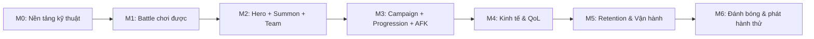

# 11 — Lộ Trình Phát Triển (Development Roadmap)

> Chia MVP thành các **milestone**. Mỗi milestone: có **mục tiêu rõ**, **test độc lập được**, **ra một bản chơi được (playable)**, và **giảm thiểu refactor về sau**. Kèm giải thích **vì sao chọn thứ tự này**.

> **Lưu ý:** đây là lộ trình **sản phẩm/tính năng**, không phải kế hoạch kiến trúc. Kiến trúc là phase kế tiếp (`15`). Roadmap này giả định phase Architecture đã cung cấp nền tảng data-driven & authority (xem điều kiện tiên quyết M0).

---

## 1. Nguyên tắc sắp thứ tự

| Nguyên tắc | Diễn giải |
|---|---|
| Loop-first | Dựng **vòng lặp cốt lõi khép kín** trước, đẹp/đầy đủ sau |
| Vertical slice | Mỗi mốc là "lát cắt dọc" chơi được, không phải module rời |
| Rủi ro cao làm sớm | Combat & authority & data-driven đưa lên đầu (giảm rủi ro `09`) |
| Data-driven ngay từ đầu | Tránh refactor lớn khi thêm nội dung |
| Cắt được | Should/Could ở cuối để cắt an toàn khi trễ |

---

## 2. Sơ đồ milestone

---

## 3. Chi tiết milestone

### M0 — Nền tảng kỹ thuật (Foundation)
> *Điều kiện tiên quyết, chủ yếu do phase Architecture định hình; liệt kê ở đây để roadmap khép kín.*

| Mục | Nội dung |
|---|---|
| Mục tiêu | Khung project chạy được: data-driven config, lưu/đọc trạng thái, kết nối client-backend cơ bản |
| Playable? | Bản "hello world" có thể load dữ liệu hero mẫu |
| Test độc lập | Load config → hiển thị 1 hero mẫu; lưu/đọc profile |
| Giảm refactor | Chốt authority & định dạng dữ liệu **trước** khi xây feature |

### M1 — Battle chơi được (Core Combat)
| Mục | Nội dung |
|---|---|
| Mục tiêu | Combat full-auto: 6 hero vs địch, có skill auto, ra thắng/thua |
| Playable? | Chọn đội cố định → xem trận auto → có kết quả |
| Test độc lập | Chạy trận với dữ liệu hero mẫu, kiểm kết quả ổn định |
| WHY sớm | Combat là **rủi ro kỹ thuật cao nhất** (TE2/TE3) → làm sớm để lộ vấn đề |

### M2 — Hero + Summon + Team (Collection Core)
| Mục | Nội dung |
|---|---|
| Mục tiêu | Summon/gacha (1 banner + pity) → nhận hero → Inventory → xây đội 6 + Formation |
| Playable? | Rút hero → đưa vào đội → sắp formation → ra trận (nối M1) |
| Test độc lập | Summon nhiều lần kiểm rate/pity; team-building lưu đúng |
| WHY | Đây là **trái tim collection** — nối với combat thành nửa vòng lặp |

### M3 — Campaign + Progression + AFK (Loop khép kín)
| Mục | Nội dung |
|---|---|
| Mục tiêu | Campaign nhiều stage + Nâng cấp hero (level) + AFK/Idle rewards + Energy |
| Playable? | **Vòng lặp cốt lõi hoàn chỉnh:** đánh → thưởng → nâng cấp → đẩy xa → AFK → lặp |
| Test độc lập | Đẩy stage, tiêu energy, level hero, claim AFK sau thời gian |
| WHY | Kết thúc M3 = **MVP Must-have loop chạy được** (mốc quan trọng nhất) |

### M4 — Kinh tế & Chất lượng sống (Economy & QoL)
| Mục | Nội dung |
|---|---|
| Mục tiêu | Nâng sao/Ascension (tối giản) + Equipment cơ bản + Shop + Currencies hoàn chỉnh + Faction advantage (nếu vào) + tua 2x/sweep |
| Playable? | Có nhiều trục nâng cấp & tiện lợi cày |
| Test độc lập | Nâng sao, lắp gear, mua shop, sweep hoạt động |
| WHY | Thêm **chiều sâu & sink** sau khi loop nền đã chắc |

### M5 — Retention & Vận hành (Retention & Ops)
| Mục | Nội dung |
|---|---|
| Mục tiêu | Daily quest + Mail + Daily login tối giản + Ranking đơn giản + Tutorial hoàn chỉnh |
| Playable? | Có lý do quay lại mỗi ngày + kênh trao thưởng vận hành |
| Test độc lập | Quest reset, mail claim, tutorial dẫn dắt người mới |
| WHY | Biến "chơi được" thành "quay lại được" + có công cụ vận hành |

### M6 — Đánh bóng & Phát hành thử (Polish & Soft Launch)
| Mục | Nội dung |
|---|---|
| Mục tiêu | Balance pass, tối ưu hiệu năng mobile, settings đầy đủ, (nên có) analytics, chuẩn bị build phát hành thử |
| Playable? | Bản MVP hoàn chỉnh cho playtest thật |
| Test độc lập | Chạy trên thiết bị thật; đo funnel tutorial & source/sink |
| WHY | Kiểm chứng giả thuyết retention với người chơi thật |

---

## 4. Bảng ánh xạ milestone ↔ feature

| Milestone | Feature chính (theo `04`) |
|---|---|
| M0 | F11 (save), nền data-driven |
| M1 | F04, F03(một phần), F01(một phần) |
| M2 | F01, F02, F03, F09, F10 |
| M3 | F05, F06, F07, F08, F12(một phần) |
| M4 | F14, F15, F18, F19, F21, F22, F23 |
| M5 | F16, F17, F20, F12(hoàn chỉnh), login |
| M6 | F13, F36(analytics), balance/polish |

---

## 5. Định nghĩa "Hoàn thành MVP" (Definition of Done)

MVP xem là hoàn thành khi:
1. Vòng lặp cốt lõi khép kín chạy ổn định (kết thúc M3, củng cố tới M5).
2. Toàn bộ **Must-have** (`01`) đã có và không lỗi chặn.
3. Người chơi mới hoàn tất onboarding và hiểu loop.
4. Chạy ổn trên thiết bị mobile tầm trung.
5. Nội dung cốt lõi là data-driven (tune được).
6. Playtest định tính cho tín hiệu "muốn chơi tiếp".

---

### Liên kết
- Feature & ưu tiên: `04-feature-analysis.md`
- MVP scope: `01-mvp-definition.md`
- Rủi ro theo mốc: `09-risk-analysis.md`
- Sẵn sàng vào Architecture: `14-readiness-checklist.md`
