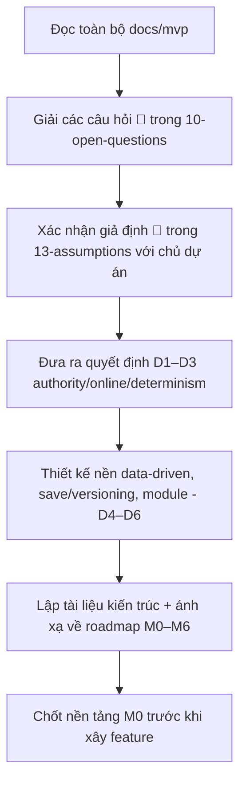

# 15 — Giai Đoạn Kế Tiếp (Next Phase)

> **KHÔNG thiết kế kiến trúc ở đây.** Tài liệu này mô tả **thông tin nào từ `docs/mvp` sẽ được dùng ở giai đoạn Architecture** và **cách giai đoạn đó tiêu thụ (consume) các tài liệu này**. Mục tiêu: đảm bảo phase kiến trúc bắt đầu đúng, không lặp lại discovery, và không bỏ sót đầu vào.

---

## 1. Vai trò của `docs/mvp` với phase Architecture

`docs/mvp` là **Single Source of Truth (SSOT)**. Phase Architecture **không được tự phát minh** yêu cầu gameplay; mọi quyết định kỹ thuật phải **truy vết được** về một tài liệu ở đây. Nếu thiếu thông tin → tra `10-open-questions.md`, không tự bịa.

---

## 2. Bản đồ tiêu thụ tài liệu (Document → Architecture concern)

| Tài liệu MVP | Phase Architecture dùng để... |
|---|---|
| `00-project-overview.md` | Nắm bối cảnh, ràng buộc nền tảng (Godot/.NET/mobile), định hướng dài hạn để không thiết kế "cụt" |
| `01-mvp-definition.md` | Xác định **phạm vi cần hỗ trợ ngay** vs phần "chừa chỗ"; tránh over-engineering ngoài MVP |
| `02-core-game-loop.md` | Suy ra các luồng dữ liệu/tương tác chính cần backend & client phối hợp |
| `03-core-gameplay.md` | Nhận diện **các thực thể (entity) & hành vi** cốt lõi cần mô hình hóa (hero, team, battle, summon...) |
| `04-feature-analysis.md` | Xếp thứ tự module & ranh giới; biết feature nào cùng cụm, phụ thuộc gì |
| `05-player-progression.md` | Hiểu các trạng thái tiến trình cần lưu & cập nhật; điểm bottleneck cần tune |
| `06-game-economy.md` | **Yêu cầu data-driven cho kinh tế**; xác định giao dịch tài nguyên cần an toàn/transaction |
| `07-liveops-planning.md` | Thiết kế "chừa chỗ" cho LiveOps: content có schedule, config tách khỏi client |
| `08-technical-impact.md` | **Đầu vào kỹ thuật trực tiếp nhất**: complexity, data, backend/godot dependency, performance, điểm nhạy cảm bảo mật |
| `09-risk-analysis.md` | Ưu tiên giảm rủi ro trong quyết định kiến trúc (đặc biệt authority, scalability, AI-coding) |
| `10-open-questions.md` | **Danh sách cần chốt trước/đầu Architecture**; các 🔴 phải giải trước khi khóa thiết kế nền |
| `11-development-roadmap.md` | Căn kiến trúc theo milestone (M0 foundation trước), hỗ trợ giao hàng tăng dần |
| `12-glossary.md` | **Ngôn ngữ chung** cho mọi tên gọi trong thiết kế & code (ubiquitous language) |
| `13-assumptions.md` | Biết đâu là quyết định đã chốt vs giả định cần xác nhận; không xây trên giả định 🔴 chưa xác nhận |
| `14-readiness-checklist.md` | Biết điều kiện tiên quyết & việc cần chốt sớm |

---

## 3. Những quyết định phase Architecture PHẢI giải quyết (bắt nguồn từ MVP)

> Đây **không phải** thiết kế — chỉ là **danh sách quyết định** mà kiến trúc phải đưa ra, kèm nguồn.

| # | Quyết định cần đưa ra | Bắt nguồn từ | Ưu tiên |
|---|---|---|---|
| D1 | Mô hình **authority** (client vs server) cho từng hệ nhạy cảm | `08` §4, `10` CB1/BE1 | 🔴 Đầu tiên |
| D2 | **Online model**: online-only hay offline-first có đồng bộ | `10` BE2, `13` A19 | 🔴 Đầu tiên |
| D3 | **Combat determinism** & nơi tính trận | `08` §2, `10` CB1/CB2 | 🔴 Đầu tiên |
| D4 | Cách tổ chức **data-driven config** (hero/stage/gacha/shop/reward) | `06`, `07`, `08` | 🟠 Sớm |
| D5 | Mô hình **lưu & versioning** profile/save | `08`, `09` TE4/BE2 | 🟠 Sớm |
| D6 | Ranh giới **module** để mở rộng nội dung không refactor | `04`, `09` SC1 | 🟠 Sớm |
| D7 | Chiến lược **chống gian lận** cho currency/gacha/AFK | `08` §4, `09` BE1 | 🟠 Sớm |
| D8 | Nền **telemetry/analytics** (chừa chỗ) | `07`, `09` LO2 | 🟢 Sau |
| D9 | Chiến lược **hiệu năng combat/UI** trên mobile | `08` §3, `09` PF | 🟢 Theo M1/M6 |

---

## 4. Cách phase Architecture nên vận hành (đề xuất quy trình tiêu thụ)

**Nguyên tắc bàn giao:**
1. Bắt đầu bằng **giải các 🔴** (không khóa nền tảng khi còn 🔴 chưa định hướng).
2. Mọi tài liệu kiến trúc tham chiếu ngược **ID tài liệu MVP** (traceability).
3. Giữ nguyên **glossary** làm tên gọi thống nhất.
4. Bám **MoSCoW & roadmap** để không thiết kế vượt MVP.
5. Khi phát hiện thông tin mới cần chốt → **thêm vào `10-open-questions.md`**, không quyết ngầm.

---

## 5. Điều KHÔNG thuộc phase này (nhắc lại)

Phase Architecture (kế tiếp) mới làm: kiến trúc hệ thống, phân tầng, module/boundary, mô hình dữ liệu/DB, API contract, tổ chức project/folder, class/diagram kỹ thuật, chiến lược đồng bộ chi tiết. **Giai đoạn MVP/Discovery này đã kết thúc ở việc hiểu game & lập tài liệu.**

---

### Liên kết
- Điều kiện sẵn sàng: `14-readiness-checklist.md`
- Câu hỏi cần giải trước: `10-open-questions.md`
- Giả định cần xác nhận: `13-assumptions.md`
- Hàm ý kỹ thuật (đầu vào chính): `08-technical-impact.md`
